# NS Exam Portal - Database Schema Documentation

## Overview
This document details the complete database schema for the NS Exam Portal, implemented on Turso (libSQL/SQLite). The schema supports multi-tenancy, subscription management, Pay Per Test billing, and comprehensive exam lifecycle tracking.

## Entity Relationship Diagram

```mermaid
erDiagram
    clients {
        TEXT id PK
        TEXT name
        TEXT address
        TEXT logo_url
        INTEGER active_status
        TEXT created_at
        TEXT updated_at
    }
    
    profiles {
        TEXT id PK
        TEXT name
        TEXT email
        TEXT client_id FK
        TEXT created_at
        TEXT updated_at
    }
    
    user_roles {
        TEXT id PK
        TEXT user_id FK
        TEXT role
        TEXT client_id FK
    }
    
    question_folders {
        TEXT id PK
        TEXT client_id FK
        TEXT name
        TEXT parent_id FK
        TEXT created_at
        TEXT updated_at
    }
    
    questions {
        TEXT id PK
        TEXT client_id FK
        TEXT folder_id FK
        TEXT question_text
        TEXT question_type
        TEXT options
        TEXT option_a
        TEXT option_b
        TEXT option_c
        TEXT option_d
        TEXT correct_answer
        TEXT correct_answers
        INTEGER marks
        REAL negative_marks
        TEXT difficulty
        TEXT explanation
        INTEGER is_case_sensitive
        TEXT import_batch_id
        INTEGER version
        TEXT created_at
        TEXT updated_at
    }
    
    question_import_logs {
        TEXT id PK
        TEXT uploaded_by
        TEXT uploaded_at
        TEXT import_batch_id
        INTEGER total_questions
        INTEGER imported_count
        INTEGER duplicate_count
        INTEGER failed_count
    }
    
    test_folders {
        TEXT id PK
        TEXT client_id FK
        TEXT name
        TEXT created_at
        TEXT updated_at
    }
    
    tests {
        TEXT id PK
        TEXT client_id FK
        TEXT folder_id FK
        TEXT test_name
        INTEGER timer
        INTEGER shuffle
        INTEGER allow_review
        INTEGER negative_marking
        REAL negative_marks
        INTEGER restrict_navigation
        INTEGER attempts_allowed
        TEXT status
        INTEGER active
        INTEGER allow_guests
        TEXT scheduled_start
        TEXT scheduled_end
        TEXT share_code
        INTEGER public_link_enabled
        INTEGER show_results_after_submission
        INTEGER allow_report_download
        TEXT result_status
        INTEGER camera_required
        INTEGER read_only
        TEXT created_at
        TEXT updated_at
    }
    
    test_sections {
        TEXT id PK
        TEXT test_id FK
        TEXT name
        INTEGER position
        INTEGER duration_minutes
        REAL negative_marks
        INTEGER shuffle_questions
        INTEGER shuffle_options
        INTEGER navigation_locked
        TEXT created_at
    }
    
    test_questions {
        TEXT id PK
        TEXT test_id FK
        TEXT question_id FK
        TEXT section_id FK
        INTEGER position
    }
    
    attempts {
        TEXT id PK
        TEXT student_id FK
        TEXT test_id FK
        REAL score
        REAL total_marks
        TEXT started_at
        TEXT submitted_at
        INTEGER time_taken
        TEXT status
        TEXT ip_address
        TEXT attempt_token
    }
    
    attempt_answers {
        TEXT id PK
        TEXT attempt_id FK
        TEXT question_id FK
        TEXT selected_option
        INTEGER marked_for_review
    }
    
    proctoring_events {
        TEXT id PK
        TEXT attempt_id FK
        TEXT test_id FK
        TEXT event_type
        TEXT severity
        INTEGER severity_score
        TEXT storage_path
        INTEGER has_evidence
        TEXT metadata
        REAL duration_seconds
        TEXT created_at
    }
    
    client_features {
        TEXT id PK
        TEXT client_id FK
        TEXT feature_name
        INTEGER enabled
        TEXT created_at
    }
    
    client_limits {
        TEXT client_id PK
        INTEGER max_exams_per_month
        INTEGER max_students_per_exam
        INTEGER max_questions_per_exam
        TEXT updated_at
    }
    
    client_usage_monthly {
        TEXT id PK
        TEXT client_id FK
        TEXT month
        INTEGER exams_created
        INTEGER attempts_created
        REAL storage_used_mb
        TEXT updated_at
    }
    
    global_settings {
        TEXT key PK
        TEXT value
        TEXT updated_at
    }
    
    audit_logs {
        TEXT id PK
        TEXT user_id
        TEXT action
        TEXT entity_type
        TEXT entity_id
        TEXT metadata
        TEXT created_at
    }
    
    subscription_plans {
        TEXT id PK
        TEXT name
        INTEGER max_exams_per_month
        INTEGER max_students_per_exam
        INTEGER max_questions_per_exam
        TEXT created_at
    }
    
    subscription_plan_features {
        TEXT plan_id FK
        TEXT feature_name
    }
    
    client_subscriptions {
        TEXT client_id PK
        TEXT plan_id FK
        TEXT start_date
        TEXT expiry_date
        TEXT status
        TEXT renewal_status
        TEXT updated_at
    }
    
    subscription_history {
        TEXT id PK
        TEXT client_id FK
        TEXT old_plan_id
        TEXT new_plan_id
        TEXT changed_by
        TEXT changed_at
    }
    
    client_subscription_requests {
        TEXT id PK
        TEXT client_id FK
        TEXT plan_id FK
        TEXT status
        TEXT requested_at
        TEXT actioned_at
    }
    
    test_packages {
        TEXT id PK
        TEXT name
        REAL price
        INTEGER max_questions
        INTEGER max_candidates
        INTEGER csv_import
        INTEGER xlsx_export
        INTEGER analytics
        INTEGER custom_branding
        INTEGER basic_proctoring
        INTEGER camera_proctoring
        INTEGER priority_support
        INTEGER active
    }
    
    client_test_purchases {
        TEXT id PK
        TEXT client_id FK
        TEXT package_id FK
        TEXT status
        TEXT purchased_at
        TEXT used_at
        TEXT assigned_test_id FK
        INTEGER custom_max_candidates
        INTEGER custom_max_questions
    }
    
    test_billing {
        TEXT test_id PK
        TEXT purchase_id FK
        TEXT package_id FK
        INTEGER max_questions
        INTEGER max_candidates
        INTEGER basic_proctoring
        INTEGER camera_proctoring
        TEXT status
        TEXT created_at
    }

    clients ||--o{ profiles : "has"
    clients ||--o{ user_roles : "has"
    clients ||--o{ question_folders : "owns"
    clients ||--o{ questions : "owns"
    clients ||--o{ test_folders : "owns"
    clients ||--o{ tests : "owns"
    clients ||--o{ client_test_purchases : "purchases"
    clients ||--o{ client_subscriptions : "subscribes"
    clients ||--o{ client_limits : "has"
    clients ||--o{ client_features : "overrides"
    clients ||--o{ client_usage_monthly : "tracks"
    clients ||--o{ client_subscription_requests : "requests"
    clients ||--o{ subscription_history : "history"

    profiles ||--o{ user_roles : "has"
    profiles ||--o{ attempts : "makes"

    question_folders ||--o{ question_folders : "nested"
    question_folders ||--o{ questions : "organizes"

    test_folders ||--o{ tests : "organizes"

    tests ||--o{ test_sections : "contains"
    tests ||--o{ test_questions : "includes"
    tests ||--o{ attempts : "receives"
    tests ||--|| test_billing : "billed"

    test_sections ||--o{ test_questions : "groups"

    questions ||--o{ test_questions : "linked"
    questions ||--o{ attempt_answers : "answered"

    attempts ||--o{ attempt_answers : "contains"
    attempts ||--o{ proctoring_events : "logs"

    subscription_plans ||--o{ subscription_plan_features : "includes"
    subscription_plans ||--o{ client_subscriptions : "assigned"
    subscription_plans ||--o{ client_subscription_requests : "requested"

    test_packages ||--o{ client_test_purchases : "sold"
    client_test_purchases ||--|| test_billing : "consumes"
```



## Detailed Table Documentation

### Core Tenant Tables

#### `clients`
Stores client organizations (tenants). Each client represents a separate organization using the platform.

| Column | Type | Description | Constraints |
|--------|------|-------------|-------------|
| `id` | TEXT | Unique client UUID | PRIMARY KEY |
| `name` | TEXT | Organization name | NOT NULL |
| `address` | TEXT | Physical address | NULLABLE |
| `logo_url` | TEXT | URL to organization logo | NULLABLE |
| `active_status` | INTEGER | `1` = active, `0` = suspended | DEFAULT 1 |
| `created_at` | TEXT | Creation timestamp | DEFAULT CURRENT_TIMESTAMP |
| `updated_at` | TEXT | Last update timestamp | DEFAULT CURRENT_TIMESTAMP |

**Business Rules**:
- Super Admins can suspend clients by setting `active_status = 0`
- Suspended clients cannot create new tests or attempts
- Logo URL used for branding in dashboards and reports

#### `profiles`
User profiles linked to Firebase Authentication UIDs.

| Column | Type | Description | Constraints |
|--------|------|-------------|-------------|
| `id` | TEXT | Firebase Auth UID | PRIMARY KEY |
| `name` | TEXT | Display name | NOT NULL |
| `email` | TEXT | Email address | NOT NULL |
| `client_id` | TEXT | Foreign key to `clients` | NULLABLE for superadmins |
| `created_at` | TEXT | Creation timestamp | DEFAULT CURRENT_TIMESTAMP |
| `updated_at` | TEXT | Last update timestamp | DEFAULT CURRENT_TIMESTAMP |

**Business Rules**:
- Super Admins have `client_id = NULL`
- Guest users have temporary profiles with `guest_` prefix emails
- Email uniqueness not enforced (Firebase handles this)

#### `user_roles`
Role assignments with multi-role support.

| Column | Type | Description | Constraints |
|--------|------|-------------|-------------|
| `id` | TEXT | Unique role assignment ID | PRIMARY KEY |
| `user_id` | TEXT | Foreign key to `profiles.id` | NOT NULL |
| `role` | TEXT | `superadmin`, `clientadmin`, or `student` | CHECK constraint |
| `client_id` | TEXT | Foreign key to `clients` | NULLABLE for superadmins |

**Business Rules**:
- Users can have multiple roles, but system uses highest priority
- Role hierarchy: `superadmin` > `clientadmin` > `student`
- Super Admins can have `client_id = NULL`

### Question Management Tables

#### `questions`
Question bank with support for multiple question types.

| Column | Type | Description | Constraints |
|--------|------|-------------|-------------|
| `id` | TEXT | Unique question UUID | PRIMARY KEY |
| `client_id` | TEXT | Foreign key to `clients` | NOT NULL |
| `folder_id` | TEXT | Foreign key to `question_folders` | NULLABLE |
| `question_text` | TEXT | Question body/content | NOT NULL |
| `question_type` | TEXT | `mcq`, `true_false`, `multi_select`, etc. | DEFAULT 'mcq' |
| `options` | TEXT | JSON array for dynamic options | DEFAULT '[]' |
| `option_a` | TEXT | Option A content | NOT NULL |
| `option_b` | TEXT | Option B content | NOT NULL |
| `option_c` | TEXT | Option C content | NULLABLE |
| `option_d` | TEXT | Option D content | NULLABLE |
| `correct_answer` | TEXT | Single correct answer (A-D) | CHECK constraint |
| `correct_answers` | TEXT | JSON array for multiple correct | DEFAULT '[]' |
| `marks` | INTEGER | Points for correct answer | DEFAULT 1 |
| `negative_marks` | REAL | Deduction for wrong answer | DEFAULT 0 |
| `difficulty` | TEXT | Difficulty level | DEFAULT 'medium' |
| `explanation` | TEXT | Solution explanation | DEFAULT '' |
| `is_case_sensitive` | INTEGER | Case sensitivity for fill_blank | DEFAULT 0 |
| `import_batch_id` | TEXT | Batch ID for bulk imports | NULLABLE |
| `version` | INTEGER | Question version for edits | DEFAULT 1 |
| `created_at` | TEXT | Creation timestamp | DEFAULT CURRENT_TIMESTAMP |
| `updated_at` | TEXT | Last update timestamp | DEFAULT CURRENT_TIMESTAMP |

**Business Rules**:
- Questions are tenant-scoped by `client_id`
- Versioning: Editing creates new version, old exams keep old version
- Bulk import: `import_batch_id` allows rollback of entire imports
- Question types determine which fields are used

### Test Management Tables

#### `tests`
Exam configurations with comprehensive settings.

| Column | Type | Description | Constraints |
|--------|------|-------------|-------------|
| `id` | TEXT | Unique test UUID | PRIMARY KEY |
| `client_id` | TEXT | Foreign key to `clients` | NOT NULL |
| `folder_id` | TEXT | Foreign key to `test_folders` | NULLABLE |
| `test_name` | TEXT | Name of the exam | NOT NULL |
| `timer` | INTEGER | Duration in minutes | NOT NULL |
| `shuffle` | INTEGER | Shuffle questions | DEFAULT 0 |
| `allow_review` | INTEGER | Allow review after submission | DEFAULT 0 |
| `negative_marking` | INTEGER | Enable negative marking | DEFAULT 0 |
| `negative_marks` | REAL | Points deducted per wrong answer | DEFAULT 0 |
| `restrict_navigation` | INTEGER | Prevent going back to questions | DEFAULT 0 |
| `attempts_allowed` | INTEGER | Attempts per student | DEFAULT 1 |
| `status` | TEXT | `draft` or `published` | DEFAULT 'draft' |
| `active` | INTEGER | Active flag | DEFAULT 1 |
| `allow_guests` | INTEGER | Allow guest access | DEFAULT 0 |
| `scheduled_start` | TEXT | Start date-time | NULLABLE |
| `scheduled_end` | TEXT | End date-time | NULLABLE |
| `share_code` | TEXT | 8-character invite code | UNIQUE |
| `public_link_enabled` | INTEGER | Enable public link | DEFAULT 0 |
| `show_results_after_submission` | INTEGER | Show score after submit | DEFAULT 0 |
| `allow_report_download` | INTEGER | Allow XLSX download | DEFAULT 0 |
| `result_status` | TEXT | `draft` or `published` | DEFAULT 'draft' |
| `camera_required` | INTEGER | Require camera for attempt | DEFAULT 0 |
| `read_only` | INTEGER | Lock test from edits | DEFAULT 0 |
| `created_at` | TEXT | Creation timestamp | DEFAULT CURRENT_TIMESTAMP |
| `updated_at` | TEXT | Last update timestamp | DEFAULT CURRENT_TIMESTAMP |

**Business Rules**:
- Tests must be `published` and `active` for students to attempt
- Scheduled windows enforced at attempt creation
- `share_code` regenerated on clone, unique across platform
- `read_only` set when Pay Per Test capacity exhausted

#### `test_sections`
Section-based test organization with per-section configuration.

| Column | Type | Description | Constraints |
|--------|------|-------------|-------------|
| `id` | TEXT | Unique section UUID | PRIMARY KEY |
| `test_id` | TEXT | Foreign key to `tests` | NOT NULL |
| `name` | TEXT | Section name | NOT NULL |
| `position` | INTEGER | Display order | DEFAULT 0 |
| `duration_minutes` | INTEGER | Section-specific timer | NULLABLE |
| `negative_marks` | REAL | Section negative marks override | DEFAULT 0 |
| `shuffle_questions` | INTEGER | Shuffle within section | DEFAULT 0 |
| `shuffle_options` | INTEGER | Shuffle options within section | DEFAULT 0 |
| `navigation_locked` | INTEGER | Prevent returning to section | DEFAULT 0 |
| `created_at` | TEXT | Creation timestamp | DEFAULT CURRENT_TIMESTAMP |

**Business Rules**:
- Sections allow different timers per section
- Navigation lock prevents returning to completed sections
- Section negative marks override test-level setting
- Option shuffling is client-side with mapping preservation

### Exam Execution Tables

#### `attempts`
Tracks candidate test attempts.

| Column | Type | Description | Constraints |
|--------|------|-------------|-------------|
| `id` | TEXT | Unique attempt UUID | PRIMARY KEY |
| `student_id` | TEXT | Foreign key to `profiles.id` | NOT NULL |
| `test_id` | TEXT | Foreign key to `tests` | NOT NULL |
| `score` | REAL | Final score | NULLABLE |
| `total_marks` | REAL | Total possible marks | NULLABLE |
| `started_at` | TEXT | Attempt start time | NULLABLE |
| `submitted_at` | TEXT | Submission time | NULLABLE |
| `time_taken` | INTEGER | Time spent in seconds | NULLABLE |
| `status` | TEXT | `in_progress` or `submitted` | DEFAULT 'in_progress' |
| `ip_address` | TEXT | Candidate IP address | NULLABLE |
| `attempt_token` | TEXT | Secure token for guest access | NULLABLE |

**Business Rules**:
- `attempt_token` generated for guest attempts, required for access
- `started_at` and `submitted_at` track attempt duration
- Score hidden unless `show_results_after_submission = 1` AND `result_status = 'published'`
- Only one `in_progress` attempt per student per test allowed

#### `attempt_answers`
Candidate answers with auto-save support.

| Column | Type | Description | Constraints |
|--------|------|-------------|-------------|
| `id` | TEXT | Unique answer ID | PRIMARY KEY |
| `attempt_id` | TEXT | Foreign key to `attempts` | NOT NULL |
| `question_id` | TEXT | Foreign key to `questions` | NOT NULL |
| `selected_option` | TEXT | Selected option (A-D) | CHECK constraint |
| `marked_for_review` | INTEGER | Flag for review | DEFAULT 0 |

**Business Rules**:
- UNIQUE constraint on `(attempt_id, question_id)` prevents duplicates
- Auto-save every 2 seconds with debouncing
- Answers preserved even if test becomes `read_only`
- Section navigation locks prevent editing locked section answers

### Proctoring Tables

#### `proctoring_events`
Security event logging with evidence storage.

| Column | Type | Description | Constraints |
|--------|------|-------------|-------------|
| `id` | TEXT | Unique event ID | PRIMARY KEY |
| `attempt_id` | TEXT | Foreign key to `attempts` | NOT NULL |
| `test_id` | TEXT | Foreign key to `tests` | NOT NULL |
| `event_type` | TEXT | Event type | NOT NULL |
| `severity` | TEXT | Severity level | NOT NULL |
| `severity_score` | INTEGER | Numeric severity score | DEFAULT 0 |
| `storage_path` | TEXT | Evidence image path | NULLABLE |
| `has_evidence` | INTEGER | Evidence flag | DEFAULT 0 |
| `metadata` | TEXT | JSON metadata | NULLABLE |
| `duration_seconds` | REAL | Event duration | DEFAULT 0 |
| `created_at` | TEXT | Event timestamp | DEFAULT CURRENT_TIMESTAMP |

**Event Types**:
- `TAB_SWITCH`: Tab/window change (score: 1)
- `WINDOW_BLUR`: Window lost focus (score: 1)
- `FULLSCREEN_EXIT`: Fullscreen exited (score: 2)
- `NO_FACE`: No face detected (score: 3)
- `MULTIPLE_FACES`: Multiple faces detected (score: 5)
- `CAMERA_DISCONNECTED`: Camera disconnected (score: 5)
- `CAMERA_PERMISSION_DENIED`: Camera permission denied (score: 5)

**Business Rules**:
- 30-second deduplication window for repeated events
- Evidence images stored in Firebase Storage with signed URLs
- Risk score accumulated per attempt
- High-risk events can trigger auto-submission

### Subscription & Billing Tables

#### `subscription_plans`
Predefined subscription tiers.

| Column | Type | Description | Constraints |
|--------|------|-------------|-------------|
| `id` | TEXT | Plan ID (`free`, `starter`, etc.) | PRIMARY KEY |
| `name` | TEXT | Display name | NOT NULL |
| `max_exams_per_month` | INTEGER | Monthly exam limit | DEFAULT -1 |
| `max_students_per_exam` | INTEGER | Students per exam limit | DEFAULT -1 |
| `max_questions_per_exam` | INTEGER | Questions per exam limit | DEFAULT -1 |
| `created_at` | TEXT | Creation timestamp | DEFAULT CURRENT_TIMESTAMP |

**Default Plans**:
- `free`: 3 exams/month, 20 students, 50 questions
- `starter`: 25 exams/month, 100 students, 100 questions
- `growth`: 50 exams/month, 250 students, 200 questions
- `enterprise`: Unlimited everything

#### `subscription_plan_features`
Feature matrix for subscription plans.

| Column | Type | Description | Constraints |
|--------|------|-------------|-------------|
| `plan_id` | TEXT | Foreign key to `subscription_plans` | PRIMARY KEY (part) |
| `feature_name` | TEXT | Feature name | PRIMARY KEY (part) |

**Features**:
- `csv_import`: Bulk CSV question import
- `xlsx_export`: XLSX performance reports
- `analytics`: Dashboard analytics
- `custom_branding`: Organization logos
- `advanced_proctoring`: Basic proctoring events
- `camera_proctoring`: Camera-based proctoring

#### `client_subscriptions`
Active subscription assignments.

| Column | Type | Description | Constraints |
|--------|------|-------------|-------------|
| `client_id` | TEXT | Foreign key to `clients` | PRIMARY KEY |
| `plan_id` | TEXT | Foreign key to `subscription_plans` | NOT NULL |
| `start_date` | TEXT | Subscription start date | NOT NULL |
| `expiry_date` | TEXT | Subscription expiry date | NOT NULL |
| `status` | TEXT | `active`, `expired`, etc. | CHECK constraint |
| `renewal_status` | TEXT | `auto_renew` or `manual` | CHECK constraint |
| `updated_at` | TEXT | Last update timestamp | DEFAULT CURRENT_TIMESTAMP |

**Business Rules**:
- Expiry checked on Super Admin page load (lazy expiration)
- Expired subscriptions block new test creation
- Status changes logged in `subscription_history`

### Pay Per Test Tables

#### `test_packages`
Assessment package catalog.

| Column | Type | Description | Constraints |
|--------|------|-------------|-------------|
| `id` | TEXT | Package ID | PRIMARY KEY |
| `name` | TEXT | Display name | NOT NULL |
| `price` | REAL | Price in INR | NOT NULL |
| `max_questions` | INTEGER | Questions per test limit | NOT NULL |
| `max_candidates` | INTEGER | Candidate attempt limit | NOT NULL |
| `csv_import` | INTEGER | CSV import enabled | DEFAULT 0 |
| `xlsx_export` | INTEGER | XLSX export enabled | DEFAULT 0 |
| `analytics` | INTEGER | Analytics enabled | DEFAULT 1 |
| `custom_branding` | INTEGER | Custom branding enabled | DEFAULT 0 |
| `basic_proctoring` | INTEGER | Basic proctoring enabled | DEFAULT 0 |
| `camera_proctoring` | INTEGER | Camera proctoring enabled | DEFAULT 0 |
| `priority_support` | INTEGER | Priority support enabled | DEFAULT 0 |
| `active` | INTEGER | Package active flag | DEFAULT 1 |

**Default Packages**:
- `base`: ₹99, 50 questions, 50 candidates
- `basic`: ₹199, 50 questions, 50 candidates, CSV+XLSX
- `standard`: ₹399, 50 questions, 50 candidates, camera proctoring
- `professional`: ₹499, 100 questions, 100 candidates
- `placement_drive`: ₹1499, 200 questions, 500 candidates

#### `client_test_purchases`
Package inventory and consumption tracking.

| Column | Type | Description | Constraints |
|--------|------|-------------|-------------|
| `id` | TEXT | Purchase transaction ID | PRIMARY KEY |
| `client_id` | TEXT | Foreign key to `clients` | NOT NULL |
| `package_id` | TEXT | Foreign key to `test_packages` | NOT NULL |
| `status` | TEXT | `requested`, `available`, or `used` | CHECK constraint |
| `purchased_at` | TEXT | Purchase timestamp | DEFAULT CURRENT_TIMESTAMP |
| `used_at` | TEXT | Consumption timestamp | NULLABLE |
| `assigned_test_id` | TEXT | Foreign key to `tests` | UNIQUE, NULLABLE |
| `custom_max_candidates` | INTEGER | Custom candidate limit | NULLABLE |
| `custom_max_questions` | INTEGER | Custom question limit | NULLABLE |

**Business Rules**:
- `requested`: Client requested, awaiting Super Admin approval
- `available`: Approved, available for test creation
- `used`: Assigned to a test, consumed
- Custom limits override package defaults
- One purchase can only be used for one test

#### `test_billing`
Links tests to consumed packages with locked limits.

| Column | Type | Description | Constraints |
|--------|------|-------------|-------------|
| `test_id` | TEXT | Foreign key to `tests` | PRIMARY KEY |
| `purchase_id` | TEXT | Foreign key to `client_test_purchases` | NOT NULL |
| `package_id` | TEXT | Foreign key to `test_packages` | NOT NULL |
| `max_questions` | INTEGER | Locked question limit | NOT NULL |
| `max_candidates` | INTEGER | Locked candidate limit | NOT NULL |
| `basic_proctoring` | INTEGER | Proctoring enabled flag | DEFAULT 0 |
| `camera_proctoring` | INTEGER | Camera proctoring enabled flag | DEFAULT 0 |
| `status` | TEXT | `active` or `completed` | DEFAULT 'active' |
| `created_at` | TEXT | Creation timestamp | DEFAULT CURRENT_TIMESTAMP |

**Business Rules**:
- Limits copied from package (or custom overrides) at assignment
- `status = 'completed'` when candidate capacity exhausted
- Linked test becomes `read_only = 1` when completed
- Proctoring settings locked to package configuration

### Support Tables

#### `client_limits`
Manual limit overrides for clients.

| Column | Type | Description | Constraints |
|--------|------|-------------|-------------|
| `client_id` | TEXT | Foreign key to `clients` | PRIMARY KEY |
| `max_exams_per_month` | INTEGER | Monthly exam limit | DEFAULT -1 |
| `max_students_per_exam` | INTEGER | Students per exam limit | DEFAULT -1 |
| `max_questions_per_exam` | INTEGER | Questions per exam limit | DEFAULT -1 |
| `updated_at` | TEXT | Last update timestamp | DEFAULT CURRENT_TIMESTAMP |

**Business Rules**:
- Overrides subscription plan limits
- `-1` indicates unlimited
- Takes precedence over subscription limits

#### `client_features`
Feature flag overrides for clients.

| Column | Type | Description | Constraints |
|--------|------|-------------|-------------|
| `id` | TEXT | Unique override ID | PRIMARY KEY |
| `client_id` | TEXT | Foreign key to `clients` | NOT NULL |
| `feature_name` | TEXT | Feature name | NOT NULL |
| `enabled` | INTEGER | `1` = enabled, `0` = disabled | DEFAULT 1 |

**Business Rules**:
- UNIQUE constraint on `(client_id, feature_name)`
- Overrides subscription plan features
- Can enable features not in subscription plan

#### `client_usage_monthly`
Monthly resource consumption tracking.

| Column | Type | Description | Constraints |
|--------|------|-------------|-------------|
| `id` | TEXT | Unique record ID | PRIMARY KEY |
| `client_id` | TEXT | Foreign key to `clients` | NOT NULL |
| `month` | TEXT | Tracking month (YYYY-MM) | NOT NULL |
| `exams_created` | INTEGER | Exams created count | DEFAULT 0 |
| `attempts_created` | INTEGER | Attempts started count | DEFAULT 0 |
| `storage_used_mb` | REAL | Storage usage in MB | DEFAULT 0 |
| `updated_at` | TEXT | Last update timestamp | DEFAULT CURRENT_TIMESTAMP |

**Business Rules**:
- UNIQUE constraint on `(client_id, month)`
- Used for monthly quota enforcement
- Storage tracking for proctoring evidence

#### `global_settings`
Platform-wide configuration.

| Column | Type | Description | Constraints |
|--------|------|-------------|-------------|
| `key` | TEXT | Setting key | PRIMARY KEY |
| `value` | TEXT | Setting value | NOT NULL |
| `updated_at` | TEXT | Last update timestamp | DEFAULT CURRENT_TIMESTAMP |

**Default Settings**:
- `maintenance_mode`: `false`
- `announcement_banner`: `''`
- `registration_enabled`: `true`
- `platform_logo`: `''`

#### `audit_logs`
Security and compliance audit trail.

| Column | Type | Description | Constraints |
|--------|------|-------------|-------------|
| `id` | TEXT | Unique log ID | PRIMARY KEY |
| `user_id` | TEXT | User who performed action | NULLABLE |
| `action` | TEXT | Action performed | NOT NULL |
| `entity_type` | TEXT | Entity type | NOT NULL |
| `entity_id` | TEXT | Entity ID | NULLABLE |
| `metadata` | TEXT | JSON metadata | NULLABLE |
| `created_at` | TEXT | Log timestamp | DEFAULT CURRENT_TIMESTAMP |

## Indexes for Performance

```sql
-- Core performance indexes
CREATE INDEX idx_user_roles_user_id ON user_roles(user_id);
CREATE INDEX idx_user_roles_client_id ON user_roles(client_id);
CREATE INDEX idx_profiles_client_id ON profiles(client_id);
CREATE INDEX idx_questions_client_id ON questions(client_id);
CREATE INDEX idx_questions_folder_id ON questions(folder_id);
CREATE INDEX idx_tests_client_id ON tests(client_id);
CREATE INDEX idx_tests_share_code ON tests(share_code);
CREATE INDEX idx_tests_folder_id ON tests(folder_id);
CREATE INDEX idx_tests_status ON tests(status);
CREATE INDEX idx_tests_scheduled_start ON tests(scheduled_start);
CREATE INDEX idx_attempts_student_id ON attempts(student_id);
CREATE INDEX idx_attempts_test_id ON attempts(test_id);
CREATE INDEX idx_attempt_answers_attempt_id ON attempt_answers(attempt_id);
CREATE INDEX idx_test_questions_test_id ON test_questions(test_id);
CREATE INDEX idx_test_questions_section_id ON test_questions(section_id);
CREATE INDEX idx_test_questions_position ON test_questions(position);
CREATE INDEX idx_test_sections_test_id ON test_sections(test_id);
CREATE INDEX idx_test_folders_client_id ON test_folders(client_id);
CREATE INDEX idx_question_folders_client_id ON question_folders(client_id);

-- Proctoring and audit indexes
CREATE INDEX idx_proctoring_attempt ON proctoring_events(attempt_id);
CREATE INDEX idx_proctoring_test ON proctoring_events(test_id);
CREATE INDEX idx_proctoring_created ON proctoring_events(created_at);
CREATE INDEX idx_attempts_student_test ON attempts(student_id, test_id);
CREATE INDEX idx_audit_logs_created ON audit_logs(created_at);
CREATE INDEX idx_audit_logs_entity ON audit_logs(entity_type, entity_id);
CREATE INDEX idx_audit_logs_user ON audit_logs(user_id);
CREATE INDEX idx_attempts_started ON attempts(started_at);

-- Subscription indexes
CREATE INDEX idx_client_subs_status ON client_subscriptions(status);
CREATE INDEX idx_client_subs_expiry ON client_subscriptions(expiry_date);
```

## Migrations Strategy

The system uses runtime schema evolution with automatic migrations:

1. **Additive Only**: Only adds columns/tables, never removes
2. **IF NOT EXISTS**: Safe creation of tables and columns
3. **Error Tolerance**: Duplicate column errors are caught and ignored
4. **Data Preservation**: Existing data preserved during migrations
5. **Automatic Execution**: Migrations run at server startup

**Migration Example**:
```typescript
// Adding new column to existing table
try {
  await db.execute(`ALTER TABLE questions ADD COLUMN question_type TEXT DEFAULT 'mcq'`);
} catch (err: any) {
  if (!err.message.includes("duplicate column")) {
    console.error("Migration error:", err);
  }
}
```

## Business Rules Summary

### Subscription Plans (Standard Offerings)

#### Free Plan
- 3 exams per month
- 50 questions per exam
- 20 students per exam
- Features: Analytics, question shuffle
- No CSV import, XLSX export, branding, or proctoring

#### Starter Plan (₹1,999/month)
- 25 exams per month
- 100 questions per exam
- 100 students per exam
- Features: CSV import, XLSX export, custom branding, advanced analytics, advanced proctoring
- Advanced Proctoring: Tab switching, window blur, copy/paste blocking, right-click blocking, fullscreen enforcement

#### Growth Plan (₹3,999/month)
- 50 exams per month
- 200 questions per exam
- 250 students per exam
- Everything in Starter + priority support

#### Enterprise Plan (Custom)
- Unlimited exams per month
- Unlimited questions per exam
- Unlimited students per exam
- All features including camera proctoring

### Pay Per Test Packages

#### Base Assessment (₹99/test)
- 50 questions max, 50 candidates max
- Features: Analytics, question shuffle, custom branding, results reports
- No CSV/XLSX, no proctoring

#### Basic Assessment (₹199/test)
- 50 questions max, 50 candidates max
- Features: CSV import, XLSX export, basic proctoring
- Basic Proctoring: Tab switch, window blur, copy/paste blocking, right-click blocking, fullscreen

#### Standard Assessment (₹399/test)
- 50 questions max, 50 candidates max
- Features: Basic proctoring + camera proctoring
- Camera Proctoring: Face detection, multiple face detection, violation snapshots

#### Professional Assessment (₹499/test)
- 100 questions max, 100 candidates max
- Features: All Standard features
- Increased capacity for larger cohorts

#### Placement Drive (₹1,499+/test)
- Configurable: 50-200 questions, 50-500 candidates
- Features: All features including full camera proctoring
- Designed for large-scale recruitment and college finals

### Tenant Isolation
- All data queries filtered by `client_id`
- Super Admins can bypass with explicit permission checks
- Guest access scoped to specific tests via share codes

### Subscription Enforcement
- Plan limits checked on test creation and attempt start
- Monthly quotas tracked in `client_usage_monthly`
- Feature flags enforced at route level
- Expiry checked lazily on Super Admin page load

### Pay Per Test Flow
1. Client purchases package (status: `requested`)
2. Super Admin approves (status: `available`)
3. Client creates test, selects package (status: `used`)
4. Limits locked in `test_billing`
5. Capacity exhausted → test becomes `read_only`

### Exam Integrity
- Timer enforcement with auto-submission
- Section navigation locks enforced server-side
- Proctoring events logged with evidence
- Answer auto-save with debouncing
- Score masking until results published

### Security Measures
- Firebase JWT verification on every request
- `attempt_token` required for guest access
- Rate limiting on sensitive endpoints
- BOLA/IDOR protection with ownership checks
- Input validation with Zod schemas