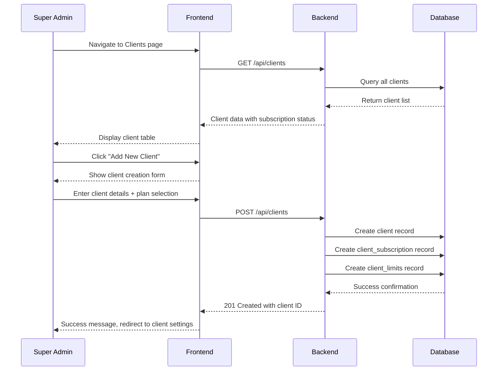
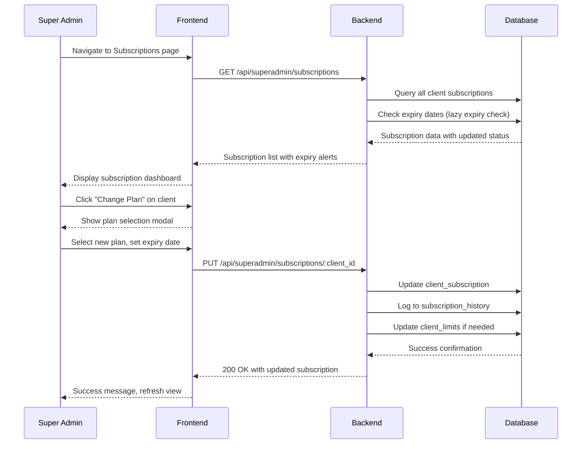
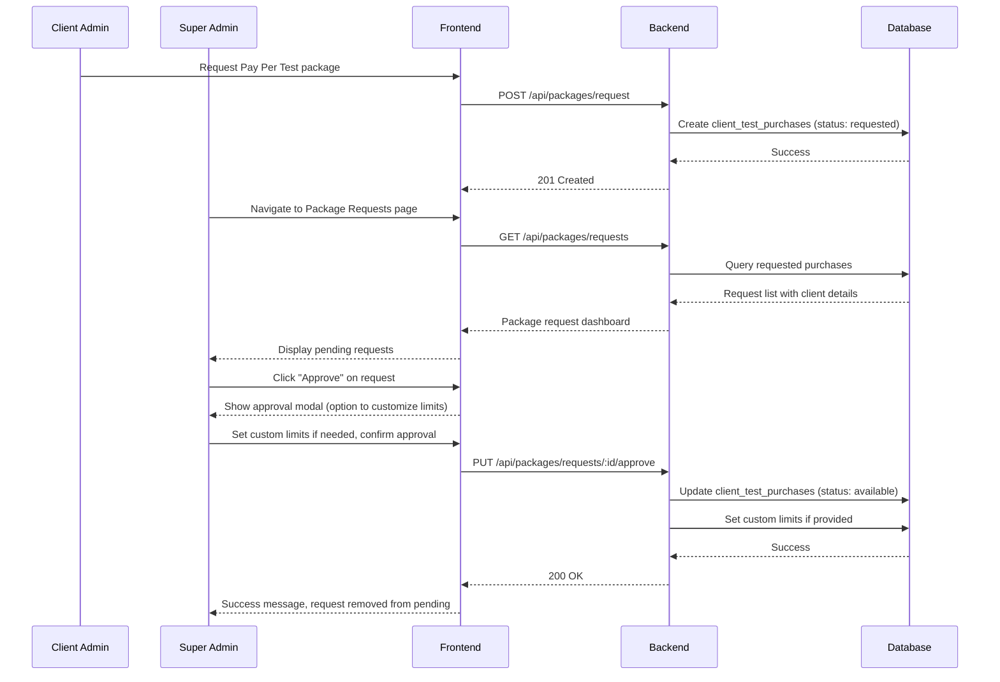
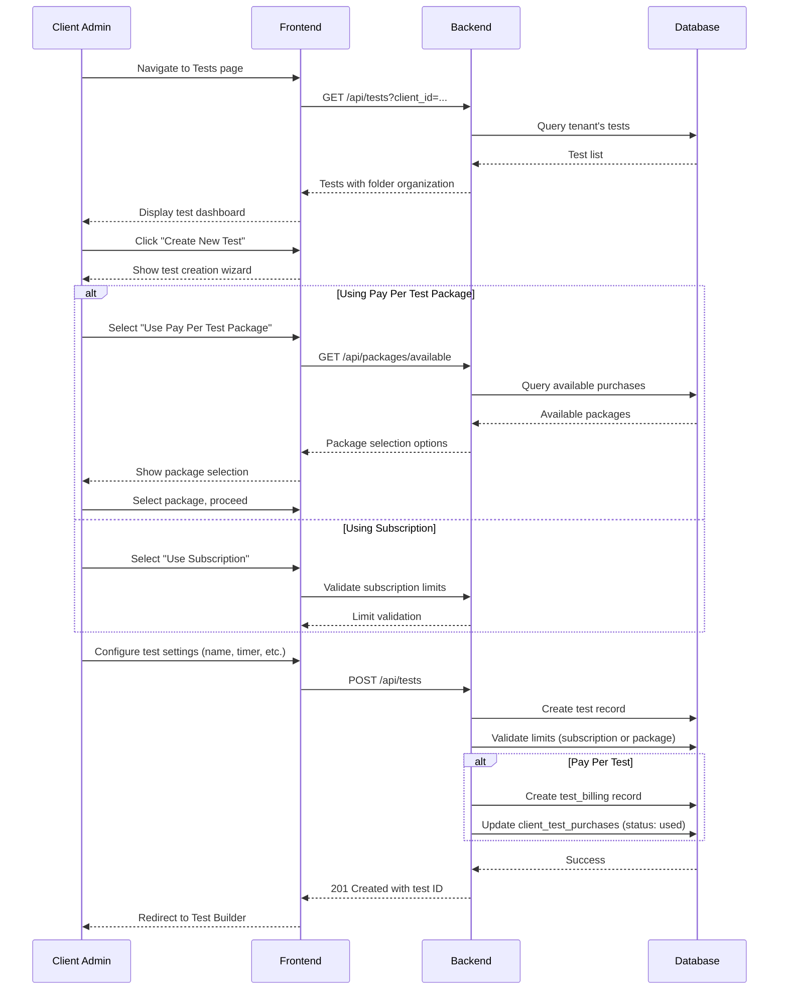
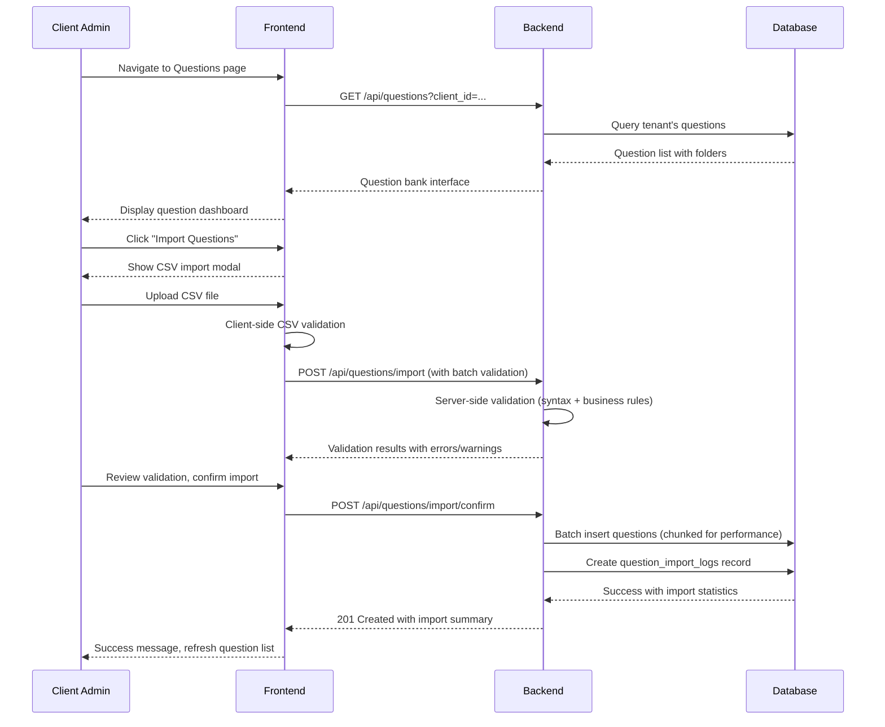
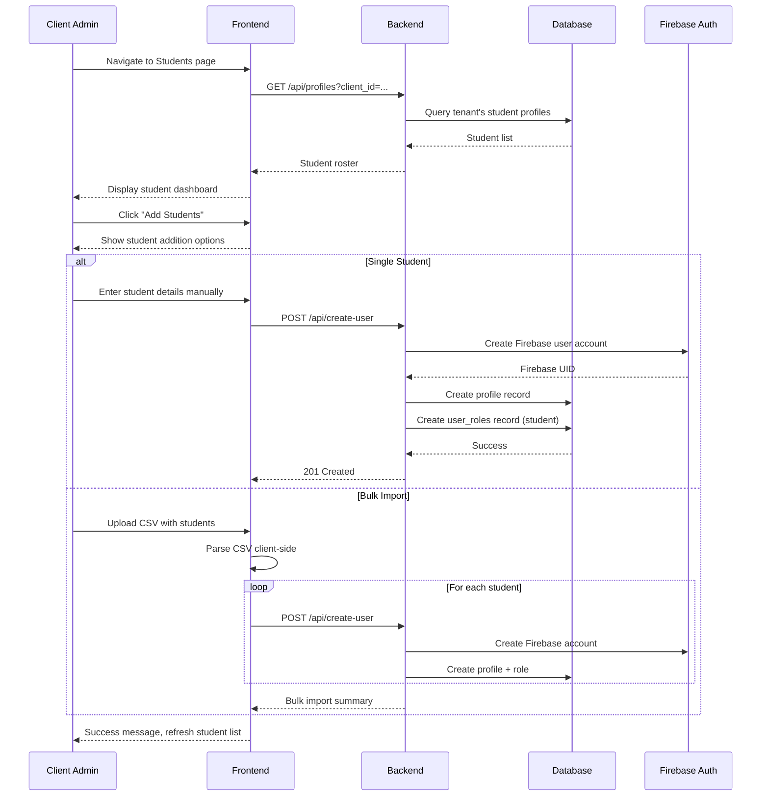
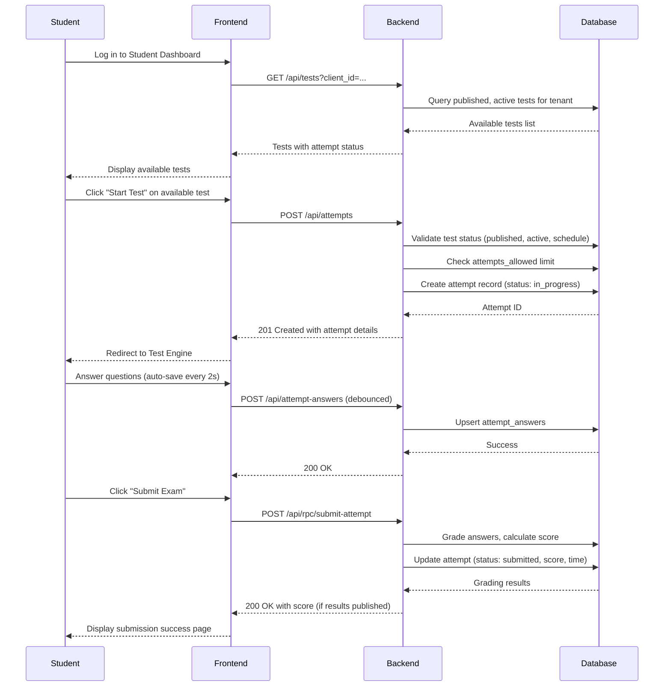
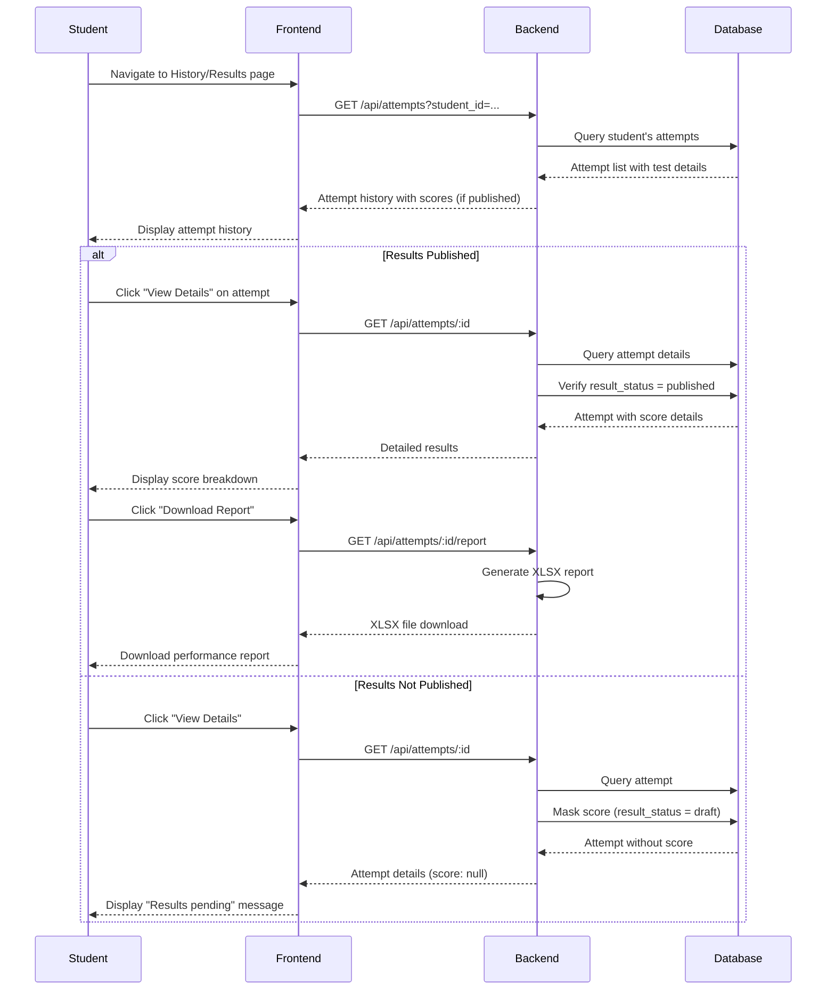
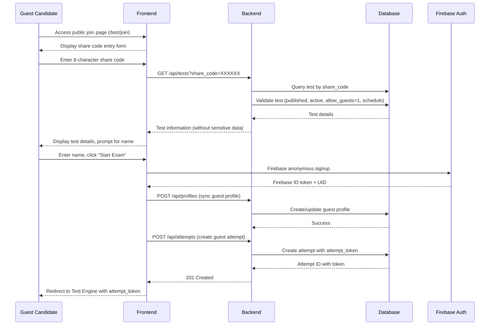
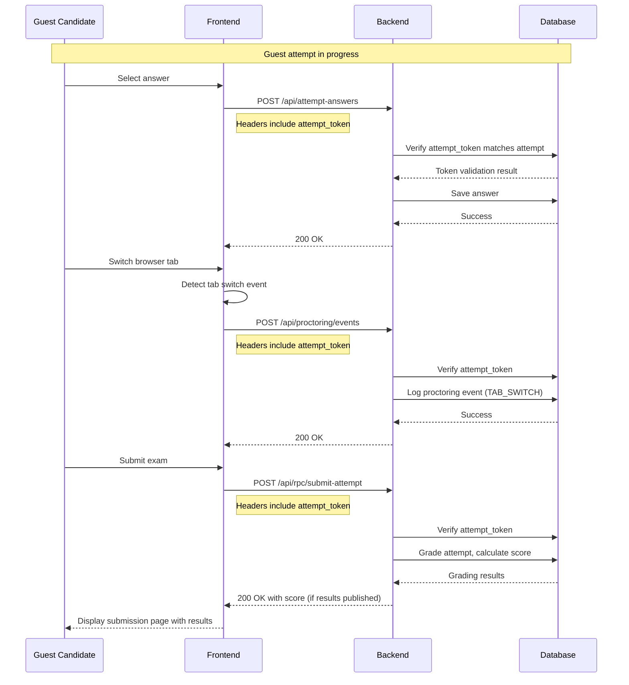

# NS Exam Portal - Features & User Flows

## Overview
This document outlines all features and user workflows in the NS Exam Portal, covering Super Admin, Client Admin, Student, and Guest User roles with detailed flow diagrams and implementation specifics.

## Role-Based Feature Matrix

### Super Admin Features
| Feature | Description | Implementation Status |
|---------|-------------|----------------------|
| **Platform Dashboard** | Overview of all clients, subscriptions, live activity | ✅ Fully Implemented |
| **Client Management** | Create, edit, suspend client organizations | ✅ Fully Implemented |
| **Subscription Administration** | Assign plans, manage expiry, track history | ✅ Fully Implemented |
| **Package Approval** | Approve/reject Pay Per Test package requests | ✅ Fully Implemented |
| **Audit Logs** | View all platform actions with filters | ✅ Fully Implemented |
| **Platform Settings** | Maintenance mode, announcements, registration controls | ✅ Fully Implemented |
| **Security Controls** | Client suspension, password reset, access management | ✅ Fully Implemented |
| **Billing Management** | Track package purchases, revenue reporting | ✅ Fully Implemented |
| **Live Monitoring** | Concurrent users, API performance, system health | ✅ Fully Implemented |

### Client Admin Features
| Feature | Description | Implementation Status |
|---------|-------------|----------------------|
| **Organization Dashboard** | Tenant-specific metrics and analytics | ✅ Fully Implemented |
| **Test Management** | Create, edit, publish, schedule, clone tests | ✅ Fully Implemented |
| **Question Bank** | Create, import, organize questions in folders | ✅ Fully Implemented |
| **Student Roster** | Manage student accounts, bulk import | ✅ Fully Implemented |
| **Analytics & Reports** | Performance metrics, XLSX report generation | ✅ Fully Implemented |
| **Subscription Management** | View current plan, request upgrades | ✅ Fully Implemented |
| **Package Selection** | Choose Pay Per Test packages for assessments | ✅ Fully Implemented |
| **Branding Controls** | Upload organization logo, customize appearance | ✅ Fully Implemented |
| **Proctoring Settings** | Configure proctoring based on plan features | ✅ Fully Implemented |

### Student Features
| Feature | Description | Implementation Status |
|---------|-------------|----------------------|
| **Student Dashboard** | View available and completed tests | ✅ Fully Implemented |
| **Exam Taking** | Complete assessments with timer and navigation | ✅ Fully Implemented |
| **Answer Management** | Select answers, mark for review, auto-save | ✅ Fully Implemented |
| **Result Review** | View scores and performance reports | ✅ Fully Implemented |
| **Attempt History** | Review past attempts and performance trends | ✅ Fully Implemented |
| **Report Download** | Download detailed XLSX performance reports | ✅ Fully Implemented |
| **Profile Management** | Update personal information | ✅ Fully Implemented |

### Guest User Features
| Feature | Description | Implementation Status |
|---------|-------------|----------------------|
| **Share Code Entry** | Enter 8-character code to join test | ✅ Fully Implemented |
| **Anonymous Authentication** | Temporary account creation without registration | ✅ Fully Implemented |
| **Exam Taking** | Complete assessment with full feature set | ✅ Fully Implemented |
| **Result Access** | View scores if enabled by test settings | ✅ Fully Implemented |
| **Report Download** | Download reports with secure token access | ✅ Fully Implemented |

## Detailed User Flows

### Super Admin Workflow

#### 1. Client Onboarding Flow


#### 2. Subscription Management Flow


#### 3. Package Approval Flow


### Client Admin Workflow

#### 1. Test Creation Flow


#### 2. Question Bank Management Flow


#### 3. Student Management Flow


### Student Workflow

#### 1. Exam Taking Flow (Registered Student)


#### 2. Result Review Flow


### Guest User Workflow

#### 1. Guest Exam Join Flow


#### 2. Guest Exam Security Flow


## Feature Implementation Details

### Test Builder Features

#### Section-Based Configuration
- **Multiple Sections**: Tests can have unlimited sections
- **Per-Section Settings**:
  - Custom duration timer (overrides test timer)
  - Negative marks override
  - Question shuffling (within section)
  - Option shuffling (within section)
  - Navigation locking (prevent return)
- **Visual Builder**: Drag-and-drop style section management
- **Question Palette**: Visual question selection and ordering

#### Question Types Support
1. **MCQ (Multiple Choice)**: Single correct answer (A-D)
2. **True/False**: Binary choice with A=True, B=False
3. **Multi-Select**: Multiple correct answers (A|B|D format)
4. **Fill in Blank**: Text input with case sensitivity option
5. **Subjective**: Essay/long answer questions
6. **Coding**: Programming questions (future enhancement)

#### Advanced Settings
- **Scheduling**: Start/end dates with timezone support
- **Attempt Limits**: Configurable attempts per student (0 = unlimited)
- **Guest Access**: Toggle guest participation
- **Result Controls**: When to show scores and allow downloads
- **Proctoring Requirements**: Camera requirement flags
- **Branding**: Organization logo display in exam

### Proctoring Implementation

#### Client-Side Detection
```javascript
// Example proctoring event detection
const proctoringEvents = {
  detectTabSwitch: () => {
    document.addEventListener('visibilitychange', () => {
      if (document.hidden) {
        logProctoringEvent('TAB_SWITCH', { duration: 1 });
      }
    });
  },
  
  detectFullscreenExit: () => {
    document.addEventListener('fullscreenchange', () => {
      if (!document.fullscreenElement) {
        logProctoringEvent('FULLSCREEN_EXIT', {});
      }
    });
  },
  
  detectCameraEvents: async (videoElement) => {
    // TensorFlow.js face detection
    const faces = await faceDetection.detect(videoElement);
    if (faces.length === 0) {
      logProctoringEvent('NO_FACE', { evidence: captureFrame(videoElement) });
    } else if (faces.length > 1) {
      logProctoringEvent('MULTIPLE_FACES', { evidence: captureFrame(videoElement) });
    }
  }
};
```

#### Server-Side Processing
- **Event Deduplication**: 30-second window for same event types
- **Risk Scoring**: Cumulative score with severity weights
- **Evidence Storage**: Base64 images → Firebase Storage
- **Auto-Submit Logic**: 15+ risk score triggers submission
- **Review Interface**: Admin dashboard for proctoring review

### Subscription & Billing Features

#### Plan Enforcement Logic
```typescript
// Example from billing.ts service
async function validateQuestionLimit(testId: string, proposedCount: number): Promise<boolean> {
  // 1. Check Pay Per Test package limits first
  const billingCheck = await db.execute({
    sql: "SELECT max_questions FROM test_billing WHERE test_id = ? LIMIT 1",
    args: [testId]
  });

  if (billingCheck.rows.length > 0) {
    const maxQs = Number(billingCheck.rows[0].max_questions);
    return proposedCount <= maxQs;
  }

  // 2. Fall back to subscription limits
  const testInfo = await db.execute({
    sql: "SELECT client_id FROM tests WHERE id = ? LIMIT 1",
    args: [testId]
  });
  if (testInfo.rows.length === 0) return true;

  const clientId = String(testInfo.rows[0].client_id);
  const plan = await getEffectivePlan(clientId);

  if (plan.max_questions_per_exam === -1) return true;
  return proposedCount <= plan.max_questions_per_exam;
}
```

#### Feature Flag System
- **Plan-Based Features**: Determined by subscription tier
- **Package-Based Features**: Determined by Pay Per Test package
- **Client Overrides**: Manual feature enable/disable per client
- **Route-Level Enforcement**: Feature checks in API routes
- **UI Gating**: Features hidden/disabled based on availability

### Analytics & Reporting

#### Dashboard Metrics
- **Super Admin**:
  - Total clients, students, questions, tests, attempts
  - Subscription plan distribution
  - Expiring soon alerts
  - Today's exam activity
  - Live load metrics (users, RPS, CPU, memory, latency)
  - Top organizations by student count

- **Client Admin**:
  - Student/question/test counts
  - Average score and pass rate
  - Top 5 performers
  - Per-test performance breakdown
  - Monthly usage vs limits

#### XLSX Report Structure
1. **Summary Sheet**:
   - Candidate details (name, email, test, date)
   - Overall score and percentage
   - Time taken vs allocated
   - Section-wise performance

2. **Detailed Questions Sheet**:
   - Question number and text
   - Options A-D
   - Chosen answer vs correct answer
   - Status (Correct/Wrong/Skipped)
   - Marks awarded
   - Explanation (if provided)

3. **Analytics Sheet**:
   - Performance graphs and charts
   - Average time per question
   - Correct answer ratio by section
   - Difficulty analysis
   - Recommendations for improvement

## Integration Points

### Firebase Integration
- **Authentication**: Email/password + anonymous auth
- **Storage**: Proctoring evidence images
- **Security**: JWT token validation
- **User Management**: Profile synchronization

### Turso Database
- **Multi-Tenant Schema**: Client-based partitioning
- **Performance Indexes**: Optimized query patterns
- **Migrations**: Runtime schema evolution
- **Backups**: Automated daily backups

### Cloudflare Pages
- **Edge Distribution**: Global CDN for frontend
- **Custom Domain**: `test.nssoftwaresolutions.in`
- **Build Optimization**: Vite production builds
- **Environment Variables**: Build-time configuration

### GCP Cloud Run
- **Containerization**: Docker-based deployment
- **Auto-scaling**: Based on request load
- **Health Checks**: Automatic monitoring
- **Logging**: Structured application logs

## Future Feature Roadmap

### Short-Term (Next Release)
1. **Email Notifications**: Test assignments, subscription updates
2. **Enhanced Proctoring**: Server-side camera validation
3. **Payment Integration**: Stripe/Razorpay for automated billing
4. **Advanced Analytics**: Predictive insights and recommendations
5. **Mobile App**: Native mobile application for students

### Medium-Term (6-12 Months)
1. **Live Proctoring**: Human proctor integration
2. **Coding Sandbox**: Programming assessment environment
3. **AI Question Generation**: Automated question creation
4. **LMS Integration**: Moodle, Canvas, Blackboard compatibility
5. **Internationalization**: Multi-language support

### Long-Term (12+ Months)
1. **Blockchain Certificates**: Immutable result verification
2. **AR/VR Assessments**: Immersive testing environments
3. **Predictive Cheating Detection**: AI-based anomaly detection
4. **Global Deployment**: Regional compliance and performance
5. **Enterprise Scalability**: Million+ concurrent user support

## Support & Troubleshooting

### Common User Issues
1. **Share Code Not Working**: Verify test is published, active, and allows guests
2. **Timer Issues**: Check browser time synchronization
3. **Submission Problems**: Ensure network connectivity, try resume option
4. **Score Not Showing**: Results may not be published by administrator
5. **Proctoring False Positives**: Review evidence, contact support if needed

### Administrator Issues
1. **Test Creation Blocked**: Check subscription limits or package availability
2. **Student Import Errors**: Verify CSV format and required columns
3. **Analytics Delays**: Data processing may take time for large datasets
4. **Subscription Expiry**: Manual renewal required for expired plans
5. **Package Capacity**: Purchase additional packages for more tests

### Technical Support
- **Email**: info.nssoftwaresolutions@gmail.com
- **Documentation**: [docs.nssoftwaresolutions.in/exam-portal](https://docs.nssoftwaresolutions.in/exam-portal)
- **Issue Tracking**: GitHub repository issues
- **Emergency Support**: Priority support for enterprise clients

## Conclusion
The NS Exam Portal provides comprehensive assessment management with robust security, flexible subscription models, and detailed analytics. The platform supports multiple user roles with tailored workflows and continues to evolve based on user feedback and technological advancements.