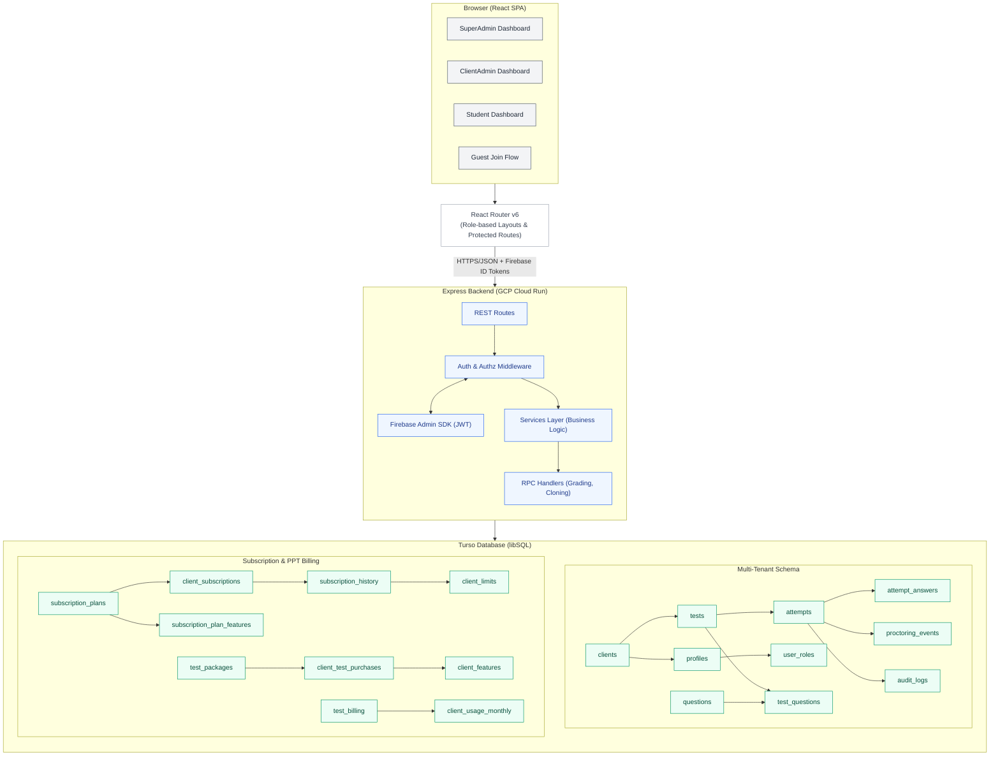

# NS Exam Portal - System Architecture

## Overview
NS Exam Portal is a production-grade multi-tenant online examination platform designed for educational institutions and corporate assessment providers. Built on a decoupled React + Express + Turso (libSQL) stack, deployed on Cloudflare Pages (frontend) and GCP Cloud Run (backend).

## System Architecture

### High-Level Architecture



### Frontend Architecture
- **Framework**: React 18 with TypeScript, Vite build tool
- **UI Components**: shadcn/ui (Radix UI primitives + Tailwind CSS)
- **Routing**: React Router v6 with role-based protected routes
- **State Management**: React Context for auth, local state for components
- **Authentication**: Firebase Authentication SDK
- **Build**: Vite with code splitting and optimized production builds
- **Deployment**: Cloudflare Pages with edge distribution

### Backend Architecture
- **Runtime**: Node.js 22, Express.js framework
- **Language**: TypeScript with ESM modules
- **Authentication**: Firebase Admin SDK for JWT verification
- **Database**: Turso (libSQL) with SQLite compatibility
- **API Design**: RESTful with RPC endpoints for specific operations
- **Rate Limiting**: Express Rate Limit with configurable tiers
- **Security**: CORS, security headers, tenant isolation
- **Deployment**: GCP Cloud Run (containerized, auto-scaling)

### Database Architecture
- **Primary Database**: Turso (serverless SQLite with edge distribution)
- **Schema**: Multi-tenant design with `client_id` partitioning
- **Relations**: Foreign key constraints with cascade/restrict
- **Indexes**: Optimized for exam workflows and dashboard queries
- **Migrations**: Runtime schema evolution with automatic migration

## Multi-Tenant Design

### Tenant Isolation Strategy
- Every database table includes a `client_id` column for tenant scoping
- All queries filter by authenticated user's `client_id` resolved from their profile
- Super Admins can query across tenants with explicit permission checks
- Guest access is scoped to specific tests via share codes, not tenant access

### Tenant Resolution Flow
```
User Request → Firebase ID Token → Extract User ID → Database Lookup → Resolve Roles
      │              │                   │                 │
      │              │                   │                 └────► User Profile + Client ID
      │              │                   │
      │              │                   └────► Auth Middleware attaches to req.user
      │              │
      └──────────────┴────► Route Handler checks permissions based on user context
```

### Data Partitioning
- **Super Admin**: No `client_id` in profile, can access all tenants
- **Client Admin**: `client_id` matches their organization, scoped queries
- **Student**: `client_id` from profile, can only access their tenant's tests
- **Guest**: Temporary `client_id` assigned from test they're accessing

## Authentication & Authorization

### Authentication Flow
1. **Firebase Authentication**: Email/password for registered users, anonymous for guests
2. **JWT Verification**: Backend validates Firebase ID tokens on every request
3. **Role Resolution**: Database lookup of `user_roles` table
4. **Tenant Context**: Resolve `client_id` from user profile

### Authorization Model
- **Role Hierarchy**: `superadmin` > `clientadmin` > `student`
- **Permission Checks**: Middleware enforces role requirements per route
- **Tenant Scoping**: All data access filtered by `client_id`
- **Guest Security**: `attempt_token` required for guest operations

### Security Features
- **Rate Limiting**: Global (1000/15min) and strict (100/1min) tiers
- **CORS**: Restricted to approved origins
- **Security Headers**: COOP, CORP headers for Firebase compatibility
- **Input Validation**: Zod schemas for all API inputs
- **SQL Injection Protection**: Parameterized queries via Turso client

## Major Modules and Workflows

### Core Modules
1. **User Management**: Profiles, roles, tenant assignment
2. **Test Management**: Creation, publishing, scheduling, cloning
3. **Question Bank**: Folders, bulk import, versioning
4. **Exam Engine**: Attempt lifecycle, answer saving, auto-submission
5. **Proctoring**: Event logging, evidence storage, risk scoring
6. **Grading**: Server-side scoring, negative marking, result publishing
7. **Analytics**: Dashboards, reports, performance metrics
8. **Subscription**: Plan management, limits enforcement, billing
9. **Pay Per Test**: Package catalog, inventory, capacity tracking
10. **Audit**: Action logging, security monitoring, compliance

### Key Workflows
1. **Test Creation**: Folder → Draft → Publish → Active
2. **Student Flow**: Join → Attempt → Answer → Submit → Results
3. **Guest Flow**: Share code → Anonymous auth → Attempt → Results
4. **Subscription Upgrade**: Request → Super Admin approval → Plan change
5. **Pay Per Test**: Package selection → Test creation → Capacity consumption
6. **Proctoring**: Event detection → Evidence capture → Risk assessment
7. **Reporting**: Attempt completion → XLSX generation → Secure download

## Deployment Architecture

### Frontend Deployment (Cloudflare Pages)
- **Build Process**: Vite production build with optimized chunks
- **CDN**: Edge distribution for global performance
- **Custom Domain**: `test.nssoftwaresolutions.in`
- **Environment Variables**: Build-time injection

### Backend Deployment (GCP Cloud Run)
- **Containerization**: Docker multi-stage build
- **Runtime**: Node.js 22 on Google Cloud Run
- **Scaling**: Automatic based on request load
- **Region**: Asia South 2 (Mumbai)
- **Environment**: Application Default Credentials for Firebase

### Database Deployment (Turso)
- **Primary Region**: Global distribution
- **Replication**: Automatic read replicas
- **Backups**: Automated daily backups
- **Monitoring**: Performance metrics and query analytics

### CI/CD Pipeline
- **Build**: GCP Cloud Build with `cloudbuild.yaml`
- **Testing**: Automated integration tests
- **Deployment**: Automatic on main branch push
- **Health Checks**: `/health` endpoint monitoring

## Performance Considerations

### Database Optimization
- **Indexes**: Strategic indexes on foreign keys and search columns
- **Query Optimization**: Batch operations, pagination support
- **Connection Pooling**: Managed by Turso client
- **Caching**: Client-side caching for static data

### API Performance
- **Rate Limiting**: Prevents abuse while allowing legitimate traffic
- **Response Caching**: Static assets served from CDN
- **Payload Optimization**: Minimal JSON responses, no over-fetching
- **Concurrent Operations**: Parallel queries where possible

### Frontend Performance
- **Code Splitting**: Route-based chunk splitting
- **Bundle Optimization**: Tree shaking, minification
- **Lazy Loading**: Heavy components loaded on demand
- **Image Optimization**: Compression, responsive sizing

## Monitoring and Observability

### Health Monitoring
- **API Health**: `/health` endpoint for uptime monitoring
- **Database Health**: Connection testing and query timeouts
- **Storage Health**: Firebase Storage availability checks

### Logging Strategy
- **Application Logs**: Console logging with structured JSON
- **Audit Logs**: Database table for security-relevant actions
- **Proctoring Logs**: Event tracking with evidence storage
- **Error Logs**: Centralized error capture with stack traces

### Metrics Collection
- **Usage Metrics**: Attempt counts, test creations, user activity
- **Performance Metrics**: API response times, database query latency
- **Business Metrics**: Subscription counts, package purchases, revenue
- **Security Metrics**: Failed auth attempts, rate limit hits

## Scalability Patterns

### Horizontal Scaling
- **Stateless Backend**: Cloud Run instances scale independently
- **Database**: Turso handles read scaling automatically
- **CDN**: Cloudflare provides edge caching

### Vertical Scaling
- **Memory Optimization**: Efficient data structures and query patterns
- **Connection Management**: Pooled database connections
- **Asset Optimization**: Compressed responses, efficient serialization

### Capacity Planning
- **Subscription Tiers**: Plan-based limits prevent over-subscription
- **Pay Per Test**: Capacity-based pricing with hard limits
- **Usage Tracking**: Monthly quotas with rollover protection
- **Alerting**: Proactive notifications for capacity thresholds

## Disaster Recovery

### Data Protection
- **Backups**: Daily automated database backups
- **Replication**: Geographic data distribution
- **Versioning**: Question versioning for audit trails

### Failover Strategy
- **Multi-region**: Turso global distribution
- **CDN Fallback**: Static assets cached at edge
- **Graceful Degradation**: Feature flags for maintenance

### Recovery Procedures
- **Database Restoration**: Point-in-time recovery from backups
- **Service Restoration**: Container redeployment from images
- **Data Validation**: Post-recovery integrity checks
