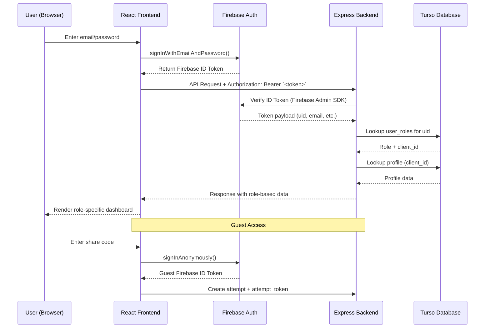

# Authentication

## Overview

The Exam Portal uses Firebase Authentication for secure, scalable user management across all roles.

## Authentication Flow



## Authentication Methods

### Email & Password

Standard email/password authentication

```bash
curl -X POST https://identitytoolkit.googleapis.com/v1/accounts:signInWithPassword \
  -H "Content-Type: application/json" \
  -d '{
    "email": "user@example.com",
    "password": "password123",
    "returnSecureToken": true
  }'
```

### Anonymous Authentication

For guest exam access

```javascript
firebase
  .auth()
  .signInAnonymously()
  .then((result) => {
    // Use result.user.uid for guest tracking
  });
```

### JWT Token Format

Firebase ID tokens are JWTs containing:

- `iss`: Issuer (Firebase project)
- `aud`: Audience (Firebase project ID)
- `auth_time`: Authentication time
- `user_id`: Firebase UID
- `sub`: Subject (same as user_id)
- `iat`: Issued at
- `exp`: Expiration (1 hour)

### Token Refresh

Tokens automatically refresh when near expiry:

```javascript
firebase.auth().onIdTokenChanged((user) => {
  if (user) {
    user.getIdToken().then((token) => {
      // Use fresh token
    });
  }
});
```

## Authorization

### Role-Based Access Control (RBAC)

**Super Admin**

- All endpoints
- Full system access
- Tenant management

**Client Admin**

- Organization-specific endpoints
- Cannot access other organizations
- Can manage users within organization

**Student**

- Can view own profile
- Can take exams
- Can view own results

**Guest**

- Limited to exam access via share code
- Anonymous identification

### Permission Matrix

| Endpoint       | Super Admin | Client Admin | Student | Guest |
| -------------- | ----------- | ------------ | ------- | ----- |
| GET /clients   | ✅          | ❌           | ❌      | ❌    |
| POST /clients  | ✅          | ❌           | ❌      | ❌    |
| GET /tests     | ✅          | ✅\*         | ✅\*    | ❌    |
| POST /tests    | ✅          | ✅\*         | ❌      | ❌    |
| POST /attempts | ✅          | ✅\*         | ✅      | ✅    |
| GET /attempts  | ✅          | ✅\*         | ✅\*    | ✅\*  |

\*Restricted to organization's own data

## Security Best Practices

### Token Handling

- Never store tokens in localStorage for sensitive operations
- Use httpOnly cookies when possible
- Always validate token expiry
- Refresh tokens proactively

### BOLA/IDOR Prevention

```typescript
// ✅ Correct: Verify user access
const userId = req.auth.uid;
const resource = await getResource(id, userId);

// ❌ Wrong: Direct access without verification
const resource = await getResource(id);
```

### Cross-Tenant Isolation

```typescript
// ✅ Correct: Always include client_id check
const tests = await db
  .select("*")
  .from("tests")
  .where("id", testId)
  .andWhere("client_id", userClientId);

// ❌ Wrong: Missing client_id validation
const tests = await db.select("*").from("tests").where("id", testId);
```

### Audit Logging

All authentication events are logged:

```json
{
  "event_type": "login",
  "user_id": "user-uuid",
  "ip_address": "192.168.1.1",
  "success": true,
  "timestamp": "2024-01-15T10:00:00Z"
}
```

## Troubleshooting

### Token Expired

```
Error: ID token has expired
Solution: Refresh token with firebase.auth().currentUser.getIdToken(true)
```

### Permission Denied

```
Error: 403 Forbidden
Solution: Check user role and permissions for the resource
```

### Invalid Token

```
Error: 401 Unauthorized
Solution: Verify token is valid and not tampered with
```

## Next Steps

- [Security & Integrity](/exam-portal/security-and-exam-integrity)
- [API Reference](/exam-portal/api-reference)
- [Error Codes](/exam-portal/error-codes)
