# Database Schema

Complete reference for the Exam Portal database structure powered by Turso (libSQL).

## Overview

The database implements a multi-tenant schema with support for comprehensive exam lifecycle management, subscription billing, Pay Per Test system, and audit tracking.

## Entity Relationship Diagram

```mermaid
erDiagram
    clients {
        TEXT id PK
        TEXT name
        TEXT address
        TEXT logo_url
        INTEGER active_status
        TEXT created_at
        TEXT updated_at
    }

    profiles {
        TEXT id PK
        TEXT name
        TEXT email
        TEXT client_id FK
        TEXT created_at
        TEXT updated_at
    }

    user_roles {
        TEXT id PK
        TEXT user_id FK
        TEXT role
        TEXT client_id FK
    }

    question_folders {
        TEXT id PK
        TEXT client_id FK
        TEXT name
        TEXT parent_id FK
        TEXT created_at
        TEXT updated_at
    }

    questions {
        TEXT id PK
        TEXT client_id FK
        TEXT folder_id FK
        TEXT question_text
        TEXT question_type
        TEXT options
        TEXT option_a
        TEXT option_b
        TEXT option_c
        TEXT option_d
        TEXT correct_answer
        TEXT correct_answers
        INTEGER marks
        REAL negative_marks
        TEXT difficulty
        TEXT explanation
        INTEGER is_case_sensitive
        TEXT import_batch_id
        INTEGER version
        TEXT created_at
        TEXT updated_at
    }

    question_import_logs {
        TEXT id PK
        TEXT uploaded_by
        TEXT uploaded_at
        TEXT import_batch_id
        INTEGER total_questions
        INTEGER imported_count
        INTEGER duplicate_count
        INTEGER failed_count
    }

    test_folders {
        TEXT id PK
        TEXT client_id FK
        TEXT name
        TEXT created_at
        TEXT updated_at
    }

    tests {
        TEXT id PK
        TEXT client_id FK
        TEXT folder_id FK
        TEXT test_name
        INTEGER timer
        INTEGER shuffle
        INTEGER allow_review
        INTEGER negative_marking
        REAL negative_marks
        INTEGER restrict_navigation
        INTEGER attempts_allowed
        TEXT status
        INTEGER active
        INTEGER allow_guests
        TEXT scheduled_start
        TEXT scheduled_end
        TEXT share_code
        INTEGER public_link_enabled
        INTEGER show_results_after_submission
        INTEGER allow_report_download
        TEXT result_status
        INTEGER camera_required
        INTEGER read_only
        TEXT created_at
        TEXT updated_at
    }

    test_sections {
        TEXT id PK
        TEXT test_id FK
        TEXT name
        INTEGER position
        INTEGER duration_minutes
        REAL negative_marks
        INTEGER shuffle_questions
        INTEGER shuffle_options
        INTEGER navigation_locked
        TEXT created_at
    }

    test_questions {
        TEXT id PK
        TEXT test_id FK
        TEXT question_id FK
        TEXT section_id FK
        INTEGER position
    }

    attempts {
        TEXT id PK
        TEXT student_id FK
        TEXT test_id FK
        REAL score
        REAL total_marks
        TEXT started_at
        TEXT submitted_at
        INTEGER time_taken
        TEXT status
        TEXT ip_address
        TEXT attempt_token
    }

    attempt_answers {
        TEXT id PK
        TEXT attempt_id FK
        TEXT question_id FK
        TEXT selected_option
        INTEGER marked_for_review
    }

    proctoring_events {
        TEXT id PK
        TEXT attempt_id FK
        TEXT test_id FK
        TEXT event_type
        TEXT severity
        INTEGER severity_score
        TEXT storage_path
        INTEGER has_evidence
        TEXT metadata
        REAL duration_seconds
        TEXT created_at
    }

    client_features {
        TEXT id PK
        TEXT client_id FK
        TEXT feature_name
        INTEGER enabled
        TEXT created_at
    }

    client_limits {
        TEXT client_id PK
        INTEGER max_exams_per_month
        INTEGER max_students_per_exam
        INTEGER max_questions_per_exam
        TEXT updated_at
    }

    client_usage_monthly {
        TEXT id PK
        TEXT client_id FK
        TEXT month
        INTEGER exams_created
        INTEGER attempts_created
        REAL storage_used_mb
        TEXT updated_at
    }

    global_settings {
        TEXT key PK
        TEXT value
        TEXT updated_at
    }

    audit_logs {
        TEXT id PK
        TEXT user_id
        TEXT action
        TEXT entity_type
        TEXT entity_id
        TEXT metadata
        TEXT created_at
    }

    subscription_plans {
        TEXT id PK
        TEXT name
        INTEGER max_exams_per_month
        INTEGER max_students_per_exam
        INTEGER max_questions_per_exam
        TEXT created_at
    }

    subscription_plan_features {
        TEXT plan_id FK
        TEXT feature_name
    }

    client_subscriptions {
        TEXT client_id PK
        TEXT plan_id FK
        TEXT start_date
        TEXT expiry_date
        TEXT status
        TEXT renewal_status
        TEXT updated_at
    }

    subscription_history {
        TEXT id PK
        TEXT client_id FK
        TEXT old_plan_id
        TEXT new_plan_id
        TEXT changed_by
        TEXT changed_at
    }

    client_subscription_requests {
        TEXT id PK
        TEXT client_id FK
        TEXT plan_id FK
        TEXT status
        TEXT requested_at
        TEXT actioned_at
    }

    test_packages {
        TEXT id PK
        TEXT name
        REAL price
        INTEGER max_questions
        INTEGER max_candidates
        INTEGER csv_import
        INTEGER xlsx_export
        INTEGER analytics
        INTEGER custom_branding
        INTEGER basic_proctoring
        INTEGER camera_proctoring
        INTEGER priority_support
        INTEGER active
    }

    client_test_purchases {
        TEXT id PK
        TEXT client_id FK
        TEXT package_id FK
        TEXT status
        TEXT purchased_at
        TEXT used_at
        TEXT assigned_test_id FK
        INTEGER custom_max_candidates
        INTEGER custom_max_questions
    }

    test_billing {
        TEXT test_id PK
        TEXT purchase_id FK
        TEXT package_id FK
        INTEGER max_questions
        INTEGER max_candidates
        INTEGER basic_proctoring
        INTEGER camera_proctoring
        TEXT status
        TEXT created_at
    }

    clients ||--o{ profiles : "has"
    clients ||--o{ user_roles : "has"
    clients ||--o{ question_folders : "owns"
    clients ||--o{ questions : "owns"
    clients ||--o{ test_folders : "owns"
    clients ||--o{ tests : "owns"
    clients ||--o{ client_test_purchases : "purchases"
    clients ||--o{ client_subscriptions : "subscribes"
    clients ||--o{ client_limits : "has"
    clients ||--o{ client_features : "overrides"
    clients ||--o{ client_usage_monthly : "tracks"
    clients ||--o{ client_subscription_requests : "requests"
    clients ||--o{ subscription_history : "history"

    profiles ||--o{ user_roles : "has"
    profiles ||--o{ attempts : "makes"

    question_folders ||--o{ question_folders : "nested"
    question_folders ||--o{ questions : "organizes"

    test_folders ||--o{ tests : "organizes"

    tests ||--o{ test_sections : "contains"
    tests ||--o{ test_questions : "includes"
    tests ||--o{ attempts : "receives"
    tests ||--|| test_billing : "billed"

    test_sections ||--o{ test_questions : "groups"

    questions ||--o{ test_questions : "linked"
    questions ||--o{ attempt_answers : "answered"

    attempts ||--o{ attempt_answers : "contains"
    attempts ||--o{ proctoring_events : "logs"

    subscription_plans ||--o{ subscription_plan_features : "includes"
    subscription_plans ||--o{ client_subscriptions : "assigned"
    subscription_plans ||--o{ client_subscription_requests : "requested"

    test_packages ||--o{ client_test_purchases : "sold"
    client_test_purchases ||--|| test_billing : "consumes"
```



The database contains the following key entity groups:

### Core Tenant Tables

- **clients**: Organization/tenant management
- **profiles**: User account information
- **user_roles**: Role assignments with multi-role support

### Question Management Tables

- **questions**: Question bank with versioning and bulk import support
- **question_folders**: Category folders for organizing questions
- **question_import_logs**: Audit trail for CSV question imports

### Test Management Tables

- **tests**: Exam configurations with comprehensive settings
- **test_folders**: Folder-based test organization
- **test_sections**: Section-based test organization with per-section configuration
- **test_questions**: Linking questions to tests with section and position

### Exam Execution Tables

- **attempts**: Student test attempts with status tracking
- **attempt_answers**: Student answers with auto-save support

### Proctoring Tables

- **proctoring_events**: Security event logging with evidence storage

### Subscription & Billing Tables

- **subscription_plans**: Predefined subscription tiers (Free, Starter, Growth, Enterprise)
- **subscription_plan_features**: Feature matrix for subscription plans
- **client_subscriptions**: Active subscription assignments
- **subscription_history**: Audit trail for plan changes
- **client_subscription_requests**: Upgrade request workflow

### Pay Per Test Tables

- **test_packages**: Assessment package catalog (₹99-₹1,499)
- **client_test_purchases**: Package inventory and consumption tracking
- **test_billing**: Links tests to consumed packages with locked limits

### Support Tables

- **client_limits**: Manual limit overrides for clients
- **client_features**: Feature flag overrides for clients
- **client_usage_monthly**: Monthly resource consumption tracking
- **global_settings**: Platform-wide configuration
- **audit_logs**: Security and compliance audit trail

## Core Tables

### Clients

Organization/tenant management.

```sql
CREATE TABLE clients (
  id TEXT PRIMARY KEY,
  name TEXT NOT NULL,
  address TEXT,
  logo_url TEXT,
  active_status INTEGER DEFAULT 1,
  created_at TEXT DEFAULT CURRENT_TIMESTAMP,
  updated_at TEXT DEFAULT CURRENT_TIMESTAMP
);
```

**Business Rules**:

- Super Admins can suspend clients by setting `active_status = 0`
- Suspended clients cannot create new tests or attempts
- Logo URL used for branding in dashboards and reports

### Profiles

User profiles linked to Firebase Authentication UIDs.

```sql
CREATE TABLE profiles (
  id TEXT PRIMARY KEY,
  name TEXT NOT NULL,
  email TEXT UNIQUE NOT NULL,
  client_id TEXT REFERENCES clients(id),
  created_at TEXT DEFAULT CURRENT_TIMESTAMP,
  updated_at TEXT DEFAULT CURRENT_TIMESTAMP
);
```

**Business Rules**:

- Super Admins have `client_id = NULL`
- Guest users have temporary profiles with `guest_` prefix emails
- Email uniqueness not enforced (Firebase handles this)

### User Roles

Role assignments with multi-role support.

```sql
CREATE TABLE user_roles (
  id TEXT PRIMARY KEY,
  user_id TEXT NOT NULL REFERENCES profiles(id),
  role TEXT NOT NULL CHECK(role IN ('superadmin', 'clientadmin', 'student')),
  client_id TEXT REFERENCES clients(id)
);
```

**Business Rules**:

- Users can have multiple roles, but system uses highest priority
- Role hierarchy: `superadmin` > `clientadmin` > `student`
- Super Admins can have `client_id = NULL`

### Question Folders

Organize questions into hierarchical folders.

```sql
CREATE TABLE question_folders (
  id TEXT PRIMARY KEY,
  client_id TEXT NOT NULL REFERENCES clients(id),
  name TEXT NOT NULL,
  parent_id TEXT REFERENCES question_folders(id),
  created_at TEXT DEFAULT CURRENT_TIMESTAMP,
  updated_at TEXT DEFAULT CURRENT_TIMESTAMP
);
```

### Questions

Question bank with versioning and bulk import support.

```sql
CREATE TABLE questions (
  id TEXT PRIMARY KEY,
  client_id TEXT NOT NULL REFERENCES clients(id),
  folder_id TEXT REFERENCES question_folders(id),
  question_text TEXT NOT NULL,
  question_type TEXT DEFAULT 'mcq',
  options TEXT DEFAULT '[]',
  option_a TEXT NOT NULL,
  option_b TEXT NOT NULL,
  option_c TEXT,
  option_d TEXT,
  correct_answer TEXT,
  correct_answers TEXT DEFAULT '[]',
  marks INTEGER DEFAULT 1,
  negative_marks REAL DEFAULT 0,
  difficulty TEXT DEFAULT 'medium',
  explanation TEXT DEFAULT '',
  is_case_sensitive INTEGER DEFAULT 0,
  import_batch_id TEXT,
  version INTEGER DEFAULT 1,
  created_at TEXT DEFAULT CURRENT_TIMESTAMP,
  updated_at TEXT DEFAULT CURRENT_TIMESTAMP
);
```

**Question Types**:

- `mcq`: Multiple choice (single correct answer A-D)
- `true_false`: True/False (A=True, B=False)
- `multi_select`: Multiple correct answers (JSON array format)
- `fill_blank`: Text input with case sensitivity option
- `subjective`: Essay/long answer
- `coding`: Programming questions (future enhancement)

**Business Rules**:

- Questions are tenant-scoped by `client_id`
- Versioning: editing copies old version, old exams keep reference
- Bulk import: `import_batch_id` allows rollback of entire imports

### Question Import Logs

Track CSV import operations.

```sql
CREATE TABLE question_import_logs (
  id TEXT PRIMARY KEY,
  uploaded_by TEXT,
  uploaded_at TEXT,
  import_batch_id TEXT,
  total_questions INTEGER,
  imported_count INTEGER,
  duplicate_count INTEGER,
  failed_count INTEGER
);
```

### Tests

Exam configurations with comprehensive settings.

```sql
CREATE TABLE tests (
  id TEXT PRIMARY KEY,
  client_id TEXT NOT NULL REFERENCES clients(id),
  folder_id TEXT REFERENCES test_folders(id),
  test_name TEXT NOT NULL,
  timer INTEGER NOT NULL,
  shuffle INTEGER DEFAULT 0,
  allow_review INTEGER DEFAULT 0,
  negative_marking INTEGER DEFAULT 0,
  negative_marks REAL DEFAULT 0,
  restrict_navigation INTEGER DEFAULT 0,
  attempts_allowed INTEGER DEFAULT 1,
  status TEXT DEFAULT 'draft',
  active INTEGER DEFAULT 1,
  allow_guests INTEGER DEFAULT 0,
  scheduled_start TEXT,
  scheduled_end TEXT,
  share_code TEXT UNIQUE,
  public_link_enabled INTEGER DEFAULT 0,
  show_results_after_submission INTEGER DEFAULT 0,
  allow_report_download INTEGER DEFAULT 0,
  result_status TEXT DEFAULT 'draft',
  camera_required INTEGER DEFAULT 0,
  read_only INTEGER DEFAULT 0,
  created_at TEXT DEFAULT CURRENT_TIMESTAMP,
  updated_at TEXT DEFAULT CURRENT_TIMESTAMP
);
```

**Business Rules**:

- Tests must be `published` and `active` for students to attempt
- Scheduled windows enforced at attempt creation
- `share_code` regenerated on clone, unique across platform
- `read_only` set when Pay Per Test capacity exhausted
- Timer is in minutes

### Test Folders

Organize tests into folders.

```sql
CREATE TABLE test_folders (
  id TEXT PRIMARY KEY,
  client_id TEXT NOT NULL REFERENCES clients(id),
  name TEXT NOT NULL,
  created_at TEXT DEFAULT CURRENT_TIMESTAMP,
  updated_at TEXT DEFAULT CURRENT_TIMESTAMP
);
```

### Test Sections

Section-based test organization with per-section configuration.

```sql
CREATE TABLE test_sections (
  id TEXT PRIMARY KEY,
  test_id TEXT NOT NULL REFERENCES tests(id),
  name TEXT NOT NULL,
  position INTEGER DEFAULT 0,
  duration_minutes INTEGER,
  negative_marks REAL DEFAULT 0,
  shuffle_questions INTEGER DEFAULT 0,
  shuffle_options INTEGER DEFAULT 0,
  navigation_locked INTEGER DEFAULT 0,
  created_at TEXT DEFAULT CURRENT_TIMESTAMP
);
```

**Business Rules**:

- Sections allow different timers per section
- Navigation lock prevents returning to completed sections
- Section negative marks override test-level setting
- Option shuffling is client-side with mapping preservation

### Test Questions

Linking questions to tests with section and position.

```sql
CREATE TABLE test_questions (
  id TEXT PRIMARY KEY,
  test_id TEXT NOT NULL REFERENCES tests(id),
  question_id TEXT NOT NULL REFERENCES questions(id),
  section_id TEXT REFERENCES test_sections(id),
  position INTEGER
);
```

### Attempts

Student test attempts.

```sql
CREATE TABLE attempts (
  id TEXT PRIMARY KEY,
  student_id TEXT NOT NULL REFERENCES profiles(id),
  test_id TEXT NOT NULL REFERENCES tests(id),
  score REAL,
  total_marks REAL,
  started_at TEXT,
  submitted_at TEXT,
  time_taken INTEGER,
  status TEXT DEFAULT 'in_progress',
  ip_address TEXT,
  attempt_token TEXT,
  created_at TEXT DEFAULT CURRENT_TIMESTAMP
);
```

**Business Rules**:

- `attempt_token` generated for guest attempts, required for access
- `started_at` and `submitted_at` track attempt duration
- Score hidden unless `show_results_after_submission = 1` AND `result_status = 'published'`
- Only one `in_progress` attempt per student per test allowed

### Attempt Answers

Student answers tracking.

```sql
CREATE TABLE attempt_answers (
  id TEXT PRIMARY KEY,
  attempt_id TEXT NOT NULL REFERENCES attempts(id),
  question_id TEXT NOT NULL REFERENCES questions(id),
  selected_option TEXT,
  marked_for_review INTEGER DEFAULT 0,
  created_at TEXT DEFAULT CURRENT_TIMESTAMP
);
```

**Business Rules**:

- UNIQUE constraint on `(attempt_id, question_id)` prevents duplicates
- Auto-save every 2 seconds with debouncing
- Answers preserved even if test becomes `read_only`

### Proctoring Events

Security event logging with evidence storage.

```sql
CREATE TABLE proctoring_events (
  id TEXT PRIMARY KEY,
  attempt_id TEXT NOT NULL REFERENCES attempts(id),
  test_id TEXT NOT NULL REFERENCES tests(id),
  event_type TEXT NOT NULL,
  severity TEXT NOT NULL,
  severity_score INTEGER DEFAULT 0,
  storage_path TEXT,
  has_evidence INTEGER DEFAULT 0,
  metadata TEXT,
  duration_seconds REAL DEFAULT 0,
  created_at TEXT DEFAULT CURRENT_TIMESTAMP
);
```

**Event Types**:

| Event Type                 | Severity | Score | Evidence Required |
| -------------------------- | -------- | ----- | ----------------- |
| `TAB_SWITCH`               | LOW      | 1     | No                |
| `WINDOW_BLUR`              | LOW      | 1     | No                |
| `FULLSCREEN_EXIT`          | MEDIUM   | 2     | No                |
| `NO_FACE`                  | MEDIUM   | 3     | Yes               |
| `MULTIPLE_FACES`           | HIGH     | 5     | Yes               |
| `CAMERA_DISCONNECTED`      | HIGH     | 5     | Yes               |
| `CAMERA_PERMISSION_DENIED` | HIGH     | 5     | No                |

**Business Rules**:

- 30-second deduplication window for repeated events
- Evidence images stored in Firebase Storage with signed URLs
- Risk score accumulated per attempt
- High-risk events can trigger auto-submission

## Subscription & Billing Tables

### Subscription Plans

Predefined subscription tiers.

```sql
CREATE TABLE subscription_plans (
  id TEXT PRIMARY KEY,
  name TEXT NOT NULL,
  description TEXT,
  monthly_price REAL,
  features TEXT,
  max_exams_per_month INTEGER DEFAULT -1,
  max_students_per_exam INTEGER DEFAULT -1,
  max_questions_per_exam INTEGER DEFAULT -1,
  created_at TEXT DEFAULT CURRENT_TIMESTAMP
);
```

**Default Plans**:

| Plan       | Price     | Exams/Month | Students/Exam | Questions/Exam |
| ---------- | --------- | ----------- | ------------- | -------------- |
| Free       | ₹0        | 3           | 20            | 50             |
| Starter    | ₹1,999/mo | 25          | 100           | 100            |
| Growth     | ₹3,999/mo | 50          | 250           | 200            |
| Enterprise | Custom    | Unlimited   | Unlimited     | Unlimited      |

### Subscription Plan Features

Feature matrix for subscription plans.

```sql
CREATE TABLE subscription_plan_features (
  plan_id TEXT REFERENCES subscription_plans(id),
  feature_name TEXT,
  PRIMARY KEY (plan_id, feature_name)
);
```

**Features**: `csv_import`, `xlsx_export`, `analytics`, `custom_branding`, `advanced_proctoring`, `camera_proctoring`

### Client Subscriptions

Active subscription assignments.

```sql
CREATE TABLE client_subscriptions (
  client_id TEXT PRIMARY KEY REFERENCES clients(id),
  plan_id TEXT NOT NULL REFERENCES subscription_plans(id),
  status TEXT DEFAULT 'active',
  start_date TEXT,
  end_date TEXT,
  renewal_status TEXT CHECK(renewal_status IN ('auto_renew', 'manual')),
  created_at TEXT DEFAULT CURRENT_TIMESTAMP,
  updated_at TEXT DEFAULT CURRENT_TIMESTAMP
);
```

**Business Rules**:

- Expiry checked on Super Admin page load (lazy expiration)
- Expired subscriptions block new test creation
- Status changes logged in `subscription_history`

### Subscription History

Audit trail for plan changes.

```sql
CREATE TABLE subscription_history (
  id TEXT PRIMARY KEY,
  client_id TEXT NOT NULL REFERENCES clients(id),
  old_plan_id TEXT REFERENCES subscription_plans(id),
  new_plan_id TEXT NOT NULL REFERENCES subscription_plans(id),
  changed_by TEXT,
  changed_at TEXT DEFAULT CURRENT_TIMESTAMP
);
```

### Client Subscription Requests

Upgrade request workflow.

```sql
CREATE TABLE client_subscription_requests (
  id TEXT PRIMARY KEY,
  client_id TEXT NOT NULL REFERENCES clients(id),
  plan_id TEXT NOT NULL REFERENCES subscription_plans(id),
  status TEXT DEFAULT 'pending',
  requested_at TEXT DEFAULT CURRENT_TIMESTAMP,
  actioned_at TEXT
);
```

## Pay Per Test Tables

### Test Packages

Assessment package catalog.

```sql
CREATE TABLE test_packages (
  id TEXT PRIMARY KEY,
  name TEXT NOT NULL,
  price REAL NOT NULL,
  max_questions INTEGER NOT NULL,
  max_candidates INTEGER NOT NULL,
  csv_import INTEGER DEFAULT 0,
  xlsx_export INTEGER DEFAULT 0,
  analytics INTEGER DEFAULT 1,
  custom_branding INTEGER DEFAULT 0,
  basic_proctoring INTEGER DEFAULT 0,
  camera_proctoring INTEGER DEFAULT 0,
  priority_support INTEGER DEFAULT 0,
  active INTEGER DEFAULT 1
);
```

**Default Packages**:

| Package         | Price  | Questions | Candidates | Features                    |
| --------------- | ------ | --------- | ---------- | --------------------------- |
| Base            | ₹99    | 50        | 50         | Analytics, Branding         |
| Basic           | ₹199   | 50        | 50         | CSV, XLSX, Basic Proctoring |
| Standard        | ₹399   | 50        | 50         | Camera Proctoring           |
| Professional    | ₹499   | 100       | 100        | All features                |
| Placement Drive | ₹1,499 | 200       | 500        | Full camera proctoring      |

### Client Test Purchases

Package inventory and consumption tracking.

```sql
CREATE TABLE client_test_purchases (
  id TEXT PRIMARY KEY,
  client_id TEXT NOT NULL REFERENCES clients(id),
  package_id TEXT NOT NULL REFERENCES test_packages(id),
  status TEXT CHECK(status IN ('requested', 'available', 'used')),
  purchased_at TEXT DEFAULT CURRENT_TIMESTAMP,
  used_at TEXT,
  assigned_test_id TEXT UNIQUE REFERENCES tests(id),
  custom_max_candidates INTEGER,
  custom_max_questions INTEGER
);
```

**Business Rules**:

- `requested`: Client requested, awaiting Super Admin approval
- `available`: Approved, available for test creation
- `used`: Assigned to a test, consumed
- One purchase can only be used for one test

### Test Billing

Links tests to consumed packages with locked limits.

```sql
CREATE TABLE test_billing (
  test_id TEXT PRIMARY KEY REFERENCES tests(id),
  purchase_id TEXT NOT NULL REFERENCES client_test_purchases(id),
  package_id TEXT NOT NULL REFERENCES test_packages(id),
  max_questions INTEGER NOT NULL,
  max_candidates INTEGER NOT NULL,
  basic_proctoring INTEGER DEFAULT 0,
  camera_proctoring INTEGER DEFAULT 0,
  status TEXT DEFAULT 'active',
  created_at TEXT DEFAULT CURRENT_TIMESTAMP
);
```

**Business Rules**:

- Limits copied from package (or custom overrides) at assignment
- `status = 'completed'` when candidate capacity exhausted
- Linked test becomes `read_only = 1` when completed

## Support Tables

### Client Limits

Manual limit overrides for clients.

```sql
CREATE TABLE client_limits (
  client_id TEXT PRIMARY KEY REFERENCES clients(id),
  max_exams_per_month INTEGER DEFAULT -1,
  max_students_per_exam INTEGER DEFAULT -1,
  max_questions_per_exam INTEGER DEFAULT -1,
  updated_at TEXT DEFAULT CURRENT_TIMESTAMP
);
```

**Business Rules**:

- Overrides subscription plan limits
- `-1` indicates unlimited
- Takes precedence over subscription limits

### Client Features

Feature flag overrides for clients.

```sql
CREATE TABLE client_features (
  id TEXT PRIMARY KEY,
  client_id TEXT NOT NULL REFERENCES clients(id),
  feature_name TEXT NOT NULL,
  enabled INTEGER DEFAULT 1,
  created_at TEXT DEFAULT CURRENT_TIMESTAMP,
  UNIQUE(client_id, feature_name)
);
```

**Business Rules**:

- Overrides subscription plan features
- Can enable features not in subscription plan

### Client Usage Monthly

Monthly resource consumption tracking.

```sql
CREATE TABLE client_usage_monthly (
  id TEXT PRIMARY KEY,
  client_id TEXT NOT NULL REFERENCES clients(id),
  month TEXT NOT NULL,
  exams_created INTEGER DEFAULT 0,
  attempts_created INTEGER DEFAULT 0,
  storage_used_mb REAL DEFAULT 0,
  updated_at TEXT DEFAULT CURRENT_TIMESTAMP,
  UNIQUE(client_id, month)
);
```

**Business Rules**:

- Used for monthly quota enforcement
- Storage tracking for proctoring evidence

### Global Settings

Platform-wide configuration.

```sql
CREATE TABLE global_settings (
  key TEXT PRIMARY KEY,
  value TEXT NOT NULL,
  updated_at TEXT DEFAULT CURRENT_TIMESTAMP
);
```

**Default Settings**: `maintenance_mode: false`, `announcement_banner: ''`, `registration_enabled: true`, `platform_logo: ''`

### Audit Logs

Security and compliance audit trail.

```sql
CREATE TABLE audit_logs (
  id TEXT PRIMARY KEY,
  user_id TEXT REFERENCES profiles(id),
  action TEXT NOT NULL,
  resource_type TEXT,
  resource_id TEXT,
  changes TEXT,
  metadata TEXT,
  ip_address TEXT,
  created_at TEXT DEFAULT CURRENT_TIMESTAMP
);
```

## Indexes

Important indexes for performance:

```sql
-- Core performance indexes
CREATE INDEX idx_user_roles_user_id ON user_roles(user_id);
CREATE INDEX idx_user_roles_client_id ON user_roles(client_id);
CREATE INDEX idx_profiles_client_id ON profiles(client_id);
CREATE INDEX idx_questions_client_id ON questions(client_id);
CREATE INDEX idx_questions_folder_id ON questions(folder_id);
CREATE INDEX idx_tests_client_id ON tests(client_id);
CREATE INDEX idx_tests_share_code ON tests(share_code);
CREATE INDEX idx_tests_folder_id ON tests(folder_id);
CREATE INDEX idx_tests_status ON tests(status);
CREATE INDEX idx_tests_scheduled_start ON tests(scheduled_start);
CREATE INDEX idx_attempts_student_id ON attempts(student_id);
CREATE INDEX idx_attempts_test_id ON attempts(test_id);
CREATE INDEX idx_attempt_answers_attempt_id ON attempt_answers(attempt_id);
CREATE INDEX idx_test_questions_test_id ON test_questions(test_id);
CREATE INDEX idx_test_questions_section_id ON test_questions(section_id);
CREATE INDEX idx_test_questions_position ON test_questions(position);
CREATE INDEX idx_test_sections_test_id ON test_sections(test_id);
CREATE INDEX idx_test_folders_client_id ON test_folders(client_id);
CREATE INDEX idx_question_folders_client_id ON question_folders(client_id);

-- Proctoring and audit indexes
CREATE INDEX idx_proctoring_attempt ON proctoring_events(attempt_id);
CREATE INDEX idx_proctoring_test ON proctoring_events(test_id);
CREATE INDEX idx_proctoring_created ON proctoring_events(created_at);
CREATE INDEX idx_attempts_student_test ON attempts(student_id, test_id);
CREATE INDEX idx_audit_logs_created ON audit_logs(created_at);
CREATE INDEX idx_audit_logs_entity ON audit_logs(entity_type, entity_id);
CREATE INDEX idx_audit_logs_user ON audit_logs(user_id);
CREATE INDEX idx_attempts_started ON attempts(started_at);

-- Subscription indexes
CREATE INDEX idx_client_subs_status ON client_subscriptions(status);
CREATE INDEX idx_client_subs_expiry ON client_subscriptions(expiry_date);
```

## Relationships

Key entity relationships:

- **Client → Profiles**: One-to-many (organizations have multiple users)
- **Client → Tests**: One-to-many (organizations create multiple exams)
- **Client → Subscriptions**: One-to-one (each client has one active subscription)
- **Client → Question Folders**: One-to-many
- **Test → Sections**: One-to-many
- **Test → Test Questions**: One-to-many through join table
- **Test → Attempts**: One-to-many (exams can have multiple student attempts)
- **Attempt → Attempt Answers**: One-to-many
- **Attempt → Proctoring Events**: One-to-many

## Multi-Tenancy Strategy

All main tables include `client_id` field ensuring:

- Complete data isolation between organizations
- Row-level security enforcement
- BOLA/IDOR protection
- Efficient multi-tenant queries

## Migrations Strategy

The system uses runtime schema evolution with automatic migrations:

1. **Additive Only**: Only adds columns/tables, never removes
2. **IF NOT EXISTS**: Safe creation of tables and columns
3. **Error Tolerance**: Duplicate column errors are caught and ignored
4. **Data Preservation**: Existing data preserved during migrations
5. **Automatic Execution**: Migrations run at server startup

**Migration Example**:

```typescript
// Adding new column to existing table
try {
  await db.execute(
    `ALTER TABLE questions ADD COLUMN question_type TEXT DEFAULT 'mcq'`,
  );
} catch (err: any) {
  if (!err.message.includes("duplicate column")) {
    console.error("Migration error:", err);
  }
}
```

## Backup & Recovery

- Turso provides automatic daily backups
- Point-in-time recovery available
- Database replication across regions
- See [Monitoring & Operations](/exam-portal/monitoring-and-operations) for details

## Next Steps

- [API Reference](/exam-portal/api-reference)
- [Architecture](/exam-portal/architecture)
- [Security Guide](/exam-portal/security-and-exam-integrity)
