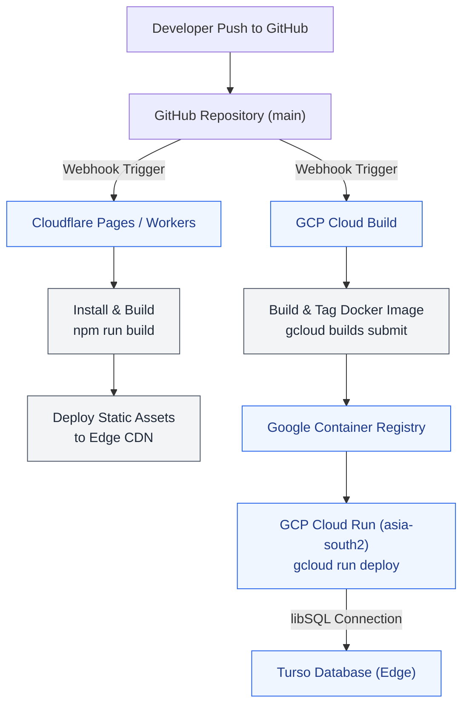

# Deployment Guide

Complete guide for deploying the Exam Portal to production.

## Deployment Architecture

The NS Exam Portal uses a modern cloud-native architecture with separate deployments for frontend and backend:

- **Frontend**: React application deployed on Cloudflare Pages
- **Backend**: Node.js API deployed on GCP Cloud Run
- **Database**: Turso (serverless SQLite) with global distribution



## Prerequisites

- GCP project with billing enabled
- Firebase project configured
- GitHub repository access
- Turso database instance
- Cloudflare account

## Backend Deployment (GCP Cloud Run)

### 1. Configure Environment Variables

Create a `.env` file with the following variables:

```
TURSO_DATABASE_URL=libsql://your-database.turso.io
TURSO_AUTH_TOKEN=your-auth-token
FIREBASE_PROJECT_ID=your-project-id
PORT=8080
```

### 2. Build and Deploy

```bash
# Build Docker image
gcloud builds submit --tag gcr.io/your-project/exam-portal-api

# Deploy to Cloud Run
gcloud run deploy exam-portal-api \
  --image gcr.io/your-project/exam-portal-api \
  --platform managed \
  --region asia-south2 \
  --allow-unauthenticated \
  --set-env-vars "TURSO_DATABASE_URL=$TURSO_DATABASE_URL,TURSO_AUTH_TOKEN=$TURSO_AUTH_TOKEN"
```

## Frontend Deployment (Cloudflare Pages)

### 1. Configure Environment Variables

In your Cloudflare Pages project, set these environment variables:

```
VITE_API_URL=https://your-api-url.run.app
VITE_FIREBASE_API_KEY=your-firebase-api-key
VITE_FIREBASE_AUTH_DOMAIN=your-project.firebaseapp.com
VITE_FIREBASE_PROJECT_ID=your-project-id
VITE_FIREBASE_APP_ID=your-app-id
```

### 2. Deploy via Git

Connect your GitHub repository to Cloudflare Pages and deploy from the main branch.

## Database Setup (Turso)

### 1. Create Database

```bash
turso db create exam-portal-db
```

### 2. Get Connection Details

```bash
turso db show exam-portal-db --url
turso db tokens create exam-portal-db
```

## Production URLs

- **Frontend**: `https://test.nssoftwaresolutions.in`
- **Backend**: `https://exam-portal-ns-479112457276.asia-south2.run.app`
- **API Documentation**: `https://docs.nssoftwaresolutions.in/exam-portal/api-reference`

## Health Checks

- **Backend Health**: `https://your-api-url.run.app/health`
- **API Info**: `https://your-api-url.run.app/`

## Monitoring

- **GCP Cloud Monitoring**: Backend performance and errors
- **Cloudflare Analytics**: Frontend traffic and performance
- **Sentry**: Error tracking and monitoring
- **Turso Dashboard**: Database performance and queries

## Troubleshooting

### Common Issues

1. **Database Connection Errors**: Verify Turso URL and auth token
2. **Firebase Authentication**: Ensure Firebase project is properly configured
3. **CORS Issues**: Check frontend URL is in backend CORS configuration
4. **Rate Limiting**: Monitor rate limit headers in API responses

### Support Resources

- [API Reference](/exam-portal/api-reference)
- [Error Codes](/exam-portal/error-codes)
- [Architecture Guide](/exam-portal/architecture)