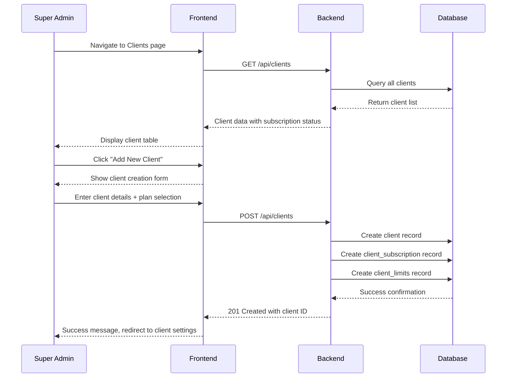
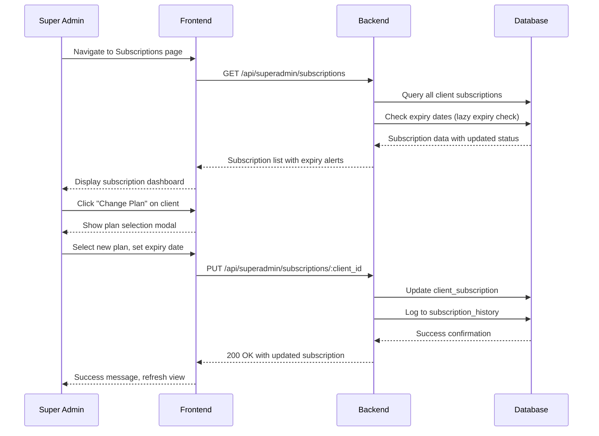
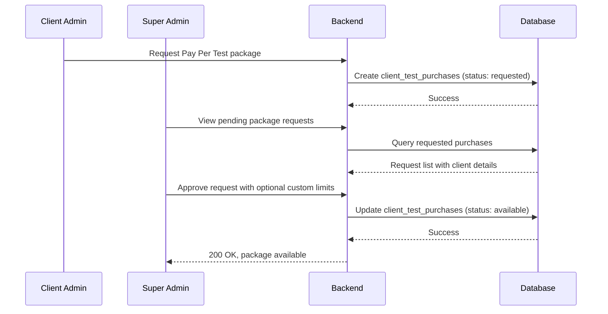
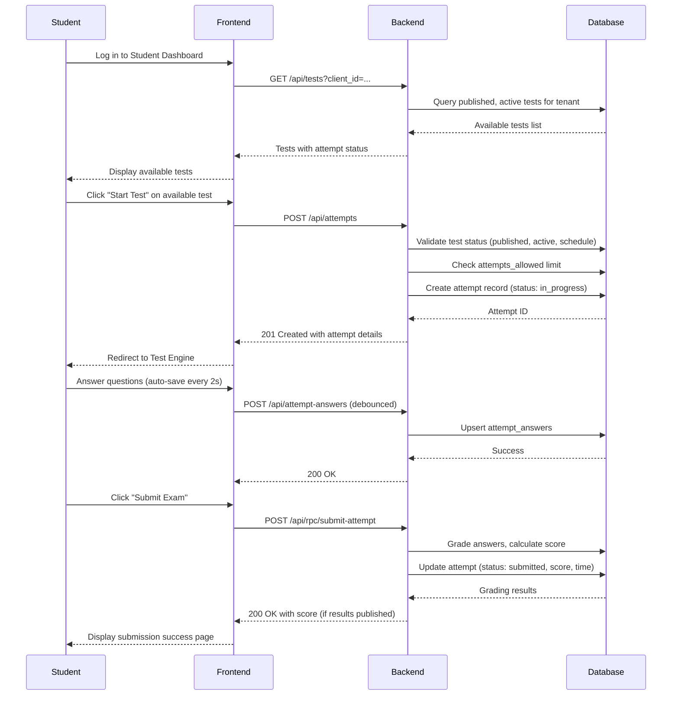
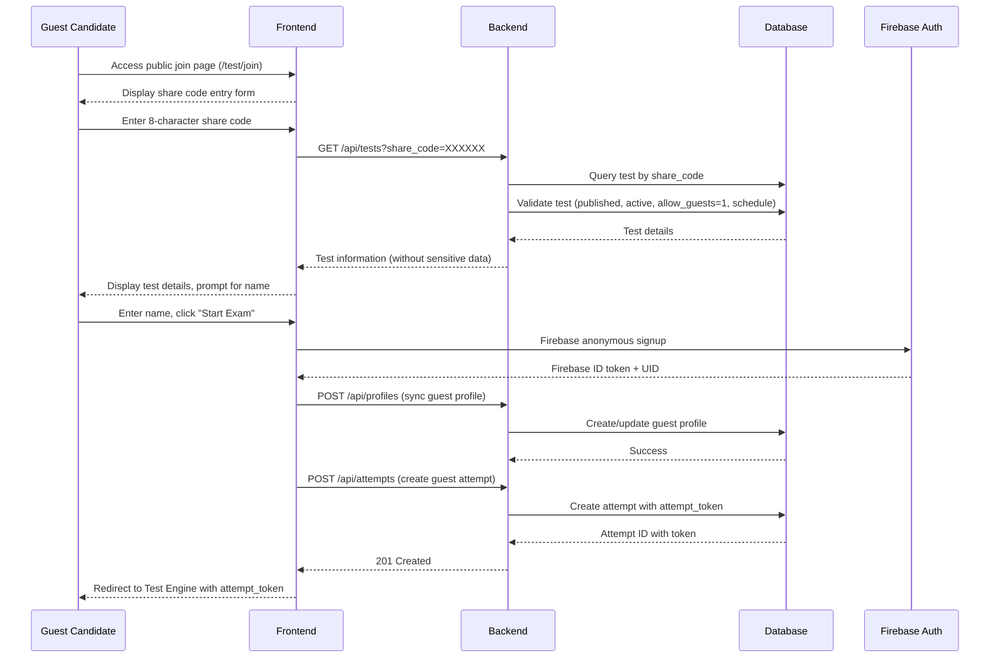

# Features & Workflows

## Overview

This document outlines all features and user workflows in the NS Exam Portal, covering Super Admin, Client Admin, Student, and Guest User roles.

## Role-Based Feature Matrix

### Super Admin Features

| Feature                         | Description                                            |
| ------------------------------- | ------------------------------------------------------ |
| **Platform Dashboard**          | Overview of all clients, subscriptions, live activity  |
| **Client Management**           | Create, edit, suspend client organizations             |
| **Subscription Administration** | Assign plans, manage expiry, track history             |
| **Package Approval**            | Approve/reject Pay Per Test package requests           |
| **Audit Logs**                  | View all platform actions with filters                 |
| **Platform Settings**           | Maintenance mode, announcements, registration controls |
| **Security Controls**           | Client suspension, password reset, access management   |
| **Billing Management**          | Track package purchases, revenue reporting             |
| **Live Monitoring**             | Concurrent users, API performance, system health       |

### Client Admin Features

| Feature                     | Description                                    |
| --------------------------- | ---------------------------------------------- |
| **Organization Dashboard**  | Tenant-specific metrics and analytics          |
| **Test Management**         | Create, edit, publish, schedule, clone tests   |
| **Question Bank**           | Create, import, organize questions in folders  |
| **Student Roster**          | Manage student accounts, bulk import           |
| **Analytics & Reports**     | Performance metrics, XLSX report generation    |
| **Subscription Management** | View current plan, request upgrades            |
| **Package Selection**       | Choose Pay Per Test packages for assessments   |
| **Branding Controls**       | Upload organization logo, customize appearance |
| **Proctoring Settings**     | Configure proctoring based on plan features    |

### Student Features

| Feature                | Description                                    |
| ---------------------- | ---------------------------------------------- |
| **Student Dashboard**  | View available and completed tests             |
| **Exam Taking**        | Complete assessments with timer and navigation |
| **Answer Management**  | Select answers, mark for review, auto-save     |
| **Result Review**      | View scores and performance reports            |
| **Attempt History**    | Review past attempts and performance trends    |
| **Report Download**    | Download detailed XLSX performance reports     |
| **Profile Management** | Update personal information                    |

### Guest User Features

| Feature                      | Description                                     |
| ---------------------------- | ----------------------------------------------- |
| **Share Code Entry**         | Enter 8-character code to join test             |
| **Anonymous Authentication** | Temporary account creation without registration |
| **Exam Taking**              | Complete assessment with full feature set       |
| **Result Access**            | View scores if enabled by test settings         |
| **Report Download**          | Download reports with secure token access       |

## Core Features

### Multi-Role System

#### Super Admin

- Tenant management
- Billing administration
- Global settings
- Audit log access
- Security configuration

#### Client Admin

- Question bank management
- Exam creation and configuration
- Student roster management
- Analytics and reporting
- Subscription management

#### Student

- Take exams
- View results
- Download reports
- Review answers
- Track progress

#### Guest Student

- Anonymous exam access
- No account required
- Access via share code
- Limited features

### Exam Management

**Exam Types:**

- Standard exams with mixed question types
- Sectioned exams with time limits per section
- Timed assessments
- Open-ended assignments

**Question Types:**

- Multiple choice (single answer)
- Multiple select (multiple answers)
- Fill in the blank
- Essay/paragraph
- True/False
- Coding (future)

**Exam Features:**

- Question shuffling
- Option shuffling
- Negative marking
- Review mode
- Partial marking
- Scheduled activation windows
- Guest access toggle with share codes

### Test Builder Features

#### Section-Based Configuration

- **Multiple Sections**: Tests can have unlimited sections
- **Per-Section Settings**:
  - Custom duration timer (overrides test timer)
  - Negative marks override
  - Question shuffling (within section)
  - Option shuffling (within section)
  - Navigation locking (prevent return)
- **Visual Builder**: Drag-and-drop style section management
- **Question Palette**: Visual question selection and ordering

#### Advanced Settings

- **Scheduling**: Start/end dates with timezone support
- **Attempt Limits**: Configurable attempts per student (0 = unlimited)
- **Guest Access**: Toggle guest participation with share code
- **Result Controls**: When to show scores and allow downloads
- **Proctoring Requirements**: Camera requirement flags
- **Branding**: Organization logo display in exam

### Proctoring

**Monitoring Options:**

- Camera-based proctoring
- Screen recording
- Continuous photo capture
- Tab switching detection
- Copy-paste prevention

**Event Tracking:**
| Event Type | Severity | Score |
|---|---|---|
| `TAB_SWITCH` | LOW | 1 |
| `WINDOW_BLUR` | LOW | 1 |
| `FULLSCREEN_EXIT` | MEDIUM | 2 |
| `NO_FACE` | MEDIUM | 3 |
| `MULTIPLE_FACES` | HIGH | 5 |
| `CAMERA_DISCONNECTED` | HIGH | 5 |
| `CAMERA_PERMISSION_DENIED` | HIGH | 5 |

**Implementation Details:**

- Client-side event detection with deduplication (30-second window)
- Server-side processing with severity scoring
- Evidence capture (Base64 images → Firebase Storage)
- 3-strike auto-submit system (15+ risk score)
- Feature gating via subscription plans

### Subscription & Billing

**Plan Types:**

| Plan       | Price     | Exams/Month | Students/Exam | Questions/Exam |
| ---------- | --------- | ----------- | ------------- | -------------- |
| Free       | ₹0        | 3           | 20            | 50             |
| Starter    | ₹1,999/mo | 25          | 100           | 100            |
| Growth     | ₹3,999/mo | 50          | 250           | 200            |
| Enterprise | Custom    | Unlimited   | Unlimited     | Unlimited      |

**Pay Per Test Packages:**

| Package         | Price  | Questions | Candidates | Key Features                |
| --------------- | ------ | --------- | ---------- | --------------------------- |
| Base            | ₹99    | 50        | 50         | Analytics, Branding         |
| Basic           | ₹199   | 50        | 50         | CSV, XLSX, Basic Proctoring |
| Standard        | ₹399   | 50        | 50         | Camera Proctoring           |
| Professional    | ₹499   | 100       | 100        | All features                |
| Placement Drive | ₹1,499 | 200       | 500        | Full camera proctoring      |

**Billing Features:**

- Monthly recurring charges (subscriptions)
- Pay-per-test credits (PPT)
- Usage tracking with monthly quotas
- Feature-based plan enforcement
- Override capabilities for Super Admin

### Analytics & Reporting

**Super Admin Dashboard:**

- Total clients, students, questions, tests, attempts
- Subscription plan distribution
- Expiring soon alerts
- Today's exam activity and proctoring events
- Top orgs by student count
- Live load metrics (concurrent users, RPS, CPU, memory, API latency)

**Client Admin Dashboard:**

- Student/question/test counts
- Average score and pass rate
- Top 5 performers
- Per-test performance breakdown
- Monthly usage vs limits

**XLSX Report Structure (3 sheets):**

1. **Summary Sheet**: Candidate details, overall score, time taken, section-wise performance
2. **Detailed Questions Sheet**: Question text, options, chosen/correct answer, status, marks
3. **Analytics Sheet**: Performance graphs, time per question, correct ratio, difficulty analysis

## User Workflows

### Super Admin: Client Onboarding Flow



### Super Admin: Subscription Management Flow



### Super Admin: Package Approval Flow



### Student: Exam Taking Flow



### Guest: Exam Join Flow



### Super Admin: Client Onboarding Flow

```
1. Navigate to Clients page (GET /api/clients)
2. Click "Add New Client"
3. Enter client details + plan selection
4. System creates:
   - Client record in clients table
   - Subscription record in client_subscriptions
   - Limits record in client_limits
5. Client appears in dashboard with subscription status
```

### Super Admin: Subscription Management Flow

```
1. Navigate to Subscriptions page
2. View all client subscriptions with expiry status
   (lazy expiry checking occurs on page load)
3. Click "Change Plan" on a client
4. Select new plan, set expiry date
5. System:
   - Updates client_subscription record
   - Logs change to subscription_history
   - Updates client_limits if needed
```

### Super Admin: Package Approval Flow

```
1. Client Admin requests Pay Per Test package (status: requested)
2. Super Admin views pending requests
3. Reviews request details (package type, pricing)
4. Approves with optional custom limit overrides
5. Package becomes available for test creation (status: available)
```

### Client Admin: Test Creation Flow

```
1. Navigate to Tests page
2. Click "Create New Test"
3. Choose billing method:
   - Pay Per Test Package (select from available inventory)
   - Subscription (validates plan limits)
4. Configure test settings (name, timer, shuffle, etc.)
5. For PPT: System creates test_billing record, marks purchase as used
6. Test created in draft status ready for builder
```

### Client Admin: Question Import Flow

```
1. Prepare CSV file with required columns
2. Navigate to question bank, click "Import"
3. Upload CSV file (POST /api/questions/import)
4. System performs two-stage validation:
   - Stage 1: Syntax and format validation
   - Stage 2: Business rules validation
5. Review validation results with errors/warnings
6. Confirm import (batch insert with rollback capability)
7. Questions added to bank with import_batch_id
```

### Client Admin: Student Management Flow

```
1. Navigate to Students page
2. Options for adding students:
   - Single: Enter details manually, system creates Firebase + Turso profile
   - Bulk: Upload CSV, system processes each student
3. For each student:
   - Create Firebase Auth account
   - Create profile in profiles table
   - Assign role in user_roles table
```

### Student: Exam Taking Flow

```
1. Log in to Student Dashboard
2. View available tests (published, active, in schedule window)
3. Click "Start Test" on available test
4. System creates attempt (status: in_progress)
5. Answer questions with auto-save (2-second debounce)
6. Section timer management with auto-advance
7. Click "Submit Exam" (POST /api/rpc/submit-attempt)
8. System grades answers server-side:
   - Compares answers to correct_answer/correct_answers
   - Applies negative marking if configured
   - Score floored at 0 (cannot go negative)
9. Results displayed if published (show_results_after_submission = 1)
```

### Student: Result Review Flow

```
1. Navigate to History page
2. View attempt list with scores (if published)
3. Click on attempt to see detailed results (score, marks)
4. Download XLSX performance report if allowed
5. Score masked until result_status = published
```

### Guest: Exam Join Flow

```
1. Access public join page (/test/join)
2. Enter 8-character share code
3. System validates:
   - Test is published and active
   - allow_guests = 1
   - Within scheduled window
4. Enter name, click "Start Exam"
5. System performs Firebase anonymous signup
6. Creates/updates guest profile
7. Creates attempt with attempt_token
8. Redirected to Test Engine
   - All operations require attempt_token in headers/query
```

### Guest: Exam Security Flow

```
1. All guest API requests include attempt_token
2. For each operation, server validates:
   - attempt_token matches attempt record
   - Guest has ownership of the attempt
3. Proctoring events logged with attempt_token validation
4. Submission requires attempt_token verification
5. Report download requires attempt_token
```

## Proctoring Implementation

### Client-Side Detection

```javascript
const proctoringEvents = {
  detectTabSwitch: () => {
    document.addEventListener("visibilitychange", () => {
      if (document.hidden) {
        logProctoringEvent("TAB_SWITCH", { duration: 1 });
      }
    });
  },

  detectFullscreenExit: () => {
    document.addEventListener("fullscreenchange", () => {
      if (!document.fullscreenElement) {
        logProctoringEvent("FULLSCREEN_EXIT", {});
      }
    });
  },

  detectCameraEvents: async (videoElement) => {
    const faces = await faceDetection.detect(videoElement);
    if (faces.length === 0) {
      logProctoringEvent("NO_FACE", { evidence: captureFrame(videoElement) });
    } else if (faces.length > 1) {
      logProctoringEvent("MULTIPLE_FACES", {
        evidence: captureFrame(videoElement),
      });
    }
  },
};
```

### Server-Side Processing

- **Event Deduplication**: 30-second window for same event types
- **Risk Scoring**: Cumulative score with severity weights
- **Evidence Storage**: Base64 images → Firebase Storage with signed URLs (15-min expiry)
- **Auto-Submit Logic**: 15+ risk score triggers submission (3-strike system)
- **Feature Gating**: Basic events require `advanced_proctoring`, camera requires `camera_proctoring`

## Subscription Enforcement Logic

```typescript
// Example from billing service
async function validateQuestionLimit(
  testId: string,
  proposedCount: number,
): Promise<boolean> {
  // 1. Check Pay Per Test package limits first
  const billingCheck = await db.execute({
    sql: "SELECT max_questions FROM test_billing WHERE test_id = ? LIMIT 1",
    args: [testId],
  });

  if (billingCheck.rows.length > 0) {
    const maxQs = Number(billingCheck.rows[0].max_questions);
    return proposedCount <= maxQs;
  }

  // 2. Fall back to subscription limits
  const testInfo = await db.execute({
    sql: "SELECT client_id FROM tests WHERE id = ? LIMIT 1",
    args: [testId],
  });
  if (testInfo.rows.length === 0) return true;

  const clientId = String(testInfo.rows[0].client_id);
  // Check client_limits override and subscription plan limits
  // ...
  return true;
}
```

## Integration Points

### Firebase Integration

- **Authentication**: Email/password + anonymous auth for guests
- **Storage**: Proctoring evidence images
- **Security**: JWT token validation with Admin SDK
- **User Management**: Profile synchronization

### Turso Database

- **Multi-Tenant Schema**: Client-based partitioning via `client_id`
- **Performance Indexes**: Optimized query patterns
- **Migrations**: Runtime schema evolution with automatic migration
- **Backups**: Automated daily backups

### Cloudflare Pages

- **Edge Distribution**: Global CDN for frontend
- **Custom Domain**: `test.nssoftwaresolutions.in`
- **Build Optimization**: Vite production builds with code splitting

### GCP Cloud Run

- **Containerization**: Docker-based deployment
- **Auto-scaling**: Based on request load
- **Health Checks**: Automatic monitoring via /health endpoint
- **Logging**: Structured application logs

## Next Steps

- [API Reference](/exam-portal/api-reference)
- [Security & Integrity](/exam-portal/security-and-exam-integrity)
- [Monitoring](/exam-portal/monitoring-and-operations)
