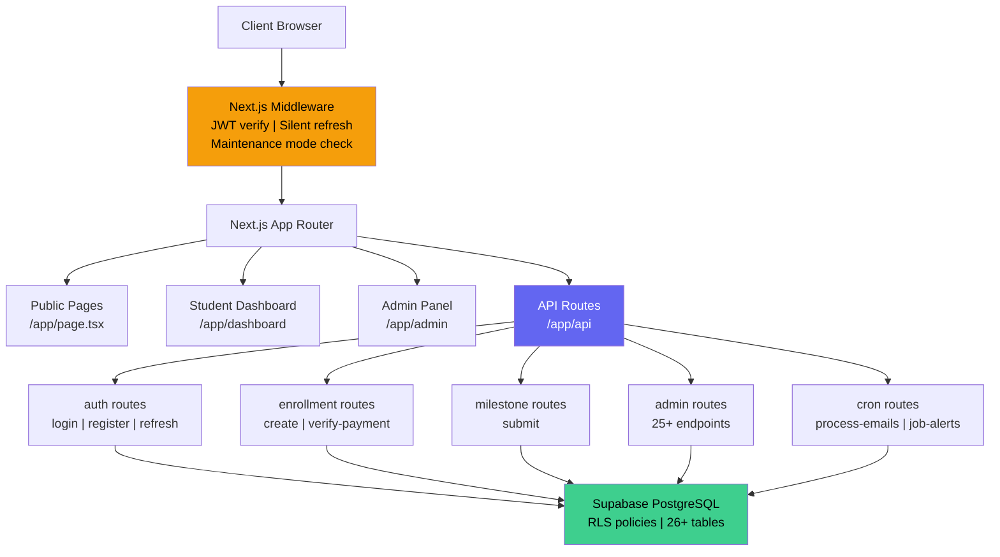
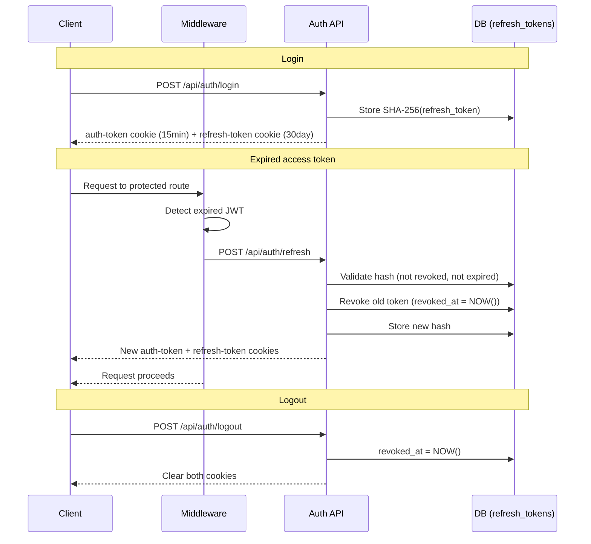
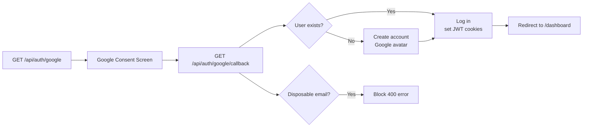
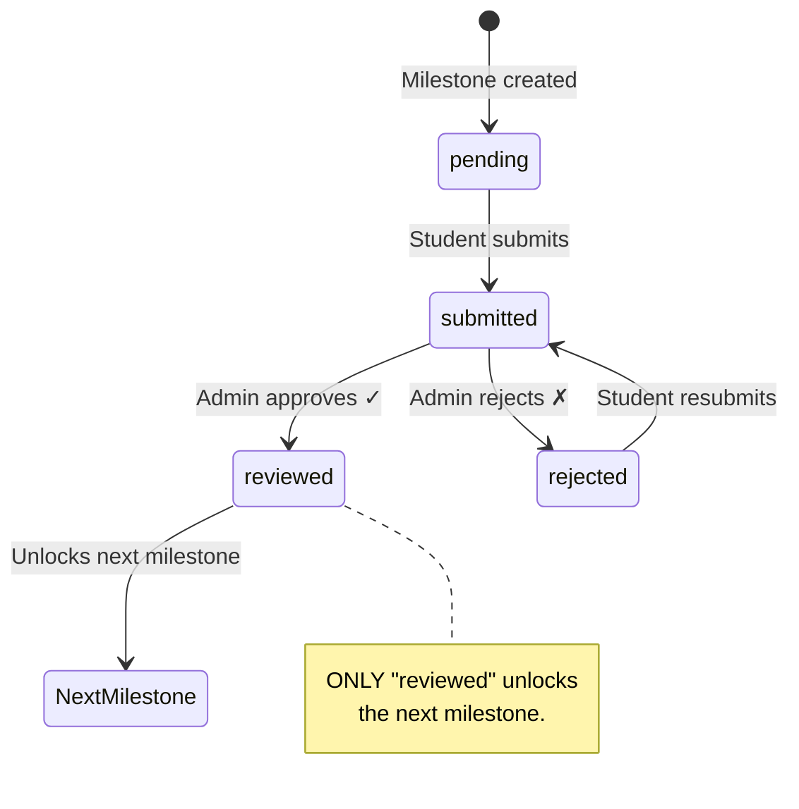
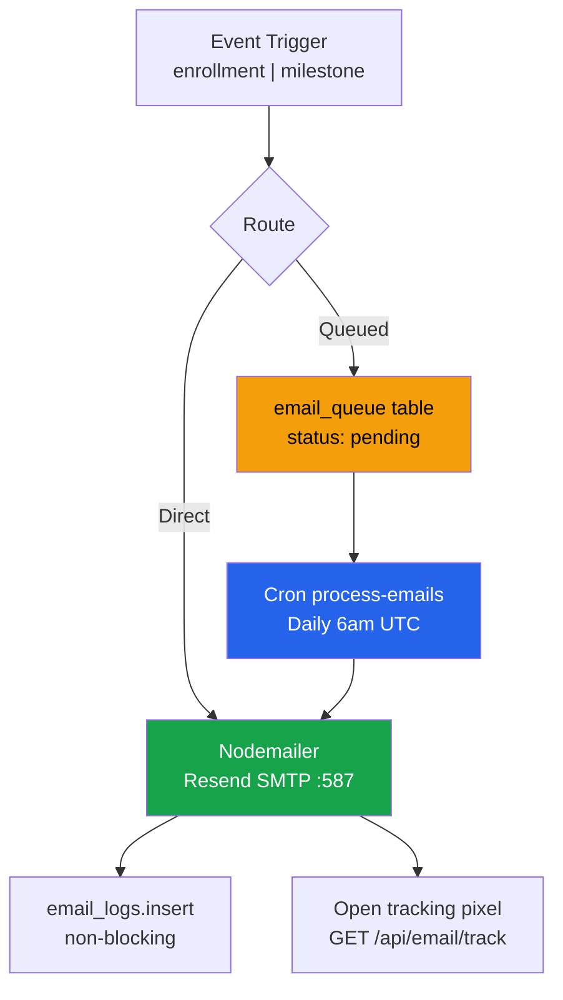
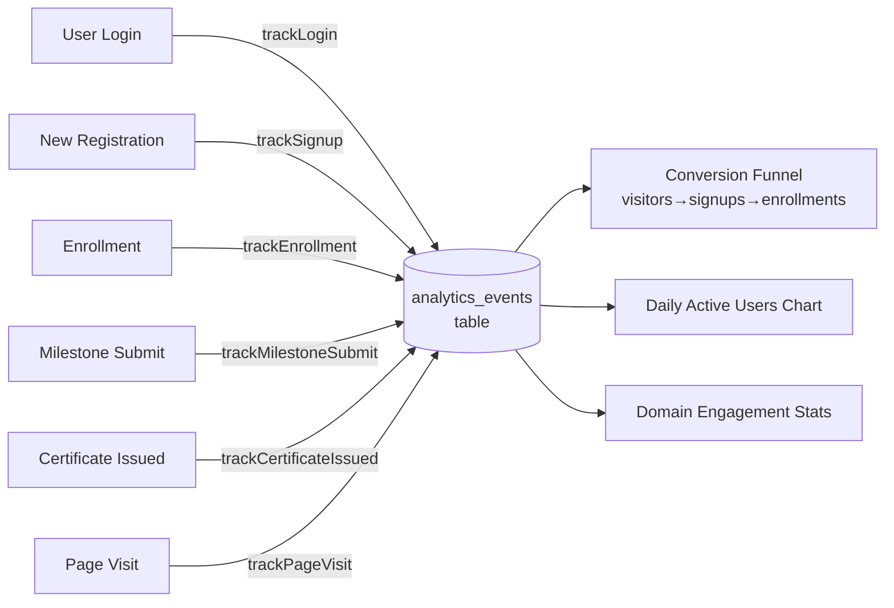
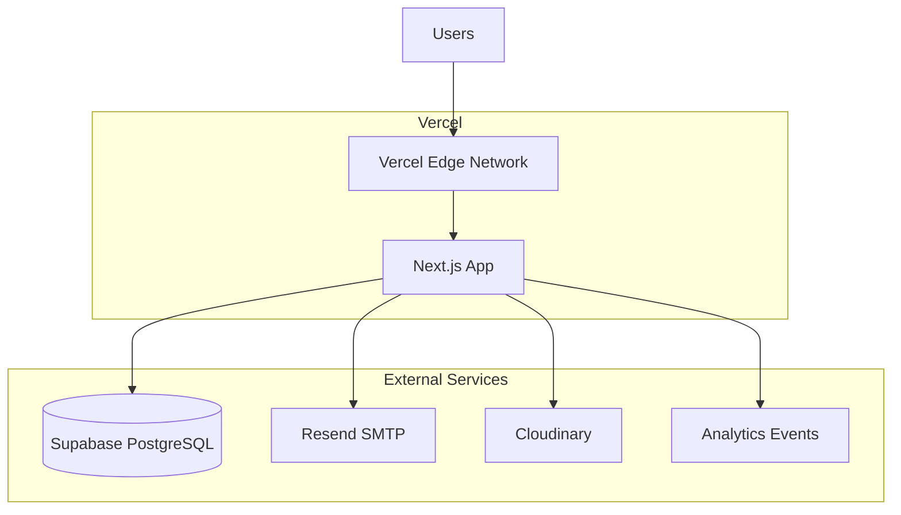
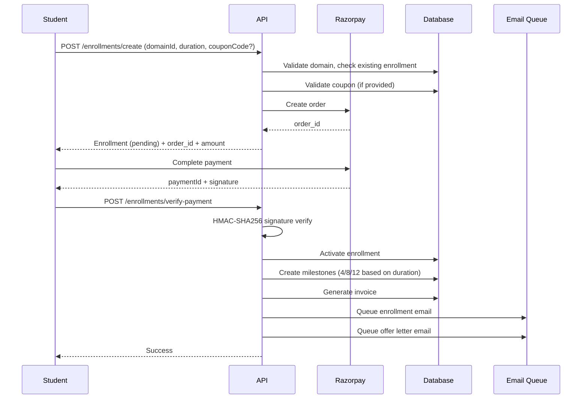
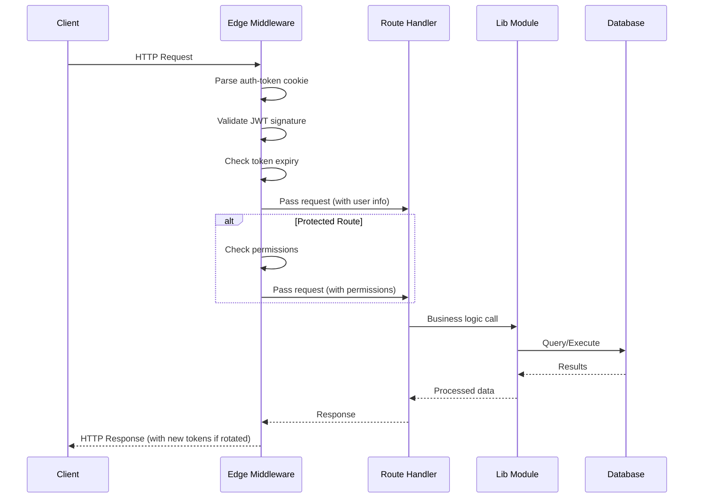

# System Architecture

Detailed technical architecture of the NS Internship Portal.

## High-Level Architecture



## Technology Stack

| Layer | Technology | Version | Purpose |
|-------|------------|---------|---------|
| **Frontend** | Next.js | 14.x | App Router, server-side rendering |
| **UI Framework** | React | 18.x | Component library |
| **Language** | TypeScript | 5.x | Type safety |
| **Styling** | Tailwind CSS | 3.x | Utility-first CSS |
| **Database** | Supabase | PostgreSQL | Core data storage |
| **Auth** | JWT | jose 6.2.1 | Token-based authentication |
| **Payment** | Razorpay | 2.9.2 | Payment processing |
| **Email** | Resend SMTP | Nodemailer | Transactional emails |
| **File Storage** | Cloudinary | - | Video, PDF, documents |
| **PDF** | PDFKit | 0.14.0 | Certificate/invoice generation |
| **Video** | Jitsi Meet | JAAS | Webinar platform |
| **Testing** | Playwright | 1.x | E2E testing |
| **Deployment** | Vercel | - | Hosting + serverless |

## Authentication System

### JWT Refresh Token Flow



### Token Storage

- **auth-token cookie:** HttpOnly, SameSite=Strict, 15min expiry
- **refresh-token cookie:** HttpOnly, SameSite=Strict, 30 days expiry
- **Storage:** Refresh token stored as SHA-256 hash in `refresh_tokens` table
- **Rotation:** New refresh token issued on each use

### Google OAuth Flow



## Milestone System

### Sequential Logic

Only `reviewed` (approved) unlocks the next milestone.



### Status Enforcement (3 layers)

1. **Client-side:** `lib/milestoneHelpers.ts` — `canSubmitMilestone()`
2. **Server-side API:** `lib/enrollmentStatus.ts` — `canSubmitMilestone()`
3. **Database:** `lib/milestones.ts` — `submitMilestone()`

### Milestone Structure

| Duration | Weekly | Major | Total |
|----------|--------|-------|-------|
| 1 Month | 3 | 1 | 4 |
| 2 Months | 6 | 2 | 8 |
| 3 Months | 9 | 3 | 12 |

**Progress Calculation:** `progress = (reviewed_count / total_count) × 100`

## Email System

### Architecture



### Email Templates (14 total)

| Template | Type | Trigger |
|----------|------|---------|
| Enrollment | enrollment | Payment verified |
| Certificate | certificate | Admin approves submission |
| Submission | submission | Student submits final project |
| Password Reset | password_reset | Forgot password |
| Milestone Reviewed | milestone_reviewed | Admin approves/rejects |
| Announcement | announcement | Admin creates with email=true |
| Deadline Reminder | deadline_reminder | 24h before milestone due |
| Offer Letter | offer_letter | Payment verified |
| Job Alert | job_alert | Weekly domain-matched jobs |
| Welcome | welcome | Lead converted to user |
| Inactive Student | inactive_student | 7+ days inactive |
| Newsletter Welcome | newsletter_welcome | Newsletter signup |
| Webinar Confirmation | webinar_confirmation | Webinar registration |
| Submission Confirmation | submission | Final project submission |

### Email Queue System

- **Storage:** `email_queue` table with status: pending → processing → sent/failed
- **Scheduling:** `/api/cron/process-emails` runs daily at 6am UTC
- **Retry:** Automatic retry on failure (max 3 attempts)
- **Tracking:** 1×1 pixel at `GET /api/email/track?id=<queueId>`
- **Admin:** View queue, cancel pending, retry failed

## Analytics System

### Event Tracking



### Event Types

| Event Type | Trigger |
|------------|---------|
| login | User logs in (also updates `last_login`) |
| signup | New user registers |
| enrollment | Student enrolls in a domain |
| milestone_submit | Student submits a milestone |
| certificate_issued | Certificate is issued |
| page_visit | Anonymous page visit |

### In-Memory Cache

A singleton `MemoryCache` class with TTL support:
- `cache.get(key)` — returns null if expired
- `cache.set(key, data, ttl)` — TTL in milliseconds (default 60s)
- `withCache(key, fn, ttl)` — async wrapper for cache-aside pattern
- Auto-cleanup of expired entries every 5 minutes

## Project Structure

```
ns-internship-portal/
├── app/
│   ├── admin/                    # Admin dashboard + jobs page
│   ├── api/
│   │   ├── admin/                # 25+ admin endpoints
│   │   ├── auth/                 # Auth: login, register, refresh, logout, google
│   │   ├── enrollments/          # Create, verify-payment, submit, cancel
│   │   ├── milestones/[id]/submit/  # Submit or resubmit
│   │   ├── cron/                 # 4 scheduled cron jobs
│   │   └── ...                   # 57+ total endpoints
│   ├── dashboard/                # Student dashboard (SPA)
│   ├── certificate/[id]/         # Public shareable certificate page
│   └── ...                       # Public pages
├── components/
│   ├── admin/                    # 19 admin tab/panel components
│   ├── chatbot/                  # Lead capture chatbot components
│   ├── newsletter/               # NewsletterSignup component
│   └── dashboard/                # Student dashboard components
├── hooks/
│   ├── useAnnouncements.ts       # Announcement state management
│   ├── usePermissions.ts         # Client-side permission checks
│   └── useToast.ts               # Toast notification state
├── lib/
│   ├── auth.ts                   # JWT token generation
│   ├── authClient.ts             # Client-side auth helpers
│   ├── email.ts                  # 12 email templates
│   ├── emailQueue.ts             # Email queue management
│   ├── milestones.ts             # Milestone logic
│   ├── analytics.ts              # Event tracking
│   └── ...                       # 25+ utility modules
├── middleware.ts                 # Edge auth + silent refresh + maintenance mode
├── supabase/migrations/          # 20+ SQL migration files
└── vercel.json                   # Cron: 4 jobs
```

## Security Controls

| Control | Implementation |
|---------|---------------|
| Password hashing | bcrypt, 10 rounds |
| Access tokens | JWT via jose, 15min expiry |
| Refresh tokens | SHA-256 hashed, DB-stored, rotated on use, revoked on logout |
| Cookie security | HttpOnly, SameSite=Strict, Secure in production |
| Rate limiting | Supabase-backed (survives restarts) |
| Input validation | All endpoints, sanitization applied |
| File upload security | Type + size validation via `lib/fileValidation.ts` |
| SQL injection | Parameterized queries via Supabase |
| IDOR prevention | Ownership checks on milestones/enrollments |
| Permission checks | 28 granular permissions, role hierarchy |
| Razorpay verification | HMAC-SHA256 signature |
| Cron protection | CRON_SECRET header required |
| Certificate expiry | 410 Gone at `/api/certificates/verify/[id]` |
| Admin audit trail | IP + user agent, 28 action types |
| Disposable email block | 16+ domains blocked on register + Google OAuth |
| Google OAuth | State parameter, code exchange, profile fetch |

## Deployment Architecture



### Vercel Cron Jobs

| Cron | Schedule | Purpose |
|------|----------|---------|
| `/api/cron/process-emails` | Daily 6am UTC | Process email queue |
| `/api/cron/inactive-students` | Daily 9am UTC | Re-engagement emails |
| `/api/cron/deadline-reminders` | Daily 8am UTC | 24h milestone reminders |
| `/api/cron/job-alerts` | Monday 9am UTC | Weekly job digest |

## Data Flow Diagrams

### Enrollment Flow



### API Request Flow



## Scaling Considerations

### Database Scaling

- Supabase provides automatic scaling
- Add read replicas for high traffic
- Use connection pooling
- Optimize queries with indexes

### Caching Strategy

- **In-memory:** Analytics queries (60s TTL)
- **CDN:** Static assets (Next.js automatic)
- **Browser:** SWR for data fetching

### Horizontal Scaling

- Next.js API routes scale automatically on Vercel
- Database connections use connection pooling
- Email queue handles bursts

### Performance Optimization

- Code splitting with Next.js
- Image optimization with `next/image`
- Lazy loading for routes
- Debounced API calls
- Pagination for large datasets

## Monitoring and Observability

| Metric | Tool | Purpose |
|--------|------|---------|
| Error tracking | Sentry (optional) | Exception monitoring |
| Performance | Vercel Speed Insights | Core Web Vitals |
| Database | Supabase Dashboard | Query performance |
| Email | Resend Dashboard | Email delivery metrics |
| Analytics | Custom | Event tracking |
