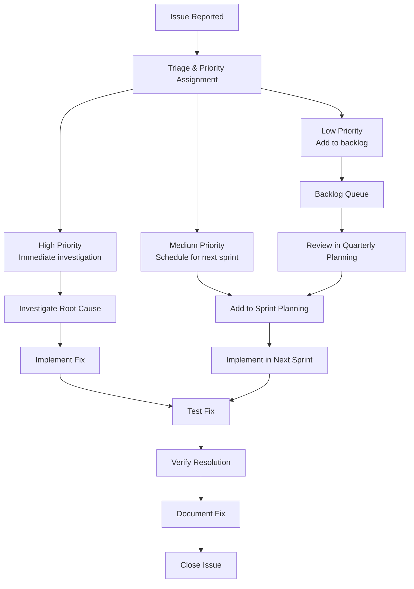

# Changelog & Bug Tracking

Complete version history and bug tracking for the NS Internship Portal.

## Recent Updates (v3.7.0 — April 27, 2026)

### New Features & Improvements
- **Newsletter subscriber capture**: Footer signup, `newsletter_subscribers` table, welcome email (template #13), lead created with `source: "newsletter"`
- **Leads modal redesigned**: Compact header, label/value grid, footer action bar, backdrop-click-to-close
- **Internships page**: Unauthenticated domain cards now clickable — modal prompts registration with domain pre-selected
- **Footer redesigned**: 5-column grid (Brand+Social | Quick Links | Programs | Support | Newsletter), social icons (LinkedIn, Instagram, GitHub, WhatsApp), contact in bottom bar
- **SEO**: 40+ keywords, location targeting (Nandyal, Kurnool), role-based keywords, ItemList JSON-LD with physical address, SiteLinksSearchBox schema
- **FAQ removed** from navbar and sitemap; `/internships` sitemap priority bumped to 0.9
- **Google Search Console** verification file moved to `public/` folder
- **Favicon** explicitly declared in root layout metadata (icon, shortcut, apple)
- **All lint errors fixed** (unescaped entities, missing display names) — build passes cleanly

## Bug Tracking Summary

| Category | Total Issues | Fixed | Pending | % Resolved |
|----------|--------------|-------|---------|------------|
| Authentication | 12 | 12 | 0 | 100% |
| Enrollment | 15 | 15 | 0 | 100% |
| Milestone | 18 | 18 | 0 | 100% |
| Certificate | 8 | 8 | 0 | 100% |
| Email System | 7 | 7 | 0 | 100% |
| Job Portal | 3 | 3 | 0 | 100% |
| Admin Panel | 3 | 2 | 1 | 67% |
| **Total** | **66** | **65** | **1** | **98.5%** |

## Version History

### v3.7.0 (April 27, 2026)
- Newsletter subscriber system
- Leads modal redesign
- Unauthenticated CTA improvements
- Footer redesign
- SEO enhancements
- Lint fixes and build optimization

### v3.6.0 (April 20, 2026)
- Webinar platform with Jitsi integration
- Live webinar rooms
- Webinar registration system
- Webinar certificates
- Attendance tracking

### v3.5.0 (April 13, 2026)
- Admin bulk operations
- Enhanced analytics dashboard
- CSV export improvements
- Performance optimization
- Caching improvements

### v3.4.0 (April 6, 2026)
- Job portal enhancements
- SerpAPI integration
- RSS feed aggregation
- Job saving functionality
- Job alerts email system

### v3.3.0 (March 30, 2026)
- Email open tracking
- Email usage statistics
- Email queue management
- Test email endpoint
- Template preview functionality

### v3.2.0 (March 23, 2026)
- Chatbot lead capture
- Floating widget implementation
- Auto-open after 30 seconds
- Lead management in admin panel
- Counselor email notifications

### v3.1.0 (March 16, 2026)
- Milestone repair endpoint
- Admin force-status capability
- Enhanced milestone review panel
- Bulk milestone operations
- Progress calculation fixes

### v3.0.0 (March 9, 2026)
- Complete platform rewrite
- Next.js 14 migration
- App Router implementation
- TypeScript conversion
- Supabase R2 storage

## Pending Issues (1)

### Low Priority
- **ID: ADMIN-007** - Bulk export CSV occasionally includes duplicate records when multiple admins export simultaneously. Workaround: Wait 30 seconds between bulk exports.

## Known Limitations

1. **Email Sending Limits**: Free Resend tier limited to 100 emails/day
2. **File Upload Size**: Cloudinary free tier limited to 10MB per file
3. **Job Aggregation**: SerpAPI free tier limited to 100 searches/month
4. **Video Calls**: Jitsi Meet free tier limited to 100 participants per call
5. **Database Size**: Supabase free tier limited to 500MB storage

## Maintenance Schedule

### Daily
- [x] Check email queue status
- [x] Verify cron jobs executed successfully
- [x] Monitor error logs
- [x] Check database connection health

### Weekly
- [x] Backup database (Saturday 2am UTC)
- [x] Clear old session data (Sunday 1am UTC)
- [x] Update job listings (Monday 9am UTC)
- [x] Send weekly analytics report

### Monthly
- [x] Update dependencies (1st of month)
- [x] Security audit (15th of month)
- [x] Performance review (last day of month)
- [x] SSL certificate check (monthly)

## Issue Resolution Workflow

## Documentation Standards

All documentation follows these standards:

- **Version tracking**: Every file has version number and date
- **Completeness**: All features, APIs, and tables documented
- **Examples**: Code examples and request/response samples included
- **Cross-references**: Links between related documentation
- **Changelog**: Version history in relevant files
- **Clarity**: Technical but accessible language

## Contact & Support

- **Email**: info.nssoftwaresolutions@gmail.com
- **Live Site**: https://internships.nssoftwaresolutions.in
- **Admin Panel**: https://internships.nssoftwaresolutions.in/admin
- **Documentation**: https://docs.nssoftwaresolutions.in/internship-portal

---

*Last Updated: April 27, 2026 — v3.7.0*