# Database Schema Documentation

Complete database structure for the NS Internship Portal.

## Entity Relationship Diagram

```mermaid
erDiagram
    users {
        UUID id PK
        VARCHAR name
        VARCHAR email
        VARCHAR role
        VARCHAR phone
        VARCHAR college
        TEXT avatar_url
        TIMESTAMP created_at
    }

    domains {
        UUID id PK
        VARCHAR name
        VARCHAR slug
        INTEGER pricing_one_month
        INTEGER pricing_two_months
        INTEGER pricing_three_months
        JSONB problem_statements
        BOOLEAN is_active
    }

    enrollments {
        UUID id PK
        UUID student_id FK
        UUID domain_id FK
        INTEGER duration
        INTEGER amount
        VARCHAR payment_status
        VARCHAR status
        TIMESTAMP start_date
        TIMESTAMP end_date
    }

    milestones {
        UUID id PK
        UUID enrollment_id FK
        UUID reviewed_by FK
        INTEGER week
        VARCHAR type
        VARCHAR status
        TIMESTAMP deadline
        INTEGER order_index
    }

    certificates {
        UUID id PK
        VARCHAR certificate_id
        UUID student_id FK
        UUID enrollment_id FK
        UUID domain_id FK
        INTEGER duration
        TIMESTAMP issue_date
        BOOLEAN is_revoked
    }

    invoices {
        UUID id PK
        VARCHAR invoice_number
        UUID enrollment_id FK
        UUID student_id FK
        INTEGER base_amount
        INTEGER cgst
        INTEGER sgst
        INTEGER total_amount
        VARCHAR payment_status
    }

    coupons {
        UUID id PK
        VARCHAR code
        VARCHAR discount_type
        INTEGER discount_value
        INTEGER max_uses
        INTEGER used_count
        UUID domain_id FK
        BOOLEAN is_active
    }

    coupon_usage {
        UUID id PK
        UUID coupon_id FK
        UUID user_id FK
        TIMESTAMP used_at
    }

    announcements {
        UUID id PK
        VARCHAR title
        VARCHAR type
        VARCHAR category
        VARCHAR target_audience
        VARCHAR status
        JSONB delivery_channels
        TIMESTAMP expires_at
    }

    announcement_reads {
        UUID id PK
        UUID announcement_id FK
        UUID user_id FK
        TIMESTAMP read_at
    }

    internship_resources {
        UUID id PK
        UUID domain_id FK
        VARCHAR title
        VARCHAR type
        TEXT resource_url
        INTEGER week
        INTEGER order_index
        BOOLEAN is_active
    }

    jobs {
        UUID id PK
        TEXT title
        TEXT company
        TEXT location
        TEXT source
        TEXT[] tags
        TIMESTAMP fetched_at
    }

    saved_jobs {
        UUID id PK
        UUID user_id FK
        UUID job_id FK
        TIMESTAMP saved_at
    }

    refresh_tokens {
        UUID id PK
        UUID user_id FK
        TEXT token_hash
        TIMESTAMP expires_at
        TIMESTAMP revoked_at
    }

    email_logs {
        UUID id PK
        TEXT recipient
        TEXT subject
        TEXT type
        TEXT status
        TIMESTAMP sent_at
    }

    email_queue {
        UUID id PK
        TEXT recipient
        TEXT template_type
        TEXT status
        INTEGER attempts
        INTEGER max_attempts
        TIMESTAMP scheduled_for
        TIMESTAMP opened_at
        INTEGER open_count
    }

    admin_activity_logs {
        UUID id PK
        UUID admin_id FK
        VARCHAR action_type
        VARCHAR entity_type
        UUID entity_id
        JSONB metadata
        TIMESTAMP created_at
    }

    permissions {
        UUID id PK
        VARCHAR name
        VARCHAR category
    }

    role_permissions {
        UUID id PK
        VARCHAR role
        UUID permission_id FK
    }

    user_permissions {
        UUID id PK
        UUID user_id FK
        UUID permission_id FK
        BOOLEAN granted
    }

    analytics_events {
        UUID id PK
        TEXT event_type
        UUID user_id FK
        TEXT session_id
        JSONB metadata
        TIMESTAMPTZ created_at
    }

    leads {
        UUID id PK
        TEXT name
        TEXT domain
        TEXT duration
        TEXT phone
        TEXT status
        TIMESTAMPTZ created_at
    }

    newsletter_subscribers {
        UUID id PK
        TEXT email
        TIMESTAMPTZ created_at
    }

    certificate_templates {
        UUID id PK
        VARCHAR template_type
        JSONB content
        BOOLEAN is_active
    }

    certificate_verifications {
        UUID id PK
        VARCHAR certificate_id
        TIMESTAMP verified_at
        VARCHAR ip_address
    }

    domain_analytics {
        UUID id PK
        UUID domain_id FK
        INTEGER total_enrollments
        INTEGER active_enrollments
        INTEGER completed
        INTEGER revenue
    }

    site_settings {
        VARCHAR key PK
        TEXT value
    }

    search_queries {
        UUID id PK
        TEXT query
        INTEGER count
        TIMESTAMP updated_at
    }

    rate_limit_requests {
        UUID id PK
        TEXT identifier
        TEXT endpoint
        INTEGER count
        TIMESTAMP window_start
    }

    %% Core relationships
    users ||--o{ enrollments : "student_id"
    users ||--o{ certificates : "student_id"
    users ||--o{ refresh_tokens : "user_id"
    users ||--o{ admin_activity_logs : "admin_id"
    users ||--o{ saved_jobs : "user_id"
    users ||--o{ announcement_reads : "user_id"
    users ||--o{ coupon_usage : "user_id"
    users ||--o{ user_permissions : "user_id"
    users ||--o{ analytics_events : "user_id"
    users ||--o{ milestones : "reviewed_by"

    domains ||--o{ enrollments : "domain_id"
    domains ||--o{ certificates : "domain_id"
    domains ||--o{ internship_resources : "domain_id"
    domains ||--o{ domain_analytics : "domain_id"
    domains ||--o{ coupons : "domain_id"

    enrollments ||--o{ milestones : "enrollment_id"
    enrollments ||--|| certificates : "enrollment_id"
    enrollments ||--|| invoices : "enrollment_id"

    coupons ||--o{ coupon_usage : "coupon_id"
    announcements ||--o{ announcement_reads : "announcement_id"
    jobs ||--o{ saved_jobs : "job_id"
    permissions ||--o{ role_permissions : "permission_id"
    permissions ||--o{ user_permissions : "permission_id"
```



## Database Overview

**Database:** PostgreSQL hosted on Supabase with Row Level Security (RLS) enabled
**Total Tables:** 26+ core tables + extensions

> Note: `supabase/schema.sql` is the initial baseline schema. All subsequent migrations extend it. This documentation reflects the fully migrated state.

## Core Tables

### 1. users

**Purpose:** User accounts (students, admins, reviewers, project admins, super admins)

| Column | Type | Constraints | Description |
|--------|------|-------------|-------------|
| id | UUID | PRIMARY KEY, DEFAULT uuid_generate_v4() | Unique user identifier |
| name | VARCHAR(255) | NOT NULL | Full name |
| email | VARCHAR(255) | UNIQUE, NOT NULL | Email address (login) |
| password | VARCHAR(255) | NOT NULL | bcrypt hash (10 rounds) |
| role | VARCHAR(20) | DEFAULT 'student' | User role |
| phone | VARCHAR(50) | NULL | Phone number |
| college | VARCHAR(255) | NULL | College/University name |
| avatar_url | TEXT | NULL | Cloudinary avatar URL |
| degree | VARCHAR(255) | NULL | Academic degree |
| branch | VARCHAR(255) | NULL | Academic branch/specialization |
| year_of_study | INTEGER | NULL | Current year of study |
| graduation_year | INTEGER | NULL | Expected graduation year |
| birthday | DATE | NULL | Date of birth |
| gender | VARCHAR(20) | NULL | Gender |
| city | VARCHAR(100) | NULL | City |
| state | VARCHAR(100) | NULL | State |
| country | VARCHAR(100) | NULL | Country |
| linkedin_url | TEXT | NULL | LinkedIn profile URL |
| github_url | TEXT | NULL | GitHub profile URL |
| reset_password_token | VARCHAR(255) | NULL | Password reset token |
| reset_password_expiry | TIMESTAMP | NULL | Token expiry |
| last_login | TIMESTAMP | NULL | Last login timestamp |
| created_at | TIMESTAMP | DEFAULT NOW() | Account creation |
| updated_at | TIMESTAMP | DEFAULT NOW() | Last update |

**Indexes:**
- `idx_users_email` ON (email)
- `idx_users_role` ON (role)

**Roles:** student, admin, project_admin, reviewer, super_admin

**Profile completeness:** Weighted score from 12 fields. Score ≥ 80 unlocks profile badge.

### 2. domains

**Purpose:** Internship domains/courses (Web Dev, Python, ML, etc.)

| Column | Type | Constraints | Description |
|--------|------|-------------|-------------|
| id | UUID | PRIMARY KEY | Unique domain identifier |
| name | VARCHAR(255) | UNIQUE, NOT NULL | Domain name |
| slug | VARCHAR(255) | UNIQUE, NOT NULL | URL slug |
| description | TEXT | NOT NULL | Domain description |
| icon | VARCHAR(255) | NULL | Icon URL |
| pricing_one_month | INTEGER | DEFAULT 400 | 1-month pricing (₹) |
| pricing_two_months | INTEGER | DEFAULT 700 | 2-month pricing (₹) |
| pricing_three_months | INTEGER | DEFAULT 1000 | 3-month pricing (₹) |
| problem_statements | JSONB | DEFAULT '[]' | Problem statements per duration |
| is_active | BOOLEAN | DEFAULT true | Domain visibility |
| deleted_at | TIMESTAMP | NULL | Soft delete timestamp |
| created_at | TIMESTAMP | DEFAULT NOW() | Creation timestamp |
| updated_at | TIMESTAMP | DEFAULT NOW() | Last update |

### 3. enrollments

**Purpose:** Student enrollments in domains

| Column | Type | Constraints | Description |
|--------|------|-------------|-------------|
| id | UUID | PRIMARY KEY | Unique enrollment ID |
| student_id | UUID | REFERENCES users(id) | Student reference |
| domain_id | UUID | REFERENCES domains(id) | Domain reference |
| duration | INTEGER | CHECK IN (1, 2, 3) | Duration in months |
| amount | INTEGER | NOT NULL | Final amount paid (₹) |
| payment_id | VARCHAR(255) | NULL | Razorpay payment ID |
| order_id | VARCHAR(255) | NULL | Razorpay order ID |
| payment_status | VARCHAR(20) | DEFAULT 'pending' | Payment status |
| status | VARCHAR(20) | DEFAULT 'active' | Enrollment status |
| submission_email | VARCHAR(255) | NULL | Final project email |
| submission_date | TIMESTAMP | NULL | Final submission date |
| admin_notes | TEXT | NULL | Admin review notes |
| certificate_id | VARCHAR(255) | NULL | Certificate ID if issued |
| start_date | TIMESTAMP | NOT NULL | Enrollment start |
| end_date | TIMESTAMP | NOT NULL | Enrollment end |

**Status values:** pending, active, submitted, completed, cancelled

### 4. milestones

**Purpose:** Weekly/major milestones per enrollment (sequential tracking)

| Column | Type | Constraints | Description |
|--------|------|-------------|-------------|
| id | UUID | PRIMARY KEY | Unique milestone ID |
| enrollment_id | UUID | REFERENCES enrollments(id) | Enrollment reference |
| week | INTEGER | NOT NULL | Week number (1-12) |
| title | VARCHAR(255) | NOT NULL | Milestone title |
| description | TEXT | NULL | Milestone description |
| type | VARCHAR(20) | CHECK IN ('weekly', 'major') | Milestone type |
| status | VARCHAR(20) | DEFAULT 'pending' | Milestone status |
| submission_notes | TEXT | NULL | Student submission notes |
| submission_date | TIMESTAMP | NULL | Submission timestamp |
| review_notes | TEXT | NULL | Admin review feedback |
| reviewed_by | UUID | REFERENCES users(id) | Reviewer user ID |
| reviewed_at | TIMESTAMP | NULL | Review timestamp |
| deadline | TIMESTAMP | NULL | Milestone deadline |
| order_index | INTEGER | DEFAULT 0 | Display order |

**Status values:** pending, submitted, reviewed, rejected
**Sequential logic:** Only `reviewed` (approved) unlocks the next milestone.

### 5. certificates

**Purpose:** Completion certificates and offer letters

| Column | Type | Constraints | Description |
|--------|------|-------------|-------------|
| id | UUID | PRIMARY KEY | Unique certificate ID |
| certificate_id | VARCHAR(255) | UNIQUE, NOT NULL | Public ID (CERT-YY-XXXXXX) |
| student_id | UUID | REFERENCES users(id) | Student reference |
| enrollment_id | UUID | REFERENCES enrollments(id) | Enrollment reference |
| domain_id | UUID | REFERENCES domains(id) | Domain reference |
| student_name | VARCHAR(255) | NOT NULL | Student name (snapshot) |
| domain_name | VARCHAR(255) | NOT NULL | Domain name (snapshot) |
| duration | INTEGER | NOT NULL | Duration in months |
| project_title | VARCHAR(500) | NOT NULL | Final project title |
| issue_date | TIMESTAMP | DEFAULT NOW() | Certificate issue date |
| expiry_at | TIMESTAMP | NULL | Expiry date |
| is_revoked | BOOLEAN | DEFAULT false | Revocation status |
| revoke_reason | TEXT | NULL | Revocation reason |
| pdf_url | TEXT | NULL | PDF URL (Cloudinary) |

**Certificate ID format:** CERT-YY-XXXXXX (e.g., CERT-26-P9L2M4)

### 6. invoices

**Purpose:** Payment invoices with GST breakdown

| Column | Type | Constraints | Description |
|--------|------|-------------|-------------|
| id | UUID | PRIMARY KEY | Unique invoice ID |
| invoice_number | VARCHAR(50) | UNIQUE, NOT NULL | Invoice number (INV-YYYY-NNNN) |
| enrollment_id | UUID | REFERENCES enrollments(id) | Enrollment reference |
| student_id | UUID | REFERENCES users(id) | Student reference |
| student_name | VARCHAR(255) | NOT NULL | Student name (snapshot) |
| student_email | VARCHAR(255) | NOT NULL | Student email (snapshot) |
| domain_name | VARCHAR(255) | NOT NULL | Domain name (snapshot) |
| duration | INTEGER | NOT NULL | Duration in months |
| base_amount | INTEGER | NOT NULL | Amount before GST (₹) |
| cgst | INTEGER | NOT NULL | CGST 9% (₹) |
| sgst | INTEGER | NOT NULL | SGST 9% (₹) |
| total_amount | INTEGER | NOT NULL | Total with GST (₹) |
| payment_id | VARCHAR(255) | NULL | Razorpay payment ID |
| payment_status | VARCHAR(20) | DEFAULT 'pending' | Payment status |
| invoice_date | TIMESTAMP | DEFAULT NOW() | Invoice generation date |

**Invoice number format:** INV-YYYY-NNNN (e.g., INV-2026-0001)
**GST calculation:** CGST 9% + SGST 9% = 18% total (configurable via GST_RATE env)

### 7. coupons

**Purpose:** Discount coupons (percentage or flat)

| Column | Type | Constraints | Description |
|--------|------|-------------|-------------|
| id | UUID | PRIMARY KEY | Unique coupon ID |
| code | VARCHAR(50) | UNIQUE, NOT NULL | Coupon code |
| discount_type | VARCHAR(20) | CHECK IN ('percentage', 'flat') | Discount type |
| discount_value | INTEGER | NOT NULL | Discount value |
| max_uses | INTEGER | NULL | Max total uses |
| used_count | INTEGER | DEFAULT 0 | Current usage count |
| valid_from | TIMESTAMP | NULL | Validity start |
| valid_until | TIMESTAMP | NULL | Validity end |
| min_amount | INTEGER | NULL | Minimum order amount |
| domain_id | UUID | REFERENCES domains(id) | Domain-specific |
| is_active | BOOLEAN | DEFAULT true | Coupon active status |

### 8. announcement_reads

**Purpose:** Track which users have read which announcements

| Column | Type | Constraints | Description |
|--------|------|-------------|-------------|
| id | UUID | PRIMARY KEY | Unique read ID |
| announcement_id | UUID | REFERENCES announcements(id) | Announcement reference |
| user_id | UUID | REFERENCES users(id) | User reference |
| read_at | TIMESTAMP | DEFAULT NOW() | Read timestamp |

**Constraint:** UNIQUE (announcement_id, user_id)

### 9. jobs

**Purpose:** Job listings cache (SerpAPI + RSS feeds)

| Column | Type | Constraints | Description |
|--------|------|-------------|-------------|
| id | UUID | PRIMARY KEY | Unique job ID |
| title | TEXT | NOT NULL | Job title |
| company | TEXT | NOT NULL | Company name |
| location | TEXT | NULL | Job location |
| description | TEXT | NULL | Job description |
| apply_link | TEXT | NOT NULL | Application URL |
| source | TEXT | NOT NULL | Source (serpapi, rss_remotive, etc.) |
| tags | TEXT[] | NULL | Tags (frontend, backend, etc.) |
| posted_at | TIMESTAMP | NULL | Original posting date |
| fetched_at | TIMESTAMP | DEFAULT NOW() | When fetched into cache |

**Tags:** frontend, backend, data, design, marketing, mobile, devops, java, fullstack

### 10. saved_jobs

**Purpose:** User-saved job listings

| Column | Type | Constraints | Description |
|--------|------|-------------|-------------|
| id | UUID | PRIMARY KEY | Unique save ID |
| user_id | UUID | REFERENCES users(id) | User reference |
| job_id | UUID | REFERENCES jobs(id) | Job reference |
| saved_at | TIMESTAMP | DEFAULT NOW() | Save timestamp |

**Constraint:** UNIQUE (user_id, job_id)

### 11. refresh_tokens

**Purpose:** JWT refresh token storage (rotation-based)

| Column | Type | Constraints | Description |
|--------|------|-------------|-------------|
| id | UUID | PRIMARY KEY | Unique token ID |
| user_id | UUID | REFERENCES users(id) | User reference |
| token_hash | TEXT | UNIQUE, NOT NULL | SHA-256 hash of raw token |
| expires_at | TIMESTAMP | NOT NULL | Token expiry (30 days) |
| created_at | TIMESTAMP | DEFAULT NOW() | Token creation |
| revoked_at | TIMESTAMP | NULL | Revocation timestamp |

### 12. email_logs

**Purpose:** Email send tracking

| Column | Type | Constraints | Description |
|--------|------|-------------|-------------|
| id | UUID | PRIMARY KEY | Unique log ID |
| recipient | TEXT | NOT NULL | Recipient email |
| subject | TEXT | NOT NULL | Email subject |
| type | TEXT | NOT NULL | Template type |
| status | TEXT | DEFAULT 'sent' | Send status |
| error_message | TEXT | NULL | Error details if failed |
| sent_at | TIMESTAMP | DEFAULT NOW() | Send timestamp |

### 13. admin_activity_logs

**Purpose:** Audit trail for admin actions

| Column | Type | Constraints | Description |
|--------|------|-------------|-------------|
| id | UUID | PRIMARY KEY | Unique log ID |
| admin_id | UUID | REFERENCES users(id) | Admin user reference |
| action_type | VARCHAR(50) | NOT NULL | Action type (28 types) |
| entity_type | VARCHAR(50) | NOT NULL | Entity type (10 types) |
| entity_id | UUID | NULL | Entity ID if applicable |
| metadata | JSONB | NULL | Additional action data |
| ip_address | VARCHAR(50) | NULL | Request IP |
| user_agent | TEXT | NULL | Request user agent |
| created_at | TIMESTAMP | DEFAULT NOW() | Action timestamp |

**Action types (28):** create_domain, edit_domain, delete_domain, approve_enrollment, etc.
**Entity types (10):** domain, enrollment, certificate, coupon, announcement, etc.

### 14. permissions

**Purpose:** Granular permission definitions (28 total)

| Column | Type | Constraints | Description |
|--------|------|-------------|-------------|
| id | UUID | PRIMARY KEY | Unique permission ID |
| name | VARCHAR(100) | UNIQUE, NOT NULL | Permission name |
| description | TEXT | NULL | Permission description |
| category | VARCHAR(50) | NULL | Permission category |

### 15. role_permissions

**Purpose:** Map permissions to roles

| Column | Type | Constraints | Description |
|--------|------|-------------|-------------|
| id | UUID | PRIMARY KEY | Unique mapping ID |
| role | VARCHAR(20) | NOT NULL | Role name |
| permission_id | UUID | REFERENCES permissions(id) | Permission reference |

### 16. user_permissions

**Purpose:** User-specific permission overrides

| Column | Type | Constraints | Description |
|--------|------|-------------|-------------|
| id | UUID | PRIMARY KEY | Unique override ID |
| user_id | UUID | REFERENCES users(id) | User reference |
| permission_id | UUID | REFERENCES permissions(id) | Permission reference |
| granted | BOOLEAN | DEFAULT true | Grant or revoke |

### 17. analytics_events

**Purpose:** User behavior event tracking

| Column | Type | Constraints | Description |
|--------|------|-------------|-------------|
| id | UUID | PRIMARY KEY | Unique event ID |
| event_type | TEXT | NOT NULL | Event type |
| user_id | UUID | REFERENCES users(id) NULL | User reference |
| session_id | TEXT | NULL | Anonymous session identifier |
| metadata | JSONB | DEFAULT '{}' | Event-specific context data |
| created_at | TIMESTAMPTZ | DEFAULT NOW() | Event timestamp |

### 18. leads

**Purpose:** Chatbot lead capture

| Column | Type | Constraints | Description |
|--------|------|-------------|-------------|
| id | UUID | PRIMARY KEY | Unique lead ID |
| name | TEXT | NOT NULL | Lead's full name |
| domain | TEXT | NOT NULL | Internship domain of interest |
| duration | TEXT | NOT NULL | Desired internship duration |
| phone | TEXT | NOT NULL | 10-digit phone number |
| source | TEXT | DEFAULT 'chatbot' | Lead source |
| status | TEXT | DEFAULT 'new' | Lead status |
| created_at | TIMESTAMPTZ | DEFAULT NOW() | Lead capture timestamp |

### 19. newsletter_subscribers

**Purpose:** Email newsletter subscribers

| Column | Type | Constraints | Description |
|--------|------|-------------|-------------|
| id | UUID | PRIMARY KEY | Unique subscriber ID |
| email | TEXT | NOT NULL, UNIQUE | Subscriber email |
| created_at | TIMESTAMPTZ | DEFAULT now() | Subscription timestamp |

### 20. email_queue

**Purpose:** Queued email delivery with retry and open tracking

| Column | Type | Constraints | Description |
|--------|------|-------------|-------------|
| id | UUID | PRIMARY KEY | Unique queue entry ID |
| recipient | TEXT | NOT NULL | Recipient email address |
| subject | TEXT | NOT NULL | Email subject |
| html | TEXT | NOT NULL | Email HTML body |
| template_type | TEXT | NOT NULL | Template type |
| status | TEXT | DEFAULT 'pending' | Queue status |
| attempts | INTEGER | DEFAULT 0 | Send attempt count |
| max_attempts | INTEGER | DEFAULT 3 | Max retry attempts |
| scheduled_for | TIMESTAMP | DEFAULT NOW() | Earliest send time |
| sent_at | TIMESTAMP | NULL | Actual send timestamp |
| error_message | TEXT | NULL | Last error if failed |
| opened_at | TIMESTAMP | NULL | First open timestamp |
| open_count | INTEGER | DEFAULT 0 | Total open events |
| metadata | JSONB | NULL | Additional context data |

### 21. certificate_templates

**Purpose:** Customizable certificate templates

| Column | Type | Constraints | Description |
|--------|------|-------------|-------------|
| id | UUID | PRIMARY KEY | Unique template ID |
| template_type | VARCHAR(50) | UNIQUE, CHECK IN (offer_letter, completion) | Template type |
| content | JSONB | NOT NULL | Template content config |
| is_active | BOOLEAN | DEFAULT true | Template active status |

### 22. site_settings

**Purpose:** Global site configuration

| Column | Type | Constraints | Description |
|--------|------|-------------|-------------|
| key | VARCHAR(100) | PRIMARY KEY | Setting key |
| value | TEXT | NOT NULL | Setting value |

**Common keys:** siteName, siteEmail, sitePhone, siteAddress, maintenanceMode, maxEnrollmentsPerStudent

### 23. internship_resources

**Purpose:** Learning resources (videos, PDFs, links) per domain per week

| Column | Type | Constraints | Description |
|--------|------|-------------|-------------|
| id | UUID | PRIMARY KEY | Unique resource ID |
| domain_id | UUID | REFERENCES domains(id) | Domain reference |
| title | VARCHAR(255) | NOT NULL | Resource title |
| description | TEXT | NULL | Resource description |
| type | VARCHAR(20) | CHECK IN (video, document, link) | Resource type |
| resource_url | TEXT | NOT NULL | URL (Cloudinary or external) |
| week | INTEGER | NOT NULL | Week number (1-20) |
| order_index | INTEGER | DEFAULT 0 | Display order within week |
| is_active | BOOLEAN | DEFAULT true | Resource visibility |

**Resource types:** video, document, link

## Additional Tables

### certificate_verifications

**Purpose:** Track public certificate verification attempts

| Column | Type | Constraints | Description |
|--------|------|-------------|-------------|
| id | UUID | PRIMARY KEY | Unique verification ID |
| certificate_id | VARCHAR(255) | NOT NULL | Certificate ID verified |
| verified_at | TIMESTAMP | DEFAULT NOW() | Verification timestamp |
| ip_address | VARCHAR(50) | NULL | Verifier IP |

### domain_analytics

**Purpose:** Domain-specific analytics cache

| Column | Type | Constraints | Description |
|--------|------|-------------|-------------|
| id | UUID | PRIMARY KEY | Unique analytics ID |
| domain_id | UUID | REFERENCES domains(id) | Domain reference |
| total_enrollments | INTEGER | DEFAULT 0 | Total enrollments |
| active_enrollments | INTEGER | DEFAULT 0 | Active enrollments |
| completed | INTEGER | DEFAULT 0 | Completed enrollments |
| revenue | INTEGER | DEFAULT 0 | Total revenue (₹) |

### search_queries

**Purpose:** Job search autocomplete suggestions

| Column | Type | Constraints | Description |
|--------|------|-------------|-------------|
| id | UUID | PRIMARY KEY | Unique query ID |
| query | TEXT | UNIQUE, NOT NULL | Search query text |
| count | INTEGER | DEFAULT 1 | Usage count |
| updated_at | TIMESTAMP | DEFAULT NOW() | Last used |

### rate_limit_requests

**Purpose:** Rate limiting (Supabase-backed, survives restarts)

| Column | Type | Constraints | Description |
|--------|------|-------------|-------------|
| id | UUID | PRIMARY KEY | Unique request ID |
| identifier | TEXT | NOT NULL | IP or user ID |
| endpoint | TEXT | NOT NULL | API endpoint |
| count | INTEGER | DEFAULT 1 | Request count |
| window_start | TIMESTAMP | DEFAULT NOW() | Rate limit window start |

## Relationships Summary

```
users (1) ──< (N) enrollments
users (1) ──< (N) certificates
users (1) ──< (N) refresh_tokens
users (1) ──< (N) admin_activity_logs
users (1) ──< (N) saved_jobs
users (1) ──< (N) announcement_reads
users (1) ──< (N) coupon_usage
users (1) ──< (N) user_permissions
users (1) ──< (N) analytics_events

domains (1) ──< (N) enrollments
domains (1) ──< (N) certificates
domains (1) ──< (N) internship_resources
domains (1) ──< (N) domain_analytics

enrollments (1) ──< (N) milestones
enrollments (1) ──< (1) certificates
enrollments (1) ──< (1) invoices
```

## Indexes Summary

**Performance indexes (15+ total):**
- Composite: `idx_enrollments_student_status`, `idx_enrollments_domain_student`
- Single: `idx_enrollments_payment_status`, `idx_enrollments_created_at`
- Milestones: `idx_milestones_enrollment_id`, `idx_milestones_status`
- Activity logs: `idx_admin_activity_logs_created_at`, `idx_admin_activity_logs_admin_id`
- Announcements: `idx_announcements_created_at`, `idx_announcements_status`
- Refresh tokens: `idx_refresh_tokens_user_id`, `idx_refresh_tokens_token_hash`
- Email logs: `idx_email_logs_sent_at`, `idx_email_logs_type`

## Constraints Summary

**CHECK constraints:**
- `users.role` IN (student, admin, project_admin, reviewer, super_admin)
- `enrollments.duration` IN (1, 2, 3)
- `enrollments.status` IN (pending, active, submitted, completed, cancelled)
- `milestones.type` IN (weekly, major)
- `milestones.status` IN (pending, submitted, reviewed, rejected)
- `announcements.type` IN (info, warning, success, error)

**UNIQUE constraints:**
- `users.email`, `domains.name`, `domains.slug`
- `certificates.certificate_id`, `invoices.invoice_number`
- `coupons.code`, `refresh_tokens.token_hash`
- `(coupon_id, user_id)` in coupon_usage

## Triggers

**Auto-update `updated_at` on:**
- users, domains, enrollments, certificates, invoices, coupons, announcements, internship_resources

```sql
CREATE OR REPLACE FUNCTION update_updated_at_column()
RETURNS TRIGGER AS $$
BEGIN
    NEW.updated_at = NOW();
    RETURN NEW;
END;
$$ language 'plpgsql';
```

## Row Level Security (RLS)

RLS enabled on all core tables. Policies allow all operations through service role key.

**Custom policies can be added for:**
- Students can only view their own enrollments/certificates
- Admins can view all data
- Public can verify certificates

## Migration Order

Run migrations in this order:
1. `schema.sql` — Core tables
2. `schema_extensions.sql` — Milestones, permissions, coupons, invoices, announcements
3. `create_admin_activity_logs.sql` — Activity logging
4. `rate_limit_and_soft_delete.sql` — Rate limiting + soft delete
5. `create_invoices_table.sql` — Invoice table
6. `alter_invoices_table.sql` — Invoice enhancements
7. `internship_resources.sql` — Learning resources
8. `20240320_jobs_cache.sql` — Job portal tables
9. `add_cancelled_enrollment_status.sql` — Add cancelled status
10. `add_rejected_milestone_status.sql` — Add rejected status
11. `create_refresh_tokens.sql` — JWT refresh tokens
12. `create_email_logs.sql` — Email tracking
13. `extend_announcements.sql` — Enhanced announcements
14. `optimize_milestone_queries.sql` — Milestone query optimization
15. `create_email_queue.sql` — Email queue system
16. `certificate_templates.sql` — Certificate templates table

## Data Types

- **UUID:** All primary keys use UUID v4 (gen_random_uuid())
- **TIMESTAMP:** All timestamps use TIMESTAMPTZ (timezone-aware)
- **JSONB:** Used for flexible data (problem_statements, delivery_channels, metadata)
- **TEXT[]:** Array type for job tags
- **VARCHAR:** Fixed-length strings with explicit limits
- **INTEGER:** Numeric values (amounts in ₹, counts)
- **BOOLEAN:** True/false flags

## Backup & Maintenance

**Recommended:**
- Daily automated backups (Supabase provides this)
- Weekly manual exports for critical tables
- Monitor table sizes and index usage
- Vacuum and analyze periodically
- Archive old email_logs (>90 days)
- Purge expired refresh_tokens (>30 days past expiry)
- Clean up old jobs cache (>14 days)
- Archive sent/failed email_queue entries (>30 days)
