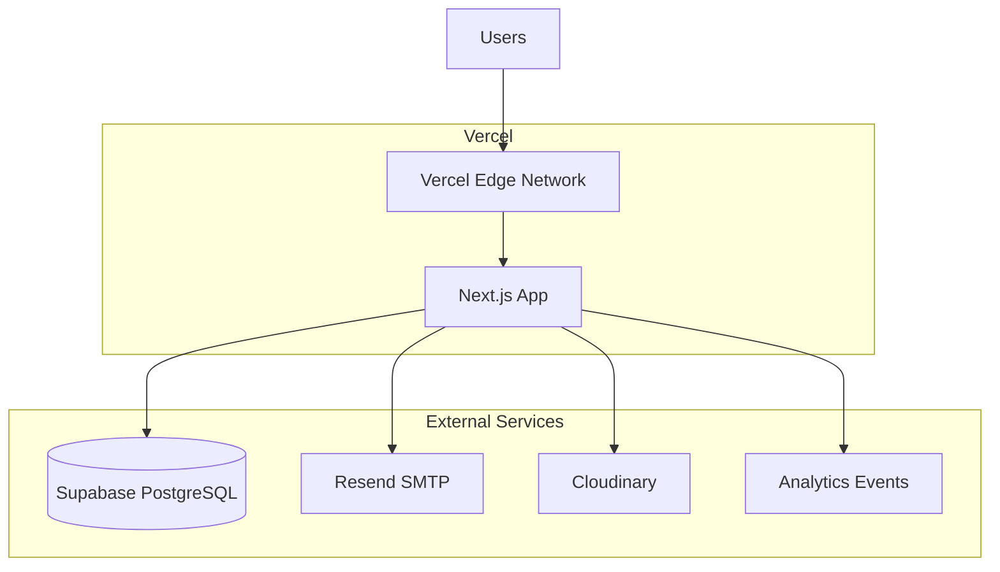

# Deployment Guide

Complete deployment instructions for the NS Internship Portal.

## Deployment Architecture



## Pre-Deployment Checklist

- [ ] All dependencies installed and tested
- [ ] Environment variables configured
- [ ] Database migrations run successfully
- [ ] Tests passing (npm test)
- [ ] Linting passing (npm run lint)
- [ ] Build successful (npm run build)
- [ ] Git repository up to date
- [ ] All secrets stored securely
- [ ] SSL certificate configured
- [ ] Backups verified
- [ ] Monitoring configured
- [ ] Error tracking enabled (optional)

## Environment Setup

### Production Environment

Create `.env.production.local`:

```env
# Application
NODE_ENV=production
NEXT_PUBLIC_BASE_URL=https://internships.nssoftwaresolutions.in

# Supabase (Production)
NEXT_PUBLIC_SUPABASE_URL=https://prod.supabase.co
NEXT_PUBLIC_SUPABASE_ANON_KEY=prod-anon-key
SUPABASE_SERVICE_ROLE_KEY=prod-service-key

# JWT (CRITICAL - Generate with: openssl rand -base64 32)
JWT_SECRET=your-super-secret-production-jwt

# Email (Production Resend)
EMAIL_HOST=smtp.resend.com
EMAIL_PORT=587
EMAIL_USER=resend
EMAIL_PASS=re_prod-api-key
EMAIL_FROM=noreply@internships.nssoftwaresolutions.in
CONTACT_EMAIL=info.nssoftwaresolutions@gmail.com

# Payment (Razorpay Production)
RAZORPAY_KEY_ID=rzp_live_your-key
RAZORPAY_KEY_SECRET=prod-secret

# Storage (Cloudinary Production)
CLOUDINARY_CLOUD_NAME=prod-cloud-name
CLOUDINARY_API_KEY=prod-api-key
CLOUDINARY_API_SECRET=prod-api-secret

# Google OAuth
GOOGLE_CLIENT_ID=prod-client-id.apps.googleusercontent.com
GOOGLE_CLIENT_SECRET=prod-client-secret

# Jobs
SERPAPI_KEY=prod-serpapi-key
CRON_SECRET=prod-cron-secret

# GST Rate
GST_RATE=0.18
```

### Staging Environment

Create `.env.staging.local`:

```env
# Application
NODE_ENV=staging
NEXT_PUBLIC_BASE_URL=https://staging.internships.nssoftwaresolutions.in

# Use staging credentials for all services
# ... (similar to production but with staging keys)
```

## Vercel Deployment

### Initial Setup

1. **Connect Repository**
   ```bash
   vercel link
   ```

2. **Configure Project**
   - Select framework: Next.js
   - Root directory: ./
   - Build command: npm run build
   - Output directory: .next

3. **Add Environment Variables**
   - Add all production environment variables in Vercel dashboard
   - Settings → Environment Variables

4. **Configure Cron Jobs**

   Update `vercel.json`:

   ```json
   {
     "crons": [
       {
         "path": "/api/cron/process-emails",
         "schedule": "0 6 * * *"
       },
       {
         "path": "/api/cron/inactive-students",
         "schedule": "0 9 * * *"
       },
       {
         "path": "/api/cron/deadline-reminders",
         "schedule": "0 8 * * *"
       },
       {
         "path": "/api/cron/job-alerts",
         "schedule": "0 9 * * 1"
       }
     ]
   }
   ```

### Deploy

**Automatic Deployment:**
- Push to main branch → Automatic deployment
- Push to other branches → Preview deployment

**Manual Deployment:**
```bash
# Deploy to production
vercel --prod

# Deploy to staging
vercel
```

## Database Deployment

### Supabase Setup

1. **Create Project**
   - Go to [supabase.com](https://supabase.com)
   - Create new project
   - Note the project URL and keys

2. **Run Migrations**
   ```bash
   # Using Supabase CLI
   supabase link --project-ref your-ref
   supabase db push
   ```

   OR manually in SQL editor:

   ```sql
   -- Run all migration files in order
   -- See supabase/ directory
   ```

3. **Verify Setup**
   - Check all tables created
   - Verify RLS policies enabled
   - Test connection

### Database Backup

**Automated Backups:**
- Supabase provides daily backups
- 30-day retention
- Point-in-time recovery

**Manual Backup:**
```bash
# Export database
pg_dump postgresql://[SUPABASE_CONNECTION_STRING] > backup.sql

# Restore database
psql postgresql://[NEW_DATABASE_URL] < backup.sql
```

## DNS & SSL Configuration

### Domain Setup

1. **Point Domain to Vercel**
   - Add CNAME record: `internships.nssoftwaresolutions.in` → `cname.vercel.com`
   - Or add A records for Vercel IP addresses

2. **Verify Domain**
   - Vercel dashboard → Project → Domains
   - Click "Verify" on your domain
   - SSL certificate auto-generates

### SSL Certificate

- **Automatic:** Vercel manages SSL via Let's Encrypt
- **Renewal:** Automatic before expiration
- **Status:** Check in Vercel dashboard → Deployments → SSL

## Monitoring & Alerts

### Vercel Monitoring

- **Performance:** Vercel Speed Insights dashboard
- **Errors:** Automatic error reporting
- **Uptime:** Monitor.vercel.com

### Application Monitoring

**Optional: Sentry Setup**

1. Create Sentry project at [sentry.io](https://sentry.io)
2. Add SENTRY_AUTH_TOKEN to env
3. Errors automatically tracked

### Email Monitoring

```bash
# Check email usage
curl -H "Cookie: auth-token=YOUR_TOKEN" \
  https://internships.nssoftwaresolutions.in/api/admin/email-stats
```

## Performance Optimization

### Build Optimization

```bash
# Analyze bundle size
npm install -D webpack-bundle-analyzer

# Build with analysis
npm run build -- --analyze
```

### Image Optimization

- Use `next/image` for all images
- Automatic optimization
- WebP format for modern browsers

### Database Optimization

```sql
-- Analyze query performance
EXPLAIN ANALYZE SELECT * FROM enrollments WHERE student_id = 'uuid';

-- Add missing indexes
CREATE INDEX idx_enrollments_student_status 
ON enrollments(student_id, status);
```

## Logging & Troubleshooting

### View Deployment Logs

```bash
# Vercel CLI
vercel logs --prod

# Stream logs
vercel logs --prod --follow
```

### Common Issues

#### Issue: Deployment fails with "out of memory"

**Solution:** Increase build memory or optimize bundle

```bash
# Check bundle size
npm run build -- --analyze
```

#### Issue: Cron jobs not running

**Solution:** Verify vercel.json and check cron status

```bash
# List cron jobs
vercel env list

# Check execution history in Vercel dashboard
```

#### Issue: Database connection fails

**Solution:** Verify DATABASE_URL and firewall rules

```bash
# Test connection
psql $DATABASE_URL -c "SELECT 1"
```

#### Issue: Email not sending

**Solution:** Check SMTP credentials and rate limits

```bash
# Test SMTP
curl telnet smtp.resend.com:587
```

## Rollback Procedures

### Rollback to Previous Deployment

**Vercel Dashboard:**
1. Go to Deployments
2. Find previous successful deployment
3. Click "..." → "Redeploy"

**CLI:**
```bash
# List deployments
vercel list

# Redeploy specific version
vercel rollback
```

### Database Rollback

**Supabase:**
1. Go to Backups
2. Select restore point
3. Click "Restore"

**Manual Restore:**
```bash
# Restore from SQL backup
psql postgresql://[URL] < backup.sql
```

## Post-Deployment

### Verification Steps

- [ ] Homepage loads correctly
- [ ] Student can register and login
- [ ] Admin panel accessible
- [ ] API endpoints respond
- [ ] Database queries work
- [ ] Email sending works
- [ ] Cron jobs execute
- [ ] File uploads work
- [ ] Payments process (test mode)
- [ ] Analytics tracking works

### Smoke Tests

```bash
# Run smoke tests after deployment
npm run test:smoke
```

### Monitor Performance

```bash
# Check Core Web Vitals
curl https://internships.nssoftwaresolutions.in/api/health
```

## Scaling Considerations

### Horizontal Scaling

- Vercel automatically scales with auto-scaling
- Database replicas for read-heavy workloads
- CDN caching for static assets

### Vertical Scaling

- Upgrade Vercel Pro plan
- Increase Supabase resources
- Upgrade SMTP service

### Optimization

- Enable database query caching
- Implement CDN for static assets
- Use edge functions for low-latency APIs
- Optimize images and code splitting

## Disaster Recovery

### Recovery Time Objectives (RTO)

| System | RTO | Criticality |
|--------|-----|------------|
| Application | 15 minutes | High |
| Database | 1 hour | Critical |
| Email | 4 hours | Medium |
| Storage | 24 hours | Low |

### Recovery Procedures

**Application Failure:**
1. Check Vercel deployment status
2. Redeploy previous version
3. Verify all systems online

**Database Failure:**
1. Trigger backup restore in Supabase
2. Wait for restoration (1-2 hours)
3. Update connection string if needed
4. Verify data integrity

**Email Failure:**
1. Check Resend service status
2. Verify API credentials
3. Switch to backup SMTP if available

## Maintenance

### Regular Tasks

**Daily:**
- Monitor error logs
- Check email queue
- Verify uptime

**Weekly:**
- Review analytics
- Check security logs
- Test backups

**Monthly:**
- Update dependencies
- Security audit
- Performance review
- Disaster recovery drill

**Quarterly:**
- Penetration testing
- Database optimization
- Capacity planning
- Compliance audit

## Support & Documentation

- **Vercel Docs:** https://vercel.com/docs
- **Supabase Docs:** https://supabase.io/docs
- **Next.js Docs:** https://nextjs.org/docs
- **Status Page:** https://status.vercel.com
