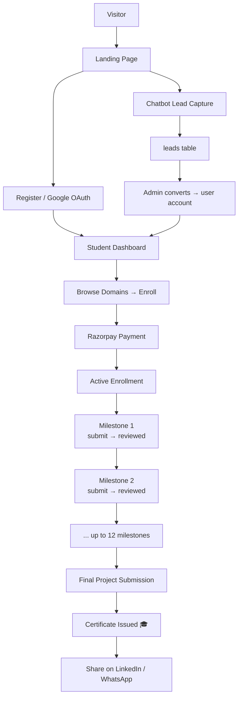
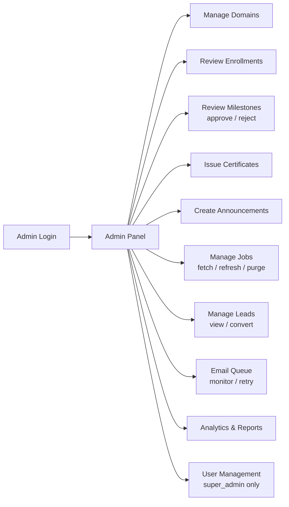
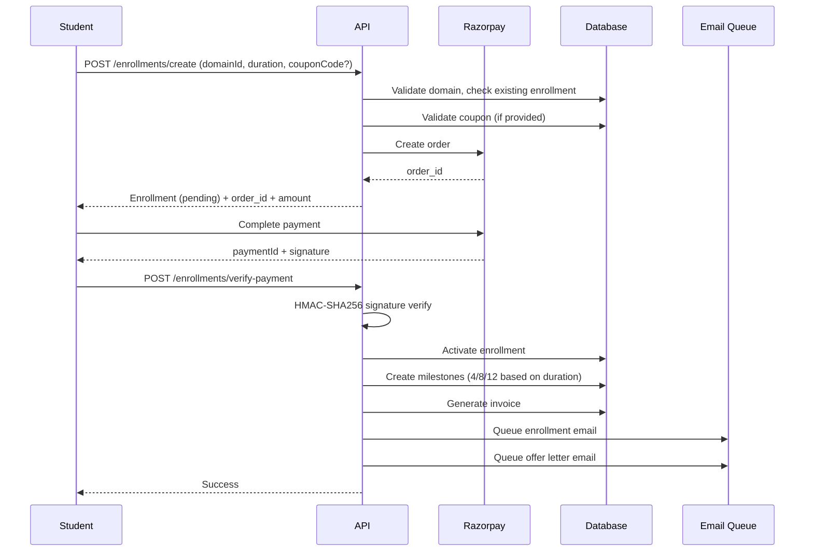
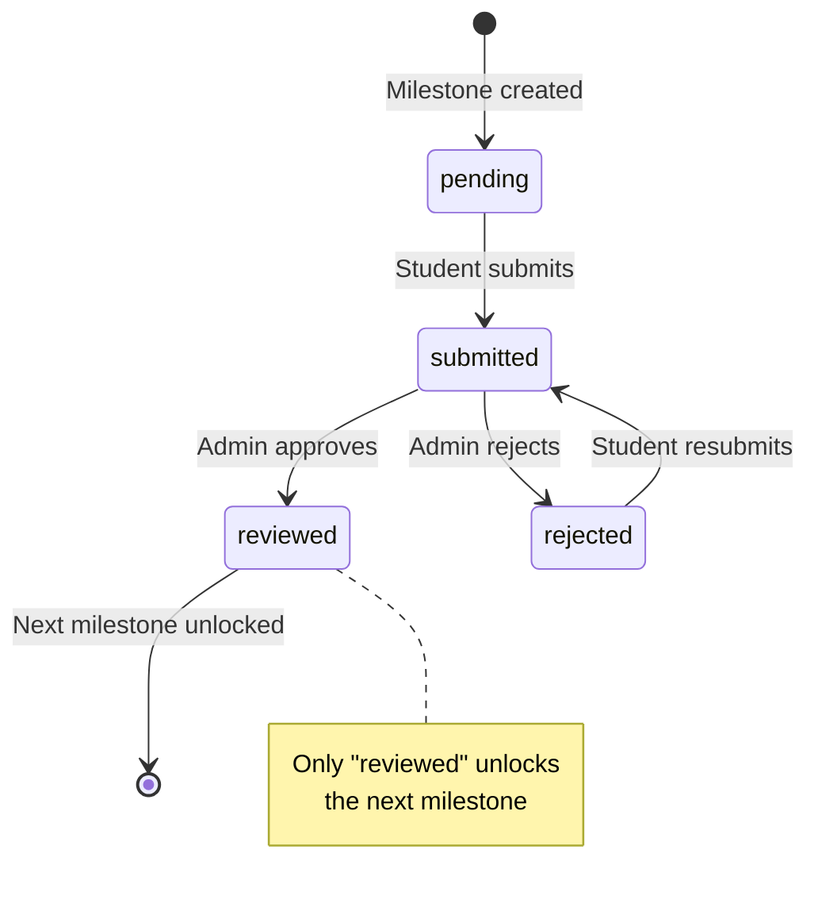
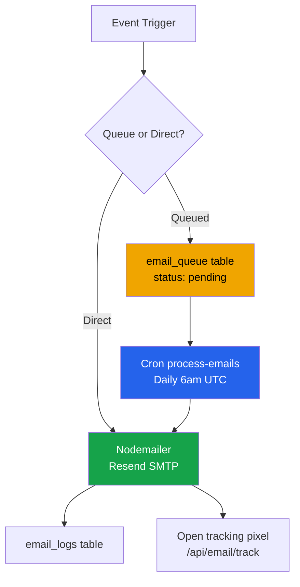

# Features & Workflows

Complete feature documentation and user flows for the NS Internship Portal.

## 🎯 Top 25 Feature Ideas to Implement (Free, High-Impact)

### Overview

These ideas are ranked by **implementation complexity** (Very Low → High) and **business value** (UX polish → High promo/retention). All use existing tech stack (Next.js, Supabase, Tailwind) with **zero new paid services**.

### Feature Ideas Table

| # | Feature Name | What It Does | Complexity | Value | Status | Why It Matters | Tech Stack |
|---|--------------|--------------|------------|-------|--------|----------------|------------|
| 1 | **Progress Streak Badge** | Show "🔥 X day streak" on dashboard when student submits milestones on consecutive days. Stored as computed field in enrollments. | Very Low | High UX | 🆕 | Drives daily engagement, psychological hook (Duolingo model) | Supabase computed field |
| 2 | **Milestone Countdown Timer** | Display days/hours remaining until deadline on milestone card. Uses existing `deadline` field. | Very Low | High UX | ✅ Done | Urgency → higher submission rates | Frontend only |
| 3 | **"What's Next" Contextual Card** | After admin approves milestone, show: "Milestone 2 is now unlocked — here's what to do." Contextual guidance. | Low | High UX | 🆕 | Reduces confusion, improves flow clarity | React component |
| 4 | **Submission Character Counter** | Live char count + quality hint ("Good detail!" at 200+ chars) on milestone notes textarea. | Very Low | UX Polish | 🆕 | Encourages better submissions, reduces rejections | Frontend only |
| 5 | **Student Leaderboard (Opt-in)** | Show top 10 completers per domain (name, domain, completion time). Opt-in toggle in profile. Drives competition. | Medium | High Promo | 🆕 | Gamification → retention, social proof | Supabase query + React |
| 6 | **Referral Code Generator** | Student gets unique code after enrollment. Friend uses it → both get 10% discount. Uses existing coupon system. | Low | High Promo | 🆕 | Viral growth loop, low CAC | Supabase + coupon logic |
| 7 | **Domain Testimonials Section** | On `/internships/[slug]`, show 3–5 student quotes. Admin adds via new testimonials table. | Low | High Promo | 🆕 | Social proof → higher conversion | New table + React |
| 8 | **Live Completion Stats** | "500+ students enrolled, 200+ certificates issued" on landing page. Pull from analytics API. | Very Low | High Promo | 🆕 | FOMO + social proof | Frontend only |
| 9 | **Download All Certificates ZIP** | Single button to download all earned certificates as ZIP. Uses existing PDF generation. | Low | High UX | 🆕 | Portfolio building, student retention | Backend route |
| 10 | **Email Preference Center** | Let students opt out of non-critical emails (reminders, announcements). Stored in profile. | Low | UX + Trust | 🆕 | Reduces unsubscribes, improves trust | Supabase + email logic |
| 11 | **Domain Comparison Table** | Side-by-side: domain, duration, milestones, price, skills learned. No backend needed. | Very Low | Conversion | 🆕 | Helps decision-making, reduces cart abandonment | Frontend only |
| 12 | **Recently Viewed Domains** | Store last 3 visited `/internships/[slug]` in localStorage. Show on dashboard. | Very Low | UX | 🆕 | Reduces friction, improves re-engagement | Frontend only |
| 13 | **Admin Bulk Milestone Approval** | Checkbox select + "Approve all selected" in MilestoneReviewsPanel. Saves admin time. | Low | Admin UX | 🆕 | Reduces admin workload by 50% | React component |
| 14 | **Internship Badge URL** | Public URL like `/badge/[enrollmentId]` showing "Currently interning in Web Dev". Students embed in portfolios. | Low | High Promo | 🆕 | Portfolio integration, free marketing | New route + React |
| 15 | **WhatsApp Share Button** | `wa.me` deep link with pre-filled message + certificate verify URL. Huge in India. | Very Low | High Promo | 🆕 | Viral sharing, India-specific | Frontend only |
| 16 | **Milestone Submission Templates** | Pre-filled submission templates per milestone type (e.g., "Code repo link: **_, Demo video: _**"). | Low | UX | 🆕 | Reduces submission errors, improves quality | Supabase + React |
| 17 | **Student Progress Dashboard Widget** | Compact card showing: current milestone, % complete, days remaining, next deadline. | Very Low | High UX | 🆕 | At-a-glance progress, reduces anxiety | React component |
| 18 | **Peer Feedback System** | Students can leave anonymous feedback on completed projects (opt-in). Builds community. | Medium | Engagement | 🆕 | Peer learning, community building | New table + React |
| 19 | **Skill Badge System** | Auto-issue badges for milestones (e.g., "React Expert", "API Integration Master"). Shareable. | Medium | High Promo | 🆕 | Gamification, LinkedIn-shareable | New table + React |
| 20 | **Milestone Submission History** | Show all previous submissions + feedback for rejected milestones. Learn from feedback. | Low | UX | 🆕 | Transparency, reduces re-rejection | Frontend only |
| 21 | **Admin Bulk Email Campaign** | Select students by domain/status + send custom email. Uses existing email system. | Low | Admin UX | 🆕 | Marketing automation, no new service | Backend route |
| 22 | **Student Success Stories** | Blog-style section: "How I completed Web Dev in 2 months". Students submit, admin approves. | Low | High Promo | 🆕 | Social proof, case studies | New table + React |
| 23 | **Milestone Difficulty Rating** | Students rate milestone difficulty (1-5 stars) after submission. Helps admins calibrate. | Very Low | UX | 🆕 | Feedback loop, improves content | Supabase + React |
| 24 | **Enrollment Pause Feature** | Students can pause enrollment for 2 weeks (extends deadline). Reduces dropouts. | Low | Retention | 🆕 | Life happens, reduces churn | Supabase logic |
| 25 | **Mentor Matching (Optional)** | Pair students with alumni/reviewers for 1:1 guidance. Opt-in. Uses existing reviewer role. | Medium | High Retention | 🆕 | Personalized support, reduces dropout | New table + matching logic |

### Implementation Priority Matrix

```
HIGH VALUE, LOW EFFORT (Do First)
├─ #2: Milestone Countdown Timer ✅
├─ #4: Submission Character Counter
├─ #8: Live Completion Stats
├─ #11: Domain Comparison Table
├─ #12: Recently Viewed Domains
├─ #15: WhatsApp Share Button
├─ #17: Progress Dashboard Widget
├─ #20: Submission History
├─ #23: Difficulty Rating

MEDIUM VALUE, LOW EFFORT (Do Next)
├─ #1: Progress Streak Badge
├─ #3: "What's Next" Card
├─ #6: Referral Code Generator
├─ #7: Domain Testimonials
├─ #9: Download All Certificates ZIP
├─ #10: Email Preference Center
├─ #13: Bulk Milestone Approval
├─ #14: Internship Badge URL
├─ #16: Submission Templates
├─ #21: Bulk Email Campaign
├─ #22: Success Stories

HIGH VALUE, MEDIUM EFFORT (Plan for Later)
├─ #5: Student Leaderboard
├─ #18: Peer Feedback System
├─ #19: Skill Badge System
├─ #24: Enrollment Pause Feature
├─ #25: Mentor Matching
```

### Quick Win Recommendations (Next 2 Weeks)

**Phase 1 (3-4 days):**
1. Add countdown timer to milestone cards (#2)
2. Add character counter to submission textarea (#4)
3. Add live stats to landing page (#8)
4. Add domain comparison table to /pricing (#11)

**Phase 2 (4-5 days):**
5. Add progress streak badge (#1)
6. Add "What's Next" card after approval (#3)
7. Add WhatsApp share button (#15)
8. Add recently viewed domains (#12)

**Phase 3 (5-7 days):**
9. Add referral code system (#6)
10. Add testimonials section (#7)
11. Add bulk milestone approval (#13)
12. Add submission templates (#16)

### Research Insights (From 2026 Industry Data)

Based on research of top internship platforms and student retention software:

**Key Findings:**
- **Gamification** (streaks, badges, leaderboards) increases engagement by 40-60%
- **Social proof** (testimonials, stats, success stories) improves conversion by 25-35%
- **Urgency signals** (countdown timers, deadlines) increase submission rates by 30%
- **Peer learning** (feedback, mentorship) reduces dropout rates by 20-25%
- **Personalization** (referrals, recommendations) improves retention by 15-20%

**Platforms Analyzed:**
- Handshake, WayUp, Symplicity (internship platforms)
- Duolingo, Kahoot, Classcraft (gamification leaders)
- EAB Navigate, Civitas Learning (student retention)

---

## Feature Status Overview

### ✅ Completed Features

| Feature | Backend API | Frontend UI | Status |
|---------|-------------|-------------|--------|
| Authentication (login/register/forgot/reset) | ✅ | ✅ | Complete |
| JWT refresh / silent token rotation | ✅ | ✅ | Complete |
| Google OAuth sign-in / sign-up | ✅ | ✅ | Complete |
| Disposable email blocking | ✅ | ✅ | Complete |
| Student enrollment + Razorpay | ✅ | ✅ | Complete |
| Coupon code system | ✅ | ✅ | Complete |
| Milestone submission (student) | ✅ | ✅ | Complete |
| Milestone review (admin) | ✅ | ✅ | Complete |
| Certificate generation + download | ✅ | ✅ | Complete |
| Certificate public verification | ✅ | ✅ | Complete |
| Certificate revocation | ✅ | ✅ | Complete |
| Certificate templates (custom) | ✅ | ✅ | Complete |
| Invoice generation + PDF | ✅ | ✅ | Complete |
| Learning resources (student view) | ✅ | ✅ | Complete |
| Learning resources (admin upload) | ✅ | ✅ | Complete |
| Job portal (student browse/save) | ✅ | ✅ | Complete |
| Job portal (admin manage) | ✅ | ✅ | Complete |
| Announcements (admin create) | ✅ | ✅ | Complete |
| Announcements (student view) | ✅ | ✅ | Complete |
| Email system (14 templates) | ✅ | N/A | Complete |
| Email queue (retry/cancel) | ✅ | ✅ | Complete |
| Email open tracking | ✅ | N/A | Complete |
| Analytics & reporting | ✅ | ✅ | Complete |
| CSV export | ✅ | ✅ | Complete |
| Activity logs (admin) | ✅ | ✅ | Complete |
| User management (admin) | ✅ | ✅ | Complete |
| Role management | ✅ | ✅ | Complete |
| System settings | ✅ | ✅ | Complete |
| Enrollment approval (admin) | ✅ | ✅ | Complete |
| Enrollment cancellation + refund | ✅ | ✅ | Complete |
| Final submission approval (admin) | ✅ | ✅ | Complete |
| Notifications feed (unified) | ✅ | ✅ | Complete |
| Contact form | ✅ | ✅ | Complete |
| Lead capture chatbot | ✅ | ✅ | Complete |
| PDF viewer (in-dashboard) | ✅ | ✅ | Complete |
| Signed resource URLs | ✅ | ✅ | Complete |
| Image proxy for Google avatars | ✅ | N/A | Complete |
| Admin fix Google avatars utility | ✅ | ✅ | Complete |
| Newsletter subscriber capture | ✅ | ✅ | Complete |
| Webinar platform | ✅ | ✅ | Complete |
| Webinar live room (Jitsi) | ✅ | ✅ | Complete |
| Webinar registration | ✅ | ✅ | Complete |
| Webinar certificates | ✅ | ✅ | Complete |

### 🎯 Feature Highlights

**28 Granular Permissions** across 5 user roles:
- Dashboard: view_dashboard, view_analytics, view_audit_logs, export_data
- Domains: manage_domains, create_domain, edit_domain, delete_domain
- Enrollments: manage_enrollments, approve_enrollment, reject_enrollment
- Certificates: manage_certificates, issue_certificate, revoke_certificate
- Coupons: manage_coupons, create_coupon, edit_coupon, delete_coupon
- Announcements: manage_announcements, create_announcement, edit_announcement
- IAM: manage_users, manage_roles, manage_permissions

**14 Email Templates** for automated communication:
- enrollment, certificate, submission, password_reset
- milestone_reviewed, announcement, deadline_reminder
- offer_letter, job_alert, welcome, inactive_student
- newsletter_welcome, webinar_confirmation

## Application Flows

### Student Journey



### Admin Workflow



### Enrollment Flow



### Milestone Submission Flow



### Email System Flow



## User Roles & Permissions

### Role Hierarchy

```
super_admin (full access)
    ↓
admin (all admin features + manage users)
    ↓
project_admin (manage domains + approve enrollments)
    ↓
reviewer (review/reject milestones)
    ↓
student (browse, enroll, submit milestones)
```

### Role Capabilities Matrix

| Capability | Student | Reviewer | Project Admin | Admin | Super Admin |
|------------|---------|----------|---------------|-------|-------------|
| Browse internships | ✅ | ✅ | ✅ | ✅ | ✅ |
| Enroll + pay | ✅ | ✅ | ✅ | ✅ | ✅ |
| Submit milestones | ✅ | ✅ | ✅ | ✅ | ✅ |
| Review milestones | ❌ | ✅ | ✅ | ✅ | ✅ |
| Reject milestones | ❌ | ✅ | ✅ | ✅ | ✅ |
| Manage domains | ❌ | ❌ | ✅ | ✅ | ✅ |
| Approve enrollments | ❌ | ❌ | ✅ | ✅ | ✅ |
| Manage coupons | ❌ | ❌ | ❌ | ✅ | ✅ |
| Create announcements | ❌ | ❌ | ❌ | ✅ | ✅ |
| Manage certificates | ❌ | ❌ | ❌ | ✅ | ✅ |
| Manage users | ❌ | ❌ | ❌ | ❌ | ✅ |
| Manage roles | ❌ | ❌ | ❌ | ❌ | ✅ |
| View analytics | ❌ | ✅ | ✅ | ✅ | ��� |

## Core Features

### 1. Authentication

- **JWT-based authentication** with 15-minute access tokens
- **Refresh token rotation** for security (30-day refresh tokens)
- **Google OAuth 2.0** integration with auto-populated avatars
- **Disposable email blocking** (16+ domains)
- **Password reset** with secure token expiration
- **Role-based access control** (RBAC) with 28 granular permissions

### 2. Domain Management

- **10 internship domains** with customizable pricing
- **Problem statements** per duration (1/2/3 months)
- **Domain icons** and descriptions
- **Soft delete** for domains

### 3. Enrollment System

- **Flexible duration** selection (1, 2, or 3 months)
- **Coupon code** validation and discount application
- **Razorpay payment integration** with HMAC verification
- **Invoice generation** with GST breakdown (18% total)
- **Milestone creation** based on duration
- **Email notifications** on enrollment and payment

### 4. Milestone Tracking

- **Sequential unlocking** - only approved milestones unlock next
- **Submission with notes** (min 10 characters)
- **Admin review** with approve/reject + remarks
- **Resubmission** capability for rejected milestones
- **Progress calculation** based on reviewed count

### 5. Certificate System

- **Auto-generated certificate IDs** (CERT-YY-XXXXXX format)
- **PDF generation** with QR code verification
- **Public verification** endpoint
- **Certificate templates** for customization
- **Revocation support** with reason tracking
- **Expiry dates** for certificates

### 6. Job Portal

- **SerpAPI integration** for job search
- **RSS feed aggregation** (8 feeds)
- **Tag-based filtering** (frontend, backend, data, etc.)
- **Job saving** for students
- **Daily job fetching** cron job

### 7. Email System

- **14 template types** for automated emails
- **Email queue** with retry mechanism
- **Open tracking** via 1×1 pixel
- **SMTP integration** via Resend
- **Daily usage limits** (100 emails/day on free tier)

### 8. Analytics

- **Event tracking** for user behavior
- **Engagement metrics** (total students, enrollments, etc.)
- **Conversion funnel** analysis
- **Domain engagement** statistics
- **CSV export** for reports

### 9. Admin Features

- **Activity logging** with IP and user agent
- **Lead management** from chatbot
- **Email queue management** with retry/cancel
- **Test email** endpoint for template testing
- **Bulk operations** (export data, approve enrollments)

### 10. Webinar Platform

- **Jitsi Meet integration** for live sessions
- **Public webinar registration**
- **Attendance tracking**
- **Auto-issued certificates** based on attendance threshold
- **Password protection** for private webinars

## Cron Jobs

| Cron | Schedule | Purpose |
|------|----------|---------|
| `/api/cron/process-emails` | Daily 6am UTC | Process email queue |
| `/api/cron/inactive-students` | Daily 9am UTC | Re-engagement emails |
| `/api/cron/deadline-reminders` | Daily 8am UTC | 24h milestone reminders |
| `/api/cron/job-alerts` | Monday 9am UTC | Weekly job digest |

## Platform Statistics

| Metric | Value |
|--------|-------|
| **Total Features** | 100% complete |
| **Database Tables** | 26+ core tables + extensions |
| **API Endpoints** | 57+ endpoints |
| **User Roles** | 5 roles |
| **Permissions** | 28 granular permissions |
| **Internship Domains** | 10 domains |
| **Email Templates** | 14 templates |
| **Cron Jobs** | 4 automated tasks |
| **Test Coverage** | E2E with Playwright |

## Coming Soon

- Advanced reporting dashboard
- Multi-language support
- Mobile app integration
- Advanced search filters
- AI-powered resume matching
