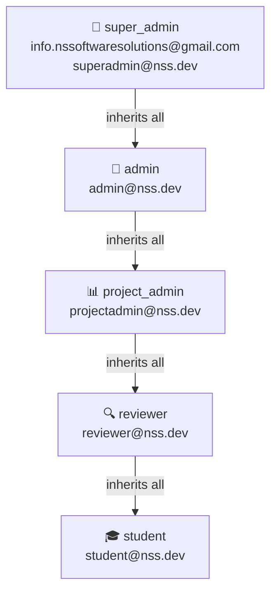

# Testing & Credentials

Test accounts and guides for testing the NS Internship Portal.

## Test Credentials

### Role Hierarchy



### Login Credentials

| Role | Email | Password | Notes |
|------|-------|----------|-------|
| super_admin | info.nssoftwaresolutions@gmail.com | admin123 | Production super admin |
| super_admin | superadmin@nss.dev | SuperAdmin@2026 | Test account |
| admin | admin@nss.dev | Admin@2026 | Test account |
| project_admin | projectadmin@nss.dev | ProjectAdmin@2026 | Test account |
| reviewer | reviewer@nss.dev | Reviewer@2026 | Test account |
| student | student@nss.dev | Student@2026 | Test account |
| student | nayabsikindar48@gmail.com | (registered) | Real student test account |

### URLs

| Environment | URL |
|-------------|-----|
| Production | https://internships.nssoftwaresolutions.in |
| Development | http://localhost:3000 |
| Admin Panel | /admin (admin roles only) |
| Dashboard | /dashboard (students) |

## Role Capabilities


## Capabilities by Role

| Role | Capabilities |
|------|--------------|
| **student** | Browse internships, enroll, submit milestones, resubmit rejected, view certificates, browse jobs |
| **reviewer** | All student + review/reject milestones, view enrollments |
| **project_admin** | All reviewer + manage domains, approve enrollments, view analytics |
| **admin** | All project_admin + manage coupons, announcements, certificates, invoices, activity logs, jobs, email |
| **super_admin** | All admin + manage users, manage roles, manage settings, change any user's role |

## Common Test Scenarios

### Test Email Templates

Run in browser console while logged in as admin:

```javascript
fetch("/api/admin/test-email", {
  method: "POST",
  credentials: "include",
  headers: { "Content-Type": "application/json" },
  body: JSON.stringify({ template: "enrollment" }),
})
  .then((r) => r.json())
  .then(console.log);
```

**Available templates:**
- enrollment
- certificate
- submission
- password_reset
- milestone_approved
- milestone_rejected
- announcement
- deadline_reminder
- offer_letter
- job_alert
- welcome
- inactive_student
- newsletter_welcome

### Test Token Refresh

The refresh token automatically rotates when access token expires. To test:

```javascript
// Expire access token manually, then make any API call
fetch("/api/auth/me", { credentials: "include" })
  .then((r) => r.json())
  .then(console.log);
```

### Test Email SMTP Connection

```javascript
fetch("/api/admin/test-email", {
  method: "POST",
  credentials: "include",
  headers: { "Content-Type": "application/json" },
  body: JSON.stringify({ template: "enrollment" }),
})
  .then((r) => r.json())
  .then((d) => console.log(JSON.stringify(d, null, 2)));
```

### Check Email Queue Status

```javascript
fetch("/api/admin/email-queue", { credentials: "include" })
  .then((r) => r.json())
  .then(console.log);
```

### Retry a Failed Email

```javascript
fetch("/api/admin/email-queue/retry", {
  method: "POST",
  credentials: "include",
  headers: { "Content-Type": "application/json" },
  body: JSON.stringify({ emailId: "<uuid>" }),
})
  .then((r) => r.json())
  .then(console.log);
```

### Check Email Usage Stats

```javascript
fetch("/api/admin/email-stats", { credentials: "include" })
  .then((r) => r.json())
  .then(console.log);
```

## Testing Workflows

### Student Enrollment Workflow

1. Log in as **student** (student@nss.dev)
2. Navigate to `/dashboard`
3. Click "Browse Internships" or go to `/internships`
4. Select a domain and click "Enroll"
5. Complete the checkout with Razorpay (use test card: 4111111111111111)
6. Verify enrollment appears in dashboard
7. Submit milestone 1 with notes
8. Check email for notifications

### Admin Review Workflow

1. Log in as **reviewer** (reviewer@nss.dev)
2. Navigate to `/admin`
3. Go to "Milestone Reviews" tab
4. Find pending milestones
5. Click "Approve" or "Reject"
6. Add remarks
7. Submit review
8. Student receives email notification

### Lead Conversion Workflow

1. As guest user on landing page, use chatbot to submit lead
2. Log in as **admin** (admin@nss.dev)
3. Navigate to `/admin` → "Leads" tab
4. Find the chatbot lead
5. Click "Convert to User"
6. New user receives welcome email
7. Lead status changes to "converted"

## Playwright E2E Tests

### Run All Tests

```bash
npm test
```

### Run Specific Test Suite

```bash
npm run test:auth          # Auth flow tests
npm run test:rbac          # Role-based access control
npm run test:student       # Student dashboard
npm run test:admin         # Admin dashboard
npm run test:api           # API endpoint tests
```

### Interactive Test UI

```bash
npm run test:ui            # Open Playwright Test UI
npm run test:headed        # Run tests with browser visible
npm run test:debug         # Debug mode
npm run test:report        # Show last test report
```

## Known Issues & Gotchas

### Authentication

- `info.nssoftwaresolutions@gmail.com` uses `admin123` which doesn't meet password validation rules — legacy production credential
- All `@nss.dev` passwords meet validation: 8+ chars, uppercase, lowercase, number
- Token refresh happens automatically in middleware on 401

### Database

- Email logs table must be created before email tracking works (`create_email_logs.sql`)
- Email queue table must be created before queue-based sending works (`create_email_queue.sql`)
- Refresh tokens table must be created before JWT refresh works (`create_refresh_tokens.sql`)

### File Uploads

- Cloudinary PDF uploads require `resource_type: 'raw'` — handled automatically by upload route
- Google OAuth avatar URLs are proxied via `/api/proxy-image` to avoid CORS issues

### Cron Jobs

- `deadline-reminders` cron requires milestones to have `deadline` set — milestones without deadlines are skipped
- `/api/cron/jobs` (SerpAPI + RSS job fetching) is **not scheduled** in `vercel.json` — trigger manually via Admin → Jobs → Fetch All
- `process-emails` cron runs **daily at 6am UTC** (not every 2 minutes)

### Google OAuth

- Google OAuth requires `GOOGLE_CLIENT_ID` and `GOOGLE_CLIENT_SECRET` env vars to be set
- Disposable email domains are blocked on registration + Google OAuth

### Email Templates

- `sendMilestoneReviewedEmail` handles both approve and reject cases via the `approved` boolean flag
- There is no separate `milestone_submitted` template function
- Admin test-email endpoint uses `milestone_approved` and `milestone_rejected` as template names

### Development

- To seed test users: `POST /api/dev/seed-test-users` (non-production only)
- To give admin access to existing student:
  1. Admin → User Management
  2. Enter their email in Create User modal
  3. Select role
  4. System auto-detects existing user and prompts to update role

## Test Data

### Test Domains

- Web Development
- Python Programming
- Machine Learning
- Data Science
- Mobile Development
- UI/UX Design
- Cloud Computing
- Cybersecurity
- DevOps Engineering
- Blockchain Development

### Test Coupon

- Code: `SAVE20`
- Type: Percentage
- Value: 20% off
- Domain: All domains
- Status: Active

### Test Razorpay Cards

**Test Mode Cards:**

| Type | Card Number | CVV | Date |
|------|-------------|-----|------|
| Visa | 4111111111111111 | 123 | 12/25 |
| Mastercard | 5555555555554444 | 123 | 12/25 |
| Invalid | 4000000000000002 | 123 | 12/25 |

## Test Utilities

### Create Test Users

```bash
# Create test users for all roles
curl -X POST http://localhost:3000/api/dev/seed-test-users
```

### Export Test Data

```bash
# Export enrollments as CSV
curl -X POST http://localhost:3000/api/admin/export \
  -H "Content-Type: application/json" \
  -H "Cookie: auth-token=your-token" \
  -d '{"entity": "enrollments"}' \
  > enrollments.csv
```

### Check System Health

```javascript
// Check if all required tables exist
fetch("/api/admin/analytics", { credentials: "include" })
  .then((r) => r.json())
  .then(data => console.log('System healthy:', !!data));
```

## Performance Testing

### Load Testing

Use Apache Bench or hey:

```bash
# Test homepage (100 requests, 10 concurrent)
ab -n 100 -c 10 http://localhost:3000/

# Test API endpoint (1000 requests, 50 concurrent)
hey -n 1000 -c 50 http://localhost:3000/api/domains
```

### Database Performance

Check slow queries:

```sql
-- Find slow queries (>100ms)
SELECT query, mean_time, calls
FROM pg_stat_statements
WHERE mean_time > 100
ORDER BY mean_time DESC
LIMIT 10;
```

## Monitoring & Debugging

### Enable Debug Logging

```bash
# Set debug env var
DEBUG=* npm run dev
```

### Check Database Connections

```sql
SELECT count(*) as connection_count
FROM pg_stat_activity;
```

### Monitor Email Queue

```sql
-- Check pending emails
SELECT count(*) as pending
FROM email_queue
WHERE status = 'pending';

-- Check failed emails
SELECT count(*) as failed
FROM email_queue
WHERE status = 'failed';
```

### View Activity Logs

```sql
-- Recent admin actions
SELECT admin_id, action_type, entity_type, created_at
FROM admin_activity_logs
ORDER BY created_at DESC
LIMIT 20;
```
