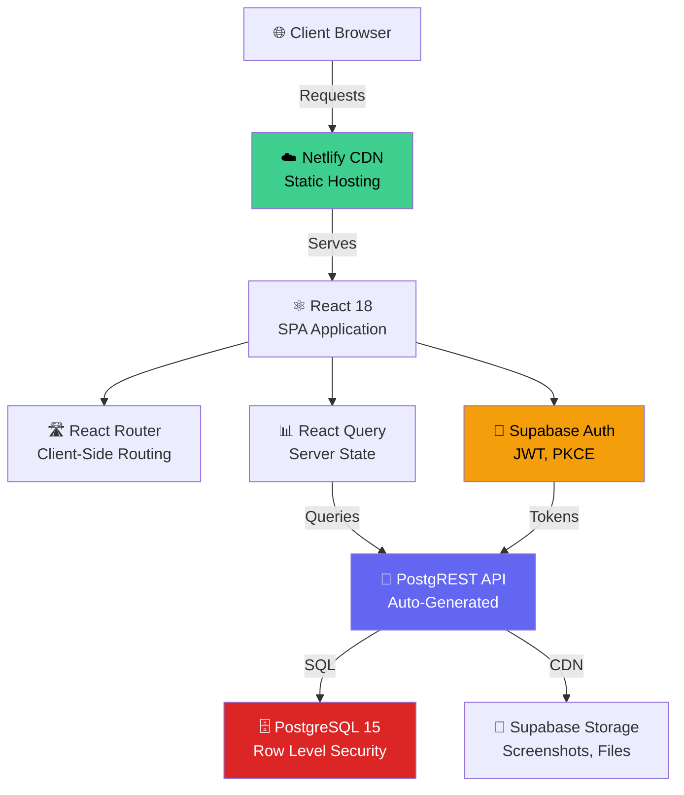
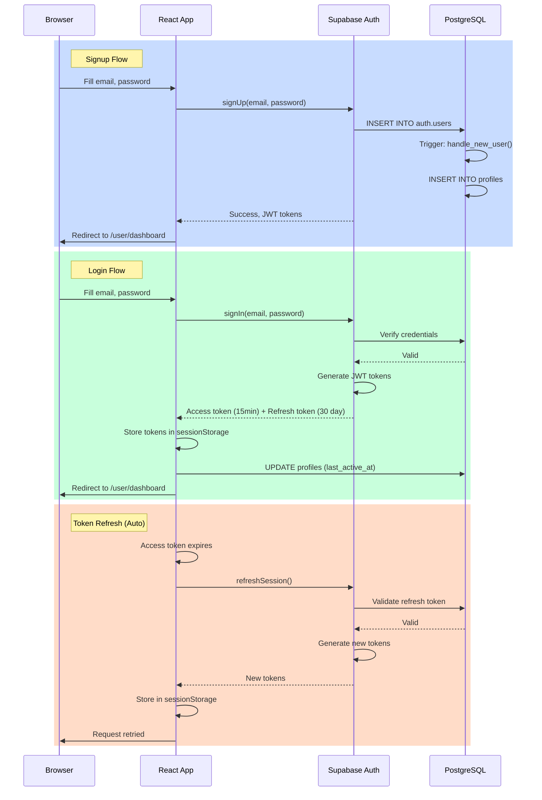
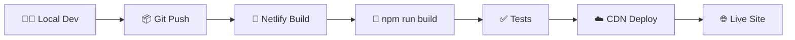

# System Architecture

Detailed technical architecture of the NS Software Solutions website.

## High-Level Architecture



## Technology Stack

| Layer | Technology | Version | Purpose |
|-------|-----------|---------|---------|
| **Frontend** | React | 18.3.1 | UI framework |
| **Language** | TypeScript | 5.8.3 | Type safety |
| **Build** | Vite | 5.4.19 | Build tool, HMR |
| **Styling** | Tailwind CSS | 3.4.17 | Utility-first CSS |
| **UI Kit** | shadcn/ui | Latest | Component library |
| **Animations** | Framer Motion | 12.23.24 | Motion effects |
| **Routing** | React Router | 6.30.1 | Client-side routing |
| **State** | React Query | 5.83.0 | Server state |
| **Forms** | React Hook Form | 7.61.1 | Form handling |
| **Validation** | Zod | 3.25.76 | Schema validation |
| **Icons** | Lucide React | 0.462.0 | Icon library |
| **SEO** | React Helmet | 2.0.5 | Meta tags |
| **Database** | PostgreSQL | 15+ | RDBMS |
| **Backend-as-a-Service** | Supabase | Latest | Auth, API, Storage, Realtime |
| **Authentication** | Supabase Auth | Latest | Email/password, JWT, PKCE |
| **File Storage** | Supabase Storage | Latest | CDN-backed object storage |
| **Hosting** | Netlify | Latest | Edge CDN, SPA hosting |
| **Analytics** | Google Analytics 4 | Latest | User behavior tracking |

## Application Architecture

### Route Map

#### Public Routes (No Authentication Required)

| Path | Component | Purpose |
|------|-----------|---------|
| `/` | Home | Landing page with hero, features, testimonials |
| `/projects` | Projects | Filterable project catalog |
| `/projects/:slug` | ProjectDetails | Individual project detail page |
| `/services` | Services | Service offerings with FAQ |
| `/about` | AboutUs | Company information and mission |
| `/contact` | Contact | Contact form |
| `/blogs` | BlogIndex | Blog post listing |
| `/blogs/project-ideas-for-cse-students` | BlogPost1 | SEO-optimized blog post |
| `/blogs/how-to-ace-your-viva` | BlogPost2 | SEO-optimized blog post |
| `/blogs/why-documentation-matters` | BlogPost3 | SEO-optimized blog post |
| `/final-year-projects/:city` | CityProjects | City landing pages (SEO) |
| `/login` | Login | Authentication page |
| `/reset-password` | ResetPassword | Password recovery |

#### Protected Routes - User (`onlyUser`)

| Path | Component | Purpose |
|------|-----------|---------|
| `/user/dashboard` | Dashboard | User overview and stats |
| `/user/my-projects` | MyProjects | User's purchased projects |
| `/user/profile` | UserProfile | Profile management |
| `/user/request-project` | RequestProject | Custom project requests |

#### Protected Routes - Admin (`onlyAdmin`)

| Path | Component | Purpose |
|------|-----------|---------|
| `/admin` | AdminDashboard | Admin overview and stats |
| `/admin/projects` | AdminProjects | Project CRUD management |
| `/admin/purchases` | PurchaseManagement | Purchase tracking and file delivery |
| `/admin/user-manager` | UserManager | User management and activity |
| `/admin/requests` | RequestsManagement | All request types (4 tabs) |

### Component Tree

```
App (Root with ErrorBoundary)
├── QueryClientProvider (React Query cache)
├── AuthProvider (Context for auth state)
├── HelmetProvider (for meta tags)
└── AppRoutes
    ├── Navbar (persistent)
    ├── Routes
    │   ├── Public pages (lazy-loaded)
    │   ├── UserLayout (outlet for /user/*)
    │   │   └── Protected user pages
    │   └── AdminLayout (outlet for /admin/*)
    │       └── Protected admin pages
    └── Footer (hidden on /admin/*)
```

## Authentication Flow



### Security Features

**PKCE Flow (Proof Key for Code Exchange)**
- Auth code exchange with code challenge/verifier
- Prevents authorization code interception
- Industry-standard for SPAs

**Token Storage**
- Access tokens: sessionStorage (cleared on tab close)
- Refresh tokens: sessionStorage (secure, short-lived)
- HttpOnly cookies: NOT used for SPA security

**Auto-Logout**
- 30-minute idle timeout
- Automatic logout on inactivity
- User warned 2 minutes before logout

## State Management Architecture

### React Query (Server State)

```
React Query Cache
├── Projects Query
│   ├── All projects (published, active)
│   ├── Individual project detail
│   └── Filtered results
├── User Queries
│   ├── Current user profile
│   ├── User purchases
│   ├── User requests
│   └── User sessions
└── Admin Queries
    ├── All projects (admin view)
    ├── All users
    ├── All purchases
    └── All requests
```

**Stale Time Strategy:**
- Projects: 5 minutes (static, rarely changes)
- User data: 1 minute (frequently accessed)
- Admin data: 30 seconds (frequently updated)
- Requests: Real-time on admin panel

### Auth Context (Local State)

```javascript
{
  user: {
    id: uuid,
    email: string,
    name: string,
    role: 'user' | 'admin'
  },
  isLoading: boolean,
  isAuthenticated: boolean,
  signUp: function,
  signIn: function,
  signOut: function,
  resetPassword: function
}
```

## API Architecture

### PostgREST Auto-Generated API

**Base URL:** `https://<project-ref>.supabase.co/rest/v1`

**Key Endpoints (Auto-Generated):**

| Resource | Endpoints |
|----------|-----------|
| `/profiles` | GET, POST, PATCH, DELETE |
| `/projects` | GET, POST, PATCH, DELETE |
| `/purchases` | GET, POST, PATCH, DELETE |
| `/purchase_files` | GET, POST, PATCH, DELETE |
| `/project_requests` | GET, POST, PATCH, DELETE |
| `/service_requests` | GET, POST, PATCH, DELETE |
| `/contact_messages` | GET, POST, PATCH, DELETE |
| `/custom_requests` | GET, POST, PATCH, DELETE |
| `/notifications` | GET, POST, PATCH, DELETE |
| `/admin_actions` | GET |

**Example Request:**
```javascript
// Get projects (public)
const { data } = await supabase
  .from('projects')
  .select('*')
  .eq('status', 'active')
  .eq('visibility', 'published');

// Create purchase (admin)
const { data } = await supabase
  .from('purchases')
  .insert({
    user_id, project_id, amount, status: 'pending'
  });
```

### Authentication Headers

All requests to protected resources include:
```
Authorization: Bearer <JWT_ACCESS_TOKEN>
```

Supabase client automatically:
- Adds JWT to all requests
- Refreshes token on 401 response
- Retries request with new token

## Row Level Security (RLS)

### Policy Examples

**profiles table:**
```sql
-- Users can read/update own profile
CREATE POLICY "Users read own profile" ON profiles
  FOR SELECT USING (auth.uid() = user_id);

-- Admins read all profiles
CREATE POLICY "Admins read all profiles" ON profiles
  FOR SELECT USING (
    EXISTS (SELECT 1 FROM profiles WHERE user_id = auth.uid() AND role = 'admin')
  );
```

**projects table:**
```sql
-- Anonymous users see published + active
CREATE POLICY "Anonymous view published" ON projects
  FOR SELECT USING (status = 'active' AND visibility = 'published');

-- Admins see all
CREATE POLICY "Admins see all projects" ON projects
  USING (
    EXISTS (SELECT 1 FROM profiles WHERE user_id = auth.uid() AND role = 'admin')
  );
```

**purchases table:**
```sql
-- Users read own purchases
CREATE POLICY "Users read own purchases" ON purchases
  FOR SELECT USING (user_id = auth.uid());

-- Admins manage all
CREATE POLICY "Admins manage purchases" ON purchases
  USING (
    EXISTS (SELECT 1 FROM profiles WHERE user_id = auth.uid() AND role = 'admin')
  );
```

## Performance Optimizations

### Code Splitting

All routes lazy-loaded via `React.lazy()`:
```javascript
const ProjectDetails = React.lazy(() => import('./pages/ProjectDetails'));
const UserDashboard = React.lazy(() => import('./pages/user/Dashboard'));
```

### Image Optimization

- Screenshots stored on Supabase Storage (CDN-backed)
- Lazy loading via `loading="lazy"`
- WebP support with JPEG fallback
- Automatic resize on upload

### Caching Strategy

| Resource | Cache Duration | Strategy |
|----------|-----------------|----------|
| HTML | No cache | Always fresh |
| JS/CSS | 365 days | Content hash in filename |
| Images | 30 days | CDN cache |
| API Responses | 1-5 min | React Query stale time |

### Database Indexes

30+ indexes optimized for queries:
- Profile lookups by `user_id`, `role`, `is_online`
- Project filters by `status`, `featured`, `slug`
- Purchase tracking by `user_id`, `status`, `created_at`
- Request searches by `status`, `created_at`

## Monitoring & Analytics

### Google Analytics 4

**Tracked Events:**
- Page views (all routes)
- User interactions (button clicks, form submissions)
- Conversion events (purchase created, request submitted)
- Custom events (project viewed, filter applied)

### Error Tracking

- ErrorBoundary catches React errors
- Console logging in development
- Structured error format sent to admin

### Performance Metrics

- Core Web Vitals: LCP, FID/INP, CLS
- Lighthouse score targets: 85+
- Time to First Byte (TTFB): < 200ms

## Deployment Pipeline



**Netlify Configuration:**
- Build command: `npm run build`
- Publish directory: `dist`
- Environment variables: Set in dashboard
- Auto-deploy: On push to main branch
- Redirects: SPA routing via `_redirects` file


---

## Navigation

<div style={{display: 'flex', justifyContent: 'space-between', marginTop: '2rem', padding: '1rem', backgroundColor: '#f0f0f0', borderRadius: '8px'}}>

[← Installation](/docs/ns-website/installation) | [→ Database Schema](/docs/ns-website/database-schema)

</div>