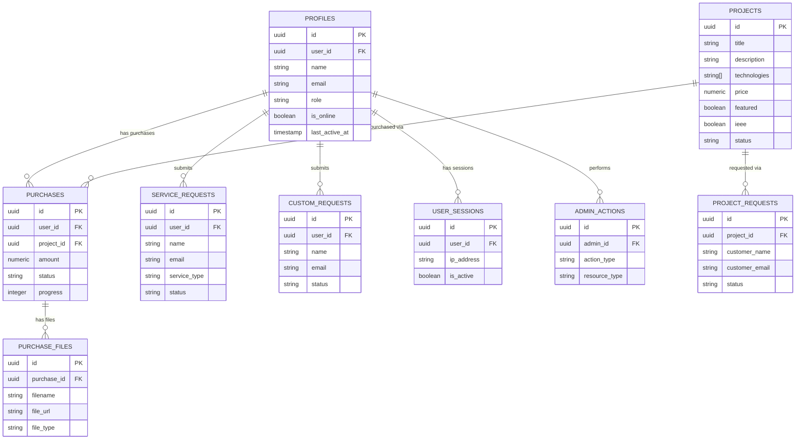

# Database Schema

Complete database structure for the NS Software Solutions website.

**Database:** PostgreSQL 15+ via Supabase  
**Last Updated:** April 29, 2026

All tables have Row Level Security (RLS) enabled for data isolation.

## Tables Overview

### 1. profiles

Stores user profile data. Auto-created on signup via `handle_new_user()` trigger.

| Column | Type | Nullable | Default | Notes |
|--------|------|----------|---------|-------|
| `id` | `uuid` | NO | `gen_random_uuid()` | Primary key |
| `user_id` | `uuid` | NO | — | FK → `auth.users.id` |
| `name` | `text` | YES | — | Display name |
| `email` | `text` | YES | — | Copied from auth on signup |
| `role` | `text` | YES | `'user'` | `'user'` or `'admin'` (RBAC) |
| `is_online` | `boolean` | YES | `false` | Real-time online status |
| `last_active_at` | `timestamptz` | YES | — | Last activity ping |
| `is_active` | `boolean` | YES | `true` | Account active flag |
| `admin_notes` | `text` | YES | — | Internal admin notes |
| `created_at` | `timestamptz` | NO | `now()` | — |
| `updated_at` | `timestamptz` | NO | `now()` | Auto-updated via trigger |

**Indexes:**
- `idx_profiles_user_id` on `user_id`
- `idx_profiles_role` on `role`
- `idx_profiles_is_online` on `is_online`
- `idx_profiles_last_active_at` on `last_active_at`
- `idx_profiles_role_active` on `(role, is_active)` (composite)

**RLS Policies:**
- Users can read/update own profile
- Admins can read/update all profiles

---

### 2. projects

The project catalog. Publicly readable (active + published only).

| Column | Type | Nullable | Default | Notes |
|--------|------|----------|---------|-------|
| `id` | `uuid` | NO | `gen_random_uuid()` | Primary key |
| `title` | `text` | NO | — | Project title (unique) |
| `description` | `text` | NO | — | Short display description |
| `short_description` | `text` | YES | — | Card subtitle |
| `full_description` | `text` | YES | — | Full detail page content (HTML) |
| `technologies` | `text[]` | NO | `'{}'` | Tech tags array (React, Django, etc) |
| `screenshots` | `text[]` | YES | — | Array of Supabase Storage URLs |
| `price` | `numeric(10,2)` | YES | — | Price in INR |
| `show_price` | `boolean` | YES | `true` | Toggle price visibility |
| `slug` | `text` | YES | — | URL-friendly identifier (unique) |
| `featured` | `boolean` | YES | `false` | Featured badge on catalog |
| `ieee` | `boolean` | YES | `false` | IEEE certification badge |
| `documentation_addon` | `boolean` | YES | `false` | Documentation available flag |
| `status` | `text` | YES | `'active'` | `'active'` or `'inactive'` |
| `visibility` | `text` | YES | `'published'` | `'published'` or `'draft'` |
| `meta_description` | `text` | YES | — | SEO meta description |
| `meta_keywords` | `text[]` | YES | — | SEO keywords array |
| `created_at` | `timestamptz` | NO | `now()` | — |
| `updated_at` | `timestamptz` | NO | `now()` | Auto-updated via trigger |

**Indexes:**
- `idx_projects_status` on `status`
- `idx_projects_featured` on `featured`
- `idx_projects_slug` on `slug`
- `idx_projects_created_at` on `created_at`

**RLS Policies:**
- Anonymous users read active + published only
- Authenticated users read all active projects
- Admins read/write all

---

### 3. purchases

Tracks project purchases assigned by admin to users.

| Column | Type | Nullable | Default | Notes |
|--------|------|----------|---------|-------|
| `id` | `uuid` | NO | `gen_random_uuid()` | Primary key |
| `user_id` | `uuid` | NO | — | FK → `auth.users.id` |
| `project_id` | `uuid` | NO | — | FK → `projects.id` |
| `amount` | `numeric(10,2)` | NO | — | Amount paid in INR |
| `status` | `text` | NO | `'pending'` | pending / confirmed / in_progress / completed / cancelled |
| `payment_status` | `text` | NO | `'pending'` | pending / paid / failed |
| `progress` | `integer` | NO | `0` | 0–100 completion percentage |
| `notes` | `text` | YES | — | Admin notes |
| `created_at` | `timestamptz` | NO | `now()` | — |
| `updated_at` | `timestamptz` | NO | `now()` | Auto-updated via trigger |

**Foreign Keys:**
- `purchases_project_id_fkey` → `projects(id)`

**Indexes:**
- `idx_purchases_user_id` on `user_id`
- `idx_purchases_project_id` on `project_id`
- `idx_purchases_status` on `status`
- `idx_purchases_payment_status` on `payment_status`
- `idx_purchases_user_status` on `(user_id, status)` (composite)

**RLS Policies:**
- Users read/create own purchases
- Admins read/write all purchases

---

### 4. purchase_files

Files delivered to users as part of a purchase.

| Column | Type | Nullable | Default | Notes |
|--------|------|----------|---------|-------|
| `id` | `uuid` | NO | `gen_random_uuid()` | Primary key |
| `purchase_id` | `uuid` | NO | — | FK → `purchases.id` |
| `filename` | `text` | NO | — | Display filename |
| `file_name` | `text` | YES | — | Alternate name field |
| `file_url` | `text` | NO | — | Direct download URL |
| `drive_link` | `text` | YES | — | Google Drive / cloud URL |
| `file_type` | `text` | NO | — | source_code / documentation / demo_video / other |
| `created_at` | `timestamptz` | NO | `now()` | — |

**Foreign Keys:**
- `purchase_files_purchase_id_fkey` → `purchases(id)` ON DELETE CASCADE

**Indexes:**
- `idx_purchase_files_purchase_id` on `purchase_id`

**RLS Policies:**
- Users read own purchase files
- Admins read/write all

---

### 5. project_requests

Requests submitted from the public project catalog (WhatsApp/Email buttons).

| Column | Type | Nullable | Default | Notes |
|--------|------|----------|---------|-------|
| `id` | `uuid` | NO | `gen_random_uuid()` | Primary key |
| `project_id` | `uuid` | YES | — | FK → `projects.id` |
| `customer_name` | `text` | NO | — | Submitter name |
| `customer_email` | `text` | NO | — | Contact email |
| `customer_phone` | `text` | YES | — | Contact number |
| `message` | `text` | YES | — | Custom message |
| `request_type` | `text` | YES | — | `'whatsapp'` or `'email'` |
| `status` | `text` | YES | `'pending'` | pending / in_progress / responded / completed |
| `admin_notes` | `text` | YES | — | Internal notes |
| `handled_by` | `uuid` | YES | — | FK → `auth.users.id` (admin) |
| `handled_at` | `timestamptz` | YES | — | When admin responded |
| `created_at` | `timestamptz` | NO | `now()` | — |

**Foreign Keys:**
- `project_requests_project_id_fkey` → `projects(id)` ON DELETE SET NULL

**Indexes:**
- `idx_project_requests_status` on `status`
- `idx_project_requests_project_id` on `project_id`
- `idx_project_requests_created_at` on `created_at`

**RLS Policies:**
- Anonymous users insert (create requests)
- Admins read/update all
- Prevent user read access (guest data)

---

### 6. service_requests

Requests submitted from the Services page.

| Column | Type | Nullable | Default | Notes |
|--------|------|----------|---------|-------|
| `id` | `uuid` | NO | `gen_random_uuid()` | Primary key |
| `user_id` | `uuid` | YES | — | FK → `auth.users.id` (if logged in) |
| `name` | `text` | NO | — | Submitter name |
| `email` | `text` | NO | — | Contact email |
| `service_type` | `text` | NO | — | Selected service category |
| `message` | `text` | YES | — | Request details |
| `status` | `text` | YES | `'pending'` | pending / in_progress / responded / completed |
| `admin_notes` | `text` | YES | — | Internal notes |
| `handled_by` | `uuid` | YES | — | FK → `auth.users.id` (admin) |
| `handled_at` | `timestamptz` | YES | — | When admin responded |
| `created_at` | `timestamptz` | NO | `now()` | — |

**Foreign Keys:**
- None (optional user_id)

**Indexes:**
- `idx_service_requests_status` on `status`
- `idx_service_requests_user_id` on `user_id`
- `idx_service_requests_created_at` on `created_at`

**RLS Policies:**
- Anonymous users insert
- Admins read/update all

---

### 7. contact_messages

Submissions from the Contact form.

| Column | Type | Nullable | Default | Notes |
|--------|------|----------|---------|-------|
| `id` | `uuid` | NO | `gen_random_uuid()` | Primary key |
| `name` | `text` | NO | — | Submitter name |
| `email` | `text` | NO | — | Contact email |
| `message` | `text` | NO | — | Inquiry message |
| `status` | `text` | YES | `'pending'` | pending / in_progress / responded / completed |
| `admin_notes` | `text` | YES | — | Internal notes |
| `handled_by` | `uuid` | YES | — | FK → `auth.users.id` (admin) |
| `handled_at` | `timestamptz` | YES | — | When admin responded |
| `created_at` | `timestamptz` | NO | `now()` | — |

**Indexes:**
- `idx_contact_messages_status` on `status`
- `idx_contact_messages_created_at` on `created_at`

**RLS Policies:**
- Anonymous users insert
- Admins read/update all

---

### 8. custom_requests

Custom project requests from logged-in users.

| Column | Type | Nullable | Default | Notes |
|--------|------|----------|---------|-------|
| `id` | `uuid` | NO | `gen_random_uuid()` | Primary key |
| `user_id` | `uuid` | YES | — | FK → `auth.users.id` |
| `name` | `text` | NO | — | Submitter name |
| `email` | `text` | NO | — | Contact email |
| `project_description` | `text` | NO | — | Detailed request |
| `budget_range` | `text` | YES | — | Budget estimate |
| `timeline` | `text` | YES | — | Expected delivery |
| `status` | `text` | YES | `'pending'` | pending / contacted / completed |
| `created_at` | `timestamptz` | NO | `now()` | — |

**Indexes:**
- `idx_custom_requests_user_id` on `user_id`
- `idx_custom_requests_status` on `status`

**RLS Policies:**
- Users read/create own requests
- Admins read all

---

### 9. notifications

Admin-facing notification feed.

| Column | Type | Nullable | Default | Notes |
|--------|------|----------|---------|-------|
| `id` | `uuid` | NO | `gen_random_uuid()` | Primary key |
| `title` | `text` | NO | — | Notification title |
| `message` | `text` | NO | — | Notification body |
| `type` | `text` | NO | — | info / warning / success / error |
| `is_read` | `boolean` | NO | `false` | Read state |
| `related_id` | `uuid` | YES | — | Optional FK to related record |
| `created_at` | `timestamptz` | NO | `now()` | — |

**Indexes:**
- `idx_notifications_is_read` on `is_read`
- `idx_notifications_created_at` on `created_at`

**RLS Policies:**
- Admins read/update all notifications

---

### 10. user_sessions

Tracks active user sessions for admin visibility.

| Column | Type | Nullable | Default | Notes |
|--------|------|----------|---------|-------|
| `id` | `uuid` | NO | `gen_random_uuid()` | Primary key |
| `user_id` | `uuid` | NO | — | FK → `auth.users.id` |
| `session_token` | `text` | YES | — | Optional session identifier |
| `ip_address` | `inet` | YES | — | User IP address |
| `user_agent` | `text` | YES | — | Browser/device info |
| `is_active` | `boolean` | YES | `true` | Session active flag |
| `last_activity` | `timestamptz` | YES | — | Last user activity |
| `expires_at` | `timestamptz` | YES | — | Session expiration time |
| `created_at` | `timestamptz` | NO | `now()` | — |

**Indexes:**
- `idx_user_sessions_user_id` on `user_id`
- `idx_user_sessions_is_active` on `is_active`
- `idx_user_sessions_expires_at` on `expires_at`

**RLS Policies:**
- Users read own sessions
- Admins read all sessions

---

### 11. admin_actions

Audit log for admin operations.

| Column | Type | Nullable | Default | Notes |
|--------|------|----------|---------|-------|
| `id` | `uuid` | NO | `gen_random_uuid()` | Primary key |
| `admin_id` | `uuid` | YES | — | FK → `auth.users.id` |
| `action_type` | `text` | NO | — | create / update / delete / export |
| `resource_type` | `text` | NO | — | project / purchase / user / request |
| `resource_id` | `uuid` | YES | — | ID of affected record |
| `description` | `text` | YES | — | Human-readable action |
| `ip_address` | `inet` | YES | — | Admin IP |
| `user_agent` | `text` | YES | — | Browser info |
| `created_at` | `timestamptz` | NO | `now()` | — |

**Indexes:**
- `idx_admin_actions_admin_id` on `admin_id`
- `idx_admin_actions_resource_type` on `resource_type`
- `idx_admin_actions_created_at` on `created_at`

**RLS Policies:**
- Admins read all actions
- Users cannot access this table

---

### 12. admin_settings

Certificate and verification records.

| Column | Type | Nullable | Default | Notes |
|--------|------|----------|---------|-------|
| `id` | `uuid` | NO | `gen_random_uuid()` | Primary key |
| `certificate_id` | `text` | NO | — | Unique certificate ID |
| `student_name` | `text` | NO | — | Student name |
| `project_title` | `text` | NO | — | Completed project |
| `issue_date` | `date` | NO | — | Certificate issue date |
| `valid` | `boolean` | YES | `true` | Certificate validity |
| `created_at` | `timestamptz` | NO | `now()` | — |

**RLS Policies:**
- Public can verify certificate
- Admins read/write all

---

## Database Functions & Triggers

### `handle_new_user()`

**Trigger:** `AFTER INSERT ON auth.users`

Auto-creates a `profiles` record when a new user signs up. Copies `name` and `email` from auth metadata.

```sql
CREATE FUNCTION public.handle_new_user()
RETURNS trigger AS $$
BEGIN
  INSERT INTO public.profiles (user_id, email, name, role)
  VALUES (new.id, new.email, new.raw_user_meta_data->>'name', 'user');
  RETURN new;
END;
$$ LANGUAGE plpgsql SECURITY DEFINER;
```

### `update_updated_at_column()`

**Trigger:** `BEFORE UPDATE` on `profiles`, `projects`, `purchases`

Sets `updated_at = now()` automatically.

```sql
CREATE FUNCTION public.update_updated_at_column()
RETURNS trigger AS $$
BEGIN
  new.updated_at = now();
  RETURN new;
END;
$$ LANGUAGE plpgsql;
```

### `update_user_activity(user_uuid uuid)`

**Called by:** `useUserActivity` hook every 2 minutes

Updates user's last activity timestamp and online status.

```sql
CREATE FUNCTION public.update_user_activity(user_uuid uuid)
RETURNS void AS $$
BEGIN
  UPDATE public.profiles
  SET last_active_at = now(), is_online = true
  WHERE user_id = user_uuid;
END;
$$ LANGUAGE plpgsql SECURITY DEFINER;
```

### `mark_user_offline(user_uuid uuid)`

**Called by:** `useUserActivity` hook on page unload

Sets `is_online = false` for user.

```sql
CREATE FUNCTION public.mark_user_offline(user_uuid uuid)
RETURNS void AS $$
BEGIN
  UPDATE public.profiles
  SET is_online = false
  WHERE user_id = user_uuid;
END;
$$ LANGUAGE plpgsql SECURITY DEFINER;
```

---

## Entity Relationship Diagram




---

## Navigation

<div style={{display: 'flex', justifyContent: 'space-between', marginTop: '2rem', padding: '1rem', backgroundColor: '#f0f0f0', borderRadius: '8px'}}>

[← System Architecture](/docs/ns-website/architecture) | [→ Features & Workflows](/docs/ns-website/features-and-workflows)

</div>